# Knowledge Graphs & Memory-Aware RAG — Complete Notes

> **Where we are:** We've optimised RAG at every layer — chunking, embeddings, query translation, routing. Now we add the most powerful missing layer: **relationships**. Knowledge Graphs + Memory turn a search engine into something that actually *understands* context.

---

## Table of Contents

**Part 1 — The Problem**
1. [What Vector Embeddings Can't Do](#1-what-vector-embeddings-cant-do)
2. [What is a Knowledge Graph?](#2-what-is-a-knowledge-graph)
3. [How a Knowledge Graph Fits Into RAG](#3-how-a-knowledge-graph-fits-into-rag)

**Part 2 — Building a Knowledge Graph**
4. [Knowledge Graph Construction — Two Approaches](#4-knowledge-graph-construction--two-approaches)
5. [Neo4j & Cypher QL — The Database Behind the Graph](#5-neo4j--cypher-ql--the-database-behind-the-graph)
6. [CREATE vs MERGE — The Key Difference](#6-create-vs-merge--the-key-difference)
7. [LLM → Cypher Query Generation](#7-llm--cypher-query-generation)
8. [LangChain LLMGraphTransformer — Full Pipeline](#8-langchain-llmgraphtransformer--full-pipeline)

**Part 3 — Retrieval from a Knowledge Graph**
9. [Graph Retrieval — Vector Entry Point + BFS](#9-graph-retrieval--vector-entry-point--bfs)
10. [GraphRAG Pipeline](#10-graphrag-pipeline)

**Part 4 — Memory**
11. [Why LLMs Forget — The Memory Problem](#11-why-llms-forget--the-memory-problem)
12. [Mem0 — Hybrid Memory (Vector + Graph)](#12-mem0--hybrid-memory-vector--graph)
13. [mem.py Walkthrough — Line by Line](#13-mempy-walkthrough--line-by-line)
14. [Real-World Usage & Voice Assistants](#14-real-world-usage--voice-assistants)

**Part 5 — The Full Picture**
15. [Complete RAG Pipeline — Diagram Series](#15-complete-rag-pipeline--diagram-series)
16. [Quick Revision Cheat Sheet](#16-quick-revision-cheat-sheet)

---

## 1. What Vector Embeddings Can't Do

### Recap — What Vector Embeddings ARE Good At

In our previous notes (RAG.md, Query_TransLation_Advance_RAG.md) we learned that vector embeddings are great for **semantic similarity search**.

```
"What is the capital of France?" → embed → search → "Paris is the capital of France" ✓
```

They find chunks whose **meaning is similar** to the query.

### The Hard Limit — Relationships and Context

Now try this:

```
Q: "Is Alice the sister of the person who manages the London office?"
```

This requires **two hops** through a relationship graph:
1. Who manages the London office? → Bob
2. Is Alice the sister of Bob? → Yes

A vector DB can't answer this. It would just find the most semantically similar chunk to the question text — but no single chunk contains both facts together.

### The Core Problem

| Task | Vector Embedding | Knowledge Graph |
|------|:-:|:-:|
| "What is JWT authentication?" | ✅ Semantic search works | ✅ Also works |
| "Who is Alice's manager?" | ❌ Needs relationship traversal | ✅ Direct graph query |
| "Find all people 2 hops from Bob" | ❌ Impossible | ✅ Graph traversal (BFS) |
| "What changed between versions?" | ⚠️ Partial | ✅ Versioned nodes/edges |
| "What facts did the user tell me across 10 sessions?" | ❌ Each session is isolated | ✅ Persistent memory graph |

> **The rule:** Semantic chunks → use vector DB. Structured facts and relationships → use a graph.

```mermaid
flowchart LR
    classDef input    fill:#e8f4fd,stroke:#2196F3,color:#0d47a1,font-weight:bold
    classDef good     fill:#e8f5e9,stroke:#4CAF50,color:#1b5e20,font-weight:bold
    classDef bad      fill:#ffebee,stroke:#F44336,color:#b71c1c,font-weight:bold

    Q["❓ Query with Relationships\ne.g. Is Alice Bob's manager?"]:::input
    VEC["🔢 Vector DB\nSemantic Similarity Search"]:::bad
    KG["🕸️ Knowledge Graph\nRelationship Traversal"]:::good
    VEC_OUT["❌ Finds semantically similar chunks\nbut cannot traverse relationships"]:::bad
    KG_OUT["✅ Alice-[:MANAGES]->Bob\nDirect graph query returns exact answer"]:::good

    Q --> VEC --> VEC_OUT
    Q --> KG --> KG_OUT
```

---

## 2. What is a Knowledge Graph?

### Simple Definition

> **Knowledge = Data about something**
> **Graph = Entities (things) + Relationships (how they connect)**

A Knowledge Graph is a **structured collection of facts** where:
- **Nodes** = Entities (people, places, concepts, documents)
- **Edges** = Relationships (what connects two nodes)
- **Properties** = Metadata on nodes and edges

### Key Terms

| Term | Meaning | Example |
|------|---------|---------|
| **Node** | An entity | `Alice`, `OpenAI`, `RAG` |
| **Edge / Relationship** | How two nodes connect | `IS_SISTER_OF`, `WORKS_AT` |
| **Label** | The *type* of a node | `(Person)`, `(Organisation)` |
| **Property** | Metadata on a node or edge | `{name: "Alice", age: 30}` |
| **Cypher** | Query language for graphs (Neo4j) | `MATCH (a:Person)-[:WORKS_AT]->(b)` |
| **Triple** | One fact: Subject → Predicate → Object | `Alice → IS_SISTER_OF → Bob` |

```mermaid
flowchart LR
    classDef person   fill:#e8f4fd,stroke:#2196F3,color:#0d47a1,font-weight:bold
    classDef org      fill:#fff3e0,stroke:#FF9800,color:#e65100,font-weight:bold
    classDef concept  fill:#f3e5f5,stroke:#9C27B0,color:#4a148c
    classDef place    fill:#e8f5e9,stroke:#4CAF50,color:#1b5e20

    ALICE["👤 Alice\n(Person)"]:::person
    BOB["👤 Bob\n(Person)"]:::person
    OPENAI["🏢 OpenAI\n(Organisation)"]:::org
    RAG["📚 RAG\n(Concept)"]:::concept
    SF["📍 San Francisco\n(Place)"]:::place

    ALICE -- "IS_SISTER_OF" --> BOB
    BOB -- "WORKS_AT" --> OPENAI
    OPENAI -- "LOCATED_IN" --> SF
    OPENAI -- "DEVELOPS" --> RAG
    ALICE -- "STUDIES" --> RAG
```

---

## 3. How a Knowledge Graph Fits Into RAG

The standard RAG stack (files 4-6) only carries text chunks. It loses all structural relationships.

**GraphRAG adds the relationship layer:**

```mermaid
flowchart TD
    classDef input     fill:#e8f4fd,stroke:#2196F3,color:#0d47a1,font-weight:bold
    classDef router    fill:#fff3e0,stroke:#FF9800,color:#e65100,font-weight:bold
    classDef db        fill:#f3e5f5,stroke:#9C27B0,color:#4a148c
    classDef retriever fill:#e8f5e9,stroke:#4CAF50,color:#1b5e20
    classDef llm       fill:#fce4ec,stroke:#E91E63,color:#880e4f,font-weight:bold
    classDef output    fill:#e0f2f1,stroke:#009688,color:#004d40,font-weight:bold
    classDef graphdb   fill:#ede7f6,stroke:#673AB7,color:#311b92

    Q["🗣️ User Query"]:::input
    TRANS["🔄 Query Translation\nMulti-Query, HyDE, Step-Back"]:::router
    VEC["🔢 Vector DB\nQdrant / ChromaDB"]:::db
    GRAPH["🕸️ Knowledge Graph\nNeo4j"]:::graphdb
    CHUNKS["📄 Relevant Chunks\nSemantic"]:::retriever
    RELS["🔗 Relevant Subgraph\nRelational facts"]:::retriever
    MERGE["⚙️ Context Merger"]:::router
    LLM["🧠 LLM"]:::llm
    ANS["✅ Answer"]:::output

    Q --> TRANS
    TRANS --> VEC
    TRANS --> GRAPH
    VEC --> CHUNKS
    GRAPH --> RELS
    CHUNKS --> MERGE
    RELS --> MERGE
    MERGE --> LLM
    LLM --> ANS
```

> **What changes:** The LLM now receives BOTH semantic chunks AND structured relationship facts. It can reason over connections that no single chunk captures.

---

## 4. Knowledge Graph Construction — Two Approaches

```mermaid
flowchart LR
    classDef input  fill:#e8f4fd,stroke:#2196F3,color:#0d47a1,font-weight:bold
    classDef step   fill:#f1f8e9,stroke:#8BC34A,color:#33691e
    classDef llm    fill:#fce4ec,stroke:#E91E63,color:#880e4f,font-weight:bold
    classDef output fill:#e0f2f1,stroke:#009688,color:#004d40,font-weight:bold

    PDF["📄 Source Document\nPDF or Text Chunk"]:::input
    RAW["🔧 Approach A: Raw/Manual\nWrite Cypher CREATE/MERGE\nstatements by hand"]:::step
    AUTO["🤖 Approach B: LLM-Automated\nLLMGraphTransformer\nextract entities + rels automatically"]:::llm
    NEO["🕸️ Neo4j Graph DB"]:::output

    PDF --> RAW --> NEO
    PDF --> AUTO --> NEO
```

### Approach A — Raw/Manual Cypher

```cypher
-- Create nodes
CREATE (alice:Person {name: "Alice", role: "Engineer"})
CREATE (openai:Company {name: "OpenAI", industry: "AI"})

-- Create relationship
CREATE (alice)-[:WORKS_AT {since: 2022}]->(openai)
```

**Use when:** schema is known upfront, small domain, high precision needed (legal/medical).

### Approach B — LLM Automated (LLMGraphTransformer)

```python
from langchain_experimental.graph_transformers import LLMGraphTransformer
from langchain_openai import ChatOpenAI

llm = ChatOpenAI(model="gpt-4o")
transformer = LLMGraphTransformer(llm=llm)

docs = [Document(page_content="Alice is the sister of Bob. Bob works at OpenAI.")]
graph_docs = transformer.convert_to_graph_documents(docs)
# Nodes:  Alice (Person), Bob (Person), OpenAI (Organisation)
# Edges:  Alice-[IS_SISTER_OF]->Bob, Bob-[WORKS_AT]->OpenAI
```

**Use when:** large document corpus, open/unknown schema, automated pipeline.

### Ingestion Pipeline

```mermaid
flowchart TD
    classDef input   fill:#e8f4fd,stroke:#2196F3,color:#0d47a1,font-weight:bold
    classDef llm     fill:#fce4ec,stroke:#E91E63,color:#880e4f,font-weight:bold
    classDef step    fill:#f1f8e9,stroke:#8BC34A,color:#33691e
    classDef graphdb fill:#ede7f6,stroke:#673AB7,color:#311b92
    classDef db      fill:#f3e5f5,stroke:#9C27B0,color:#4a148c

    PDF2["📄 PDF / Text Document"]:::input
    CHUNK["✂️ Chunk Text\nSemantic Chunker"]:::step
    EMBED["🔢 Embed Chunks\ntext-embedding-3-small"]:::step
    LLM_T["🤖 LLMGraphTransformer"]:::llm
    TRIPLES["⚡ Graph Triples\nNode, Relationship, Node"]:::step
    VDB["🔢 Vector DB Qdrant"]:::db
    NEO2["🕸️ Neo4j Graph"]:::graphdb

    PDF2 --> CHUNK
    CHUNK --> EMBED --> VDB
    CHUNK --> LLM_T --> TRIPLES --> NEO2
```

---

## 5. Neo4j & Cypher QL — The Database Behind the Graph

> **Analogy:** Neo4j is to graphs what PostgreSQL is to tables.

### Cypher QL — Basic Syntax

```cypher
-- Find a person named Alice
MATCH (p:Person {name: "Alice"}) RETURN p

-- Find all companies Alice works at
MATCH (p:Person {name: "Alice"})-[:WORKS_AT]->(c:Company)
RETURN c.name

-- Find Alice's colleagues (2 hops)
MATCH (p:Person {name: "Alice"})-[:WORKS_AT]->(c:Company)<-[:WORKS_AT]-(col:Person)
RETURN col.name

-- Find all nodes within 2 hops of Alice
MATCH (p:Person {name: "Alice"})-[*1..2]->(related)
RETURN related
```

### Reading Cypher Like English

```
MATCH (alice:Person {name: "Alice"})
      -[:WORKS_AT {since: 2022}]->
      (openai:Company {name: "OpenAI"})
RETURN alice, openai
```

↓ *"Find a Person named Alice who has a WORKS_AT relationship (since 2022) pointing to a Company named OpenAI, return both."*

### Syntax Reference

```cypher
-- Node:          (varName:Label {prop: value})
-- Relationship:  -[:TYPE]->               directed
--                -[:TYPE {prop: v}]-       with properties
--                -[*1..3]->               variable depth 1-3 hops
--                -[*]->                   unlimited hops (use carefully!)
```

---

## 6. CREATE vs MERGE — The Key Difference

### CREATE — Always Inserts New

```cypher
CREATE (alice:Person {name: "Alice"})
CREATE (alice:Person {name: "Alice"})
-- Result: TWO Alice nodes! ❌
```

Processing 100 PDF chunks each mentioning "OpenAI" with CREATE → 100 duplicate nodes.

### MERGE — Find or Create (Upsert)

```cypher
MERGE (alice:Person {name: "Alice"})
MERGE (alice:Person {name: "Alice"})
-- Result: ONE Alice node ✅
```

### Full MERGE Pattern

```cypher
MERGE (alice:Person {name: "Alice"})
ON CREATE SET alice.createdAt = timestamp(), alice.age = 30
ON MATCH  SET alice.lastSeen  = timestamp()

-- ON CREATE: runs only when node is newly created
-- ON MATCH:  runs only when node already existed
```

### Updating and Deleting Relationships

```cypher
-- Update property on a relationship
MATCH (a:Person {name: "Alice"})-[r:WORKS_AT]->(c:Company {name: "OpenAI"})
SET r.role = "Senior Engineer", r.since = 2023

-- Delete a relationship
MATCH (a:Person {name: "Alice"})-[r:WORKS_AT]->(c)
DELETE r

-- MERGE a relationship (safe upsert)
MATCH (a:Person {name: "Alice"}), (c:Company {name: "OpenAI"})
MERGE (a)-[r:WORKS_AT]->(c)
ON CREATE SET r.since = 2023
ON MATCH  SET r.updatedAt = timestamp()
```

### Decision Table

| Situation | CREATE | MERGE |
|-----------|:------:|:-----:|
| One-time seed data | ✅ | ✅ |
| Automated pipeline (PDF ingestion) | ❌ duplicates! | ✅ always safe |
| Updating existing node properties | ❌ | ✅ with ON MATCH |

> **Rule: In any automated pipeline → always use `MERGE`.**

---

## 7. LLM → Cypher Query Generation

### The Full Flow

```mermaid
flowchart TD
    classDef input   fill:#e8f4fd,stroke:#2196F3,color:#0d47a1,font-weight:bold
    classDef llm     fill:#fce4ec,stroke:#E91E63,color:#880e4f,font-weight:bold
    classDef step    fill:#f1f8e9,stroke:#8BC34A,color:#33691e
    classDef graphdb fill:#ede7f6,stroke:#673AB7,color:#311b92
    classDef output  fill:#e0f2f1,stroke:#009688,color:#004d40,font-weight:bold

    Q["🗣️ Natural Language Query\nWho is Alice's manager?"]:::input
    SCHEMA["📋 Graph Schema\nnode labels, rel types, properties"]:::step
    LLM1["🤖 LLM — Cypher Generator\nSchema + Query → Cypher"]:::llm
    CYPHER["⚡ Generated Cypher\nMATCH (a:Person {name:'Alice'})\n-[:REPORTS_TO]->(m:Person)\nRETURN m.name"]:::step
    NEO["🕸️ Neo4j Execute Cypher"]:::graphdb
    RESULTS["📊 Graph Results\n{name: 'Bob'}"]:::step
    LLM2["🧠 LLM — Answer Generator"]:::llm
    ANS["✅ Alice's manager is Bob"]:::output

    Q --> LLM1
    SCHEMA --> LLM1
    LLM1 --> CYPHER --> NEO --> RESULTS --> LLM2 --> ANS
```

### Making LLM-Cypher Reliable — Always Inject the Schema

```python
schema = graph.schema  # auto-fetched from Neo4j

system_prompt = f"""
You are a Neo4j Cypher expert. NEVER invent labels or relationship types.
Graph Schema: {schema}
Rules: Use MATCH for reading, MERGE for writing. Always add LIMIT.
"""
```

### Reliability Ladder

| Stars | Approach |
|:-----:|---------|
| ⭐ | Basic — LLM generates Cypher from natural language (~70-80% accuracy) |
| ⭐⭐ | Inject full graph schema |
| ⭐⭐⭐ | Schema + few-shot Q→Cypher examples in prompt |
| ⭐⭐⭐⭐ | Schema + few-shot + output validation + retry on error |
| ⭐⭐⭐⭐⭐ | Fine-tuned on your schema + unit tests |

---

## 8. LangChain LLMGraphTransformer — Full Pipeline

### The Three Components

```mermaid
flowchart LR
    classDef input   fill:#e8f4fd,stroke:#2196F3,color:#0d47a1,font-weight:bold
    classDef llm     fill:#fce4ec,stroke:#E91E63,color:#880e4f,font-weight:bold
    classDef step    fill:#f1f8e9,stroke:#8BC34A,color:#33691e
    classDef graphdb fill:#ede7f6,stroke:#673AB7,color:#311b92
    classDef output  fill:#e0f2f1,stroke:#009688,color:#004d40,font-weight:bold

    DOC["📄 Document\nLangChain Document"]:::input
    CHAT["💬 ChatModel\nChatOpenAI / ChatAnthropic"]:::llm
    TRANS["🔄 LLMGraphTransformer\nlangchain_experimental"]:::llm
    GDOC["📦 GraphDocument\n- nodes: Node(id,type,props)\n- relationships: Rel(src,type,tgt)"]:::step
    NEO["🕸️ Neo4jGraph\n.add_graph_documents()"]:::graphdb
    RES["✅ Knowledge Graph in Neo4j"]:::output

    DOC --> TRANS
    CHAT --> TRANS
    TRANS --> GDOC --> NEO --> RES
```

### The Code Pattern

```python
from langchain_community.graphs import Neo4jGraph
from langchain_experimental.graph_transformers import LLMGraphTransformer
from langchain_openai import ChatOpenAI

llm = ChatOpenAI(model="gpt-4o", temperature=0)
ll_transformer = LLMGraphTransformer(llm=llm)
graph = Neo4jGraph(url="bolt://localhost:7687", username="neo4j", password="...")

docs = [Document(page_content="Alice is head of engineering at OpenAI. She reports to Sam Altman.")]
graph_documents = ll_transformer.convert_to_graph_documents(docs)

graph.add_graph_documents(graph_documents, baseEntityLabel=True, include_source=True)
# Uses MERGE internally — no duplicates
```

### What the Abstraction Hides

| What You Call | What LangChain Does |
|---|---|
| `LLMGraphTransformer(llm=llm)` | Wraps LLM with entity/rel extraction system prompt |
| `.convert_to_graph_documents(docs)` | Calls LLM per chunk, parses output into `GraphDocument` |
| `graph.add_graph_documents(...)` | Translates nodes/rels into `MERGE` Cypher, runs them |
| `baseEntityLabel=True` | Adds `__Entity__` base label to all nodes |
| `include_source=True` | Creates `Document` node linked to all extracted entities |

### Schema-Constrained Extraction

```python
ll_transformer = LLMGraphTransformer(
    llm=llm,
    allowed_nodes=["Person", "Company", "Concept", "Location"],
    allowed_relationships=["WORKS_AT", "LOCATED_IN", "STUDIES", "MANAGES"],
    node_properties=True,
    relationship_properties=True
)
```

Constraining the LLM → cleaner graph, fewer irrelevant nodes.

---

## 9. Graph Retrieval — Vector Entry Point + BFS

### The Core Problem

A graph with millions of nodes can't be fully traversed per query.

> **How do you find the right starting node out of 1 million?**
> **Answer: Vector embeddings find the entry point — then graph traversal takes over.**

### The Two-Phase Retrieval

```mermaid
flowchart TD
    classDef input   fill:#e8f4fd,stroke:#2196F3,color:#0d47a1,font-weight:bold
    classDef step    fill:#f1f8e9,stroke:#8BC34A,color:#33691e
    classDef db      fill:#f3e5f5,stroke:#9C27B0,color:#4a148c
    classDef graphdb fill:#ede7f6,stroke:#673AB7,color:#311b92
    classDef llm     fill:#fce4ec,stroke:#E91E63,color:#880e4f,font-weight:bold
    classDef output  fill:#e0f2f1,stroke:#009688,color:#004d40,font-weight:bold

    Q["🗣️ User Query\nTell me about Alice's team"]:::input

    subgraph PHASE1 ["Phase 1 — Find Entry Point via Vector"]
        EMBED["🔢 Embed Query"]:::step
        VDB["Vector DB\nTop 3 similar nodes"]:::db
        NODES["📍 Entry Nodes\nAlice_node_id, Team_node_id"]:::step
    end

    subgraph PHASE2 ["Phase 2 — Traverse Graph via BFS"]
        BFS["🔄 BFS Cypher\nExpand 1-2 hops from entry"]:::graphdb
        SUBGRAPH["📊 Relevant Subgraph\nAll connected facts"]:::graphdb
    end

    MERGE2["⚙️ Merge Chunks + Subgraph"]:::step
    LLM["🧠 LLM"]:::llm
    ANS["✅ Answer"]:::output

    Q --> PHASE1
    EMBED --> VDB --> NODES
    NODES --> PHASE2
    BFS --> SUBGRAPH --> MERGE2
    VDB --> MERGE2
    MERGE2 --> LLM --> ANS
```

### BFS — Breadth-First Search

```
Level 0 (entry):   Alice
Level 1 (1 hop):   Bob, OpenAI, RAG
Level 2 (2 hops):  Sam Altman (Bob's manager), San Francisco (OpenAI location)
```

```cypher
-- All nodes within 2 hops of Alice
MATCH (start:Person {name: "Alice"})-[*1..2]-(related)
RETURN start, related

-- Filtered by relationship type
MATCH (start:Person {name: "Alice"})
      -[:WORKS_AT|MANAGES|REPORTS_TO*1..2]-(related)
RETURN related
```

### Neo4j Vector Index

```cypher
CREATE VECTOR INDEX entity_embeddings
FOR (e:__Entity__) ON e.embedding
OPTIONS { indexConfig: { `vector.dimensions`: 1536, `vector.similarity_function`: 'cosine' } }

CALL db.index.vector.queryNodes('entity_embeddings', 3, $queryEmbedding)
YIELD node, score
RETURN node.id, node.type, score
```

---

## 10. GraphRAG Pipeline

```mermaid
flowchart TD
    classDef input     fill:#e8f4fd,stroke:#2196F3,color:#0d47a1,font-weight:bold
    classDef router    fill:#fff3e0,stroke:#FF9800,color:#e65100,font-weight:bold
    classDef db        fill:#f3e5f5,stroke:#9C27B0,color:#4a148c
    classDef graphdb   fill:#ede7f6,stroke:#673AB7,color:#311b92
    classDef retriever fill:#e8f5e9,stroke:#4CAF50,color:#1b5e20
    classDef llm       fill:#fce4ec,stroke:#E91E63,color:#880e4f,font-weight:bold
    classDef output    fill:#e0f2f1,stroke:#009688,color:#004d40,font-weight:bold

    subgraph BUILD ["Indexing Time (One-off)"]
        PDF2["📄 Document"]:::input
        CHUNK2["✂️ Chunk"]:::router
        E2["🔢 Embed chunks → Vector DB"]:::db
        LLM_T2["🤖 LLMGraphTransformer → triples"]:::llm
        NEO2["🕸️ Neo4j MERGE nodes + rels"]:::graphdb
        PDF2 --> CHUNK2 --> E2
        CHUNK2 --> LLM_T2 --> NEO2
    end

    subgraph QUERY ["Query Time (Every request)"]
        Q2["🗣️ User Query"]:::input
        QT["🔄 Query Translation\nMulti-Query / HyDE"]:::router
        ROUTE["🚦 Router Logical / Semantic"]:::router
        VEC_S["Vector Search → Top-K Chunks"]:::db
        GRAPH_S["Graph Search → BFS subgraph"]:::graphdb
        CYPHER_G["🤖 LLM Cypher Gen → Execute"]:::llm
        RERANK["📊 Re-rank Cross-Encoder"]:::retriever
        CTX["⚙️ Context = Chunks + Subgraph + Cypher"]:::retriever
        LLM_A["🧠 LLM Answer Generator"]:::llm
        ANS2["✅ Final Answer"]:::output

        Q2 --> QT --> ROUTE
        ROUTE --> VEC_S --> RERANK --> CTX
        ROUTE --> GRAPH_S --> CTX
        ROUTE --> CYPHER_G --> CTX
        CTX --> LLM_A --> ANS2
    end
```

---

## 11. Why LLMs Forget — The Memory Problem

Every LLM call starts fresh. Even if a user told you important context in Session 1, Session 2 starts with zero memory.

The naive fix — dump all history in the context — fails because 500 turns ≈ 50,000 tokens per call: expensive, context window fills up, "lost in the middle" degradation.

```mermaid
flowchart LR
    classDef input  fill:#e8f4fd,stroke:#2196F3,color:#0d47a1,font-weight:bold
    classDef step   fill:#f1f8e9,stroke:#8BC34A,color:#33691e
    classDef db     fill:#f3e5f5,stroke:#9C27B0,color:#4a148c
    classDef llm    fill:#fce4ec,stroke:#E91E63,color:#880e4f,font-weight:bold
    classDef bad    fill:#ffebee,stroke:#F44336,color:#b71c1c,font-weight:bold

    subgraph BAD ["❌ Naive — Dump All History"]
        H1["All 500 messages in context\n50k tokens per call — expensive and degrades"]:::bad
    end

    subgraph GOOD ["✅ Smart Memory"]
        M1["New message arrives"]:::input
        M2["Search memory → retrieve top-3 relevant facts"]:::step
        M3["Inject ~200 tokens of context"]:::step
        M4["LLM answers"]:::llm
        M5["New facts saved to memory"]:::db
        M1 --> M2 --> M3 --> M4 --> M5
    end
```

---

## 12. Mem0 — Hybrid Memory (Vector + Graph)

`pip install mem0ai` — a **memory layer for LLM applications**.

When user says "My friend Alice works at OpenAI", Mem0 stores:
- **Vector DB (Qdrant):** embedded sentence for semantic search
- **Graph DB (Neo4j):** `(User)-[:HAS_FRIEND]->(Alice)-[:WORKS_AT]->(OpenAI)`

```mermaid
flowchart TD
    classDef input   fill:#e8f4fd,stroke:#2196F3,color:#0d47a1,font-weight:bold
    classDef llm     fill:#fce4ec,stroke:#E91E63,color:#880e4f,font-weight:bold
    classDef db      fill:#f3e5f5,stroke:#9C27B0,color:#4a148c
    classDef graphdb fill:#ede7f6,stroke:#673AB7,color:#311b92
    classDef step    fill:#f1f8e9,stroke:#8BC34A,color:#33691e
    classDef output  fill:#e0f2f1,stroke:#009688,color:#004d40,font-weight:bold
    classDef embed   fill:#fff8e1,stroke:#FFC107,color:#795548

    MSG["💬 User Message\nMy friend Alice works at OpenAI"]:::input

    subgraph MEM0 ["Mem0 Memory Layer"]
        EXTRACT["🤖 LLM Fact Extractor\ngpt-4.1"]:::llm
        FACT["⚡ Extracted Fact\nuser has friend Alice\nAlice works at OpenAI"]:::step
        EMB["🔢 Embedder\ntext-embedding-3-small"]:::embed
        VSTORE["📦 Vector Store Qdrant"]:::db
        GSTORE["🕸️ Graph Store Neo4j"]:::graphdb
        EXTRACT --> FACT
        FACT --> EMB --> VSTORE
        FACT --> GSTORE
    end

    QUERY["🗣️ Future Query\nWhere does my friend work?"]:::input
    SEARCH["🔍 mem_client.search(query, user_id)"]:::step
    RESULTS["📋 Retrieved Memory\nAlice works at OpenAI (score: 0.94)"]:::step
    LLM_ANS["🧠 Answer LLM (memory in system prompt)"]:::llm
    ANS["✅ Your friend Alice works at OpenAI"]:::output

    MSG --> MEM0
    QUERY --> SEARCH
    VSTORE --> SEARCH
    GSTORE --> SEARCH
    SEARCH --> RESULTS --> LLM_ANS --> ANS
```

### Mem0 Config (from mem.py)

```python
config = {
    "version": "v1.1",
    "embedder":     {"provider": "openai", "config": {"model": "text-embedding-3-small"}},
    "llm":          {"provider": "openai", "config": {"model": "gpt-4.1"}},
    "vector_store": {"provider": "qdrant", "config": {"host": "localhost", "port": 6333}},
    "graph_store":  {"provider": "neo4j",  "config": {"url": "bolt://localhost:7687", ...}}
}
mem_client = Memory.from_config(config)
```

### The Five Memory Operations

| Operation | Method | What it Does |
|-----------|--------|-------------|
| **Add** | `mem_client.add(messages, user_id="p123")` | Extract facts → store in vector + graph |
| **Search** | `mem_client.search(query, user_id="p123")` | Find relevant memories for current query |
| **Get All** | `mem_client.get_all(user_id="p123")` | Return all memories for a user |
| **Delete** | `mem_client.delete(memory_id)` | Remove a specific memory |
| **Update** | `mem_client.update(memory_id, data)` | Update an existing memory |

---

## 13. mem.py Walkthrough — Line by Line

```python
from mem0 import Memory
from openai import OpenAI

mem_client = Memory.from_config(config)   # connects to Qdrant + Neo4j
openai_client = OpenAI(api_key=OPENAI_API_KEY)

def chat(message):
    # STEP 1: Retrieve relevant memories semantically
    mem_result = mem_client.search(query=message, user_id="p123")

    # STEP 2: Format memories as a string
    memories = "\n".join([m["memory"] for m in mem_result.get("results")])

    # STEP 3: Inject ONLY relevant memories into system prompt (~200 tokens, not 50k)
    SYSTEM_PROMPT = f"""
        You are a Memory-Aware Agent...
        Memory and Score:
        {memories}
    """

    messages = [
        {"role": "system",    "content": SYSTEM_PROMPT},
        {"role": "user",      "content": message}
    ]

    # STEP 4: LLM call with memory context
    result = openai_client.chat.completions.create(model="gpt-4.1", messages=messages)
    messages.append({"role": "assistant", "content": result.choices[0].message.content})

    # STEP 5: Save this exchange so future turns can recall it
    mem_client.add(messages, user_id="p123")

    return result.choices[0].message.content
```

### How Memory Builds Across Turns

```mermaid
flowchart TD
    classDef input fill:#e8f4fd,stroke:#2196F3,color:#0d47a1,font-weight:bold
    classDef step  fill:#f1f8e9,stroke:#8BC34A,color:#33691e
    classDef db    fill:#f3e5f5,stroke:#9C27B0,color:#4a148c
    classDef llm   fill:#fce4ec,stroke:#E91E63,color:#880e4f,font-weight:bold

    subgraph T1 ["Turn 1: My name is Sahil I love Python"]
        L1["🧠 LLM: Nice to meet you Sahil!"]:::llm
        A1["mem_client.add → stores:\nUser name is Sahil\nUser likes Python"]:::db
    end

    subgraph T2 ["Turn 2: What language for ML?"]
        S2["search → User likes Python (0.89)"]:::step
        L2["🧠 LLM: Use Python with PyTorch!"]:::llm
        A2["add → User wants to learn ML"]:::db
    end

    subgraph T3 ["Turn 3: Who am I?"]
        S3["search → User name is Sahil (0.95)"]:::step
        L3["🧠 LLM: You are Sahil!"]:::llm
    end

    T1 --> T2 --> T3
```

### user_id Scoping

```python
mem_client.add(messages, user_id="alice")   # Alice's memories only
mem_client.add(messages, user_id="bob")     # Bob's memories (separate)
mem_client.search(query, user_id="alice")   # Only returns Alice's memories
```

> Foundation for **personalized AI assistants** at scale.

---

## 14. Real-World Usage & Voice Assistants

```mermaid
flowchart TD
    classDef input  fill:#e8f4fd,stroke:#2196F3,color:#0d47a1,font-weight:bold
    classDef step   fill:#f1f8e9,stroke:#8BC34A,color:#33691e
    classDef llm    fill:#fce4ec,stroke:#E91E63,color:#880e4f,font-weight:bold
    classDef db     fill:#f3e5f5,stroke:#9C27B0,color:#4a148c
    classDef output fill:#e0f2f1,stroke:#009688,color:#004d40,font-weight:bold

    VOICE["🎤 Hey, remind me of my friend's address"]:::input
    STT["🔊 Speech-to-Text Whisper"]:::step
    MEM_S["🧠 Mem0 Search friend address"]:::db
    RECALL["📋 Memory: Alice lives at 12 Main St"]:::step
    LLM_R["🤖 LLM composes response"]:::llm
    TTS["🔉 Text-to-Speech ElevenLabs"]:::output
    ADDM["💾 mem_client.add — save exchange"]:::db

    VOICE --> STT --> MEM_S --> RECALL --> LLM_R --> TTS
    LLM_R --> ADDM
```

### Use Cases Across All 7 Files

| Use Case | Techniques Used |
|----------|-----------------------|
| **Legal Document Q&A** | RAG (4) + KG for clause relations + Query Translation (5) |
| **Customer Support Bot** | RAG + Routing (6) + Memory (7) for user history |
| **Coding Assistant** | Routing (6) to right DB + KG for function dependencies |
| **HR Policy Bot** | Multi-Rep Indexing (5) + KG for org chart |
| **Research Assistant** | HyDE + Multi-Query (5) + KG for concept maps |
| **Personal Tutor** | Memory (7) for learning history + adaptive difficulty |
| **Voice Assistant** | STT → KG + Memory → LLM → TTS |

---

## 15. Complete RAG Pipeline — Diagram Series

> **Use case: Vendor Service Agreement PDF upload with full Q&A.**
> All techniques from files 1–7 applied. No code — architecture only.

---

### Diagram 1: Full System Overview

```mermaid
flowchart TD
    classDef input   fill:#e8f4fd,stroke:#2196F3,color:#0d47a1,font-weight:bold
    classDef step    fill:#f1f8e9,stroke:#8BC34A,color:#33691e
    classDef llm     fill:#fce4ec,stroke:#E91E63,color:#880e4f,font-weight:bold
    classDef db      fill:#f3e5f5,stroke:#9C27B0,color:#4a148c
    classDef graphdb fill:#ede7f6,stroke:#673AB7,color:#311b92
    classDef router  fill:#fff3e0,stroke:#FF9800,color:#e65100,font-weight:bold
    classDef output  fill:#e0f2f1,stroke:#009688,color:#004d40,font-weight:bold
    classDef embed   fill:#fff8e1,stroke:#FFC107,color:#795548

    PDF["📄 Vendor Service\nAgreement PDF"]:::input

    subgraph IDX ["INDEXING PIPELINE (one-off)"]
        PARSE["📝 Parse PDF"]:::step
        CHNK["✂️ Smart Chunking\nSemantic or Recursive"]:::step
        EMBD["🔢 Embed Chunks"]:::embed
        KG_EX["🤖 LLMGraphTransformer\nExtract entities + relations"]:::llm
        VDB["Vector DB Qdrant"]:::db
        NEO3["Knowledge Graph Neo4j"]:::graphdb
    end

    subgraph QUERY2 ["QUERY PIPELINE (per request)"]
        USER["👤 User Question\nWhat are the payment terms?"]:::input
        QT2["🔄 Query Translation\nMulti-Query + HyDE"]:::router
        ROUTE2["🚦 Router\nKG or Vector or Both?"]:::router
        MEM_S2["🧠 Memory Search\nMem0"]:::llm
        V_RET["Vector Retrieval + Re-ranking"]:::db
        G_RET["Graph Retrieval BFS"]:::graphdb
        CTX2["⚙️ Context Assembly\nChunks + Graph + Memory"]:::step
        LLM_A2["🧠 Answer LLM"]:::llm
        SAVE2["💾 Save to Memory Mem0"]:::step
        ANS3["✅ Answer"]:::output
    end

    PDF --> IDX
    PARSE --> CHNK --> EMBD --> VDB
    CHNK --> KG_EX --> NEO3

    USER --> QT2 --> ROUTE2
    USER --> MEM_S2
    ROUTE2 --> V_RET --> CTX2
    ROUTE2 --> G_RET --> CTX2
    MEM_S2 --> CTX2
    CTX2 --> LLM_A2 --> ANS3
    LLM_A2 --> SAVE2
```

---

### Diagram 2: Chunking Strategy for Legal Documents

```mermaid
flowchart TD
    classDef input  fill:#e8f4fd,stroke:#2196F3,color:#0d47a1,font-weight:bold
    classDef step   fill:#f1f8e9,stroke:#8BC34A,color:#33691e
    classDef llm    fill:#fce4ec,stroke:#E91E63,color:#880e4f,font-weight:bold
    classDef output fill:#e0f2f1,stroke:#009688,color:#004d40,font-weight:bold
    classDef bad    fill:#ffebee,stroke:#F44336,color:#b71c1c

    PDF2["📄 Vendor Service Agreement\n40 clauses, 25 pages"]:::input

    FIXED["Fixed-Size 500 tokens\n⚠️ May cut mid-clause"]:::bad
    RECUR["Recursive Character\nSplit at newlines and full stops\n✅ Preserves paragraphs"]:::step
    SEM["Semantic Chunker\nSplit when meaning changes\n✅ Best for legal docs"]:::llm
    HIER["Parent-Child Hierarchical\nSummary + detail chunks\n✅ Multi-Rep Indexing"]:::output

    PDF2 --> FIXED
    PDF2 --> RECUR
    PDF2 --> SEM
    PDF2 --> HIER

    RECO["Recommended combination"]:::llm
    C1["Semantic Chunker for body text"]:::llm
    C2["+ Clause-level splits at Section and Clause keywords"]:::step
    C3["+ Parent = full clause, Child = sentence-level"]:::output
    C4["+ 10% overlap to preserve boundary context"]:::step

    SEM --> RECO
    HIER --> RECO
    RECO --> C1 --> C2 --> C3 --> C4
```

---

### Diagram 3: Knowledge Graph from the Agreement

```mermaid
flowchart LR
    classDef org     fill:#fff3e0,stroke:#FF9800,color:#e65100,font-weight:bold
    classDef concept fill:#f3e5f5,stroke:#9C27B0,color:#4a148c
    classDef date    fill:#e8f5e9,stroke:#4CAF50,color:#1b5e20
    classDef clause  fill:#ede7f6,stroke:#673AB7,color:#311b92

    VENDOR["🏢 VendorCo\nOrganisation"]:::org
    CLIENT["🏢 ClientCo\nOrganisation"]:::org
    SVC["⚙️ Software Services"]:::concept
    PAY["💰 Payment Terms\n30 days net"]:::clause
    TERM["📅 Contract Term 2 years"]:::date
    SLA["📊 SLA 99.9% uptime"]:::concept
    LIA["⚖️ Liability Cap 500k"]:::clause
    GOV["📜 Governing Law\nDelaware USA"]:::date

    VENDOR -- "PROVIDES" --> SVC
    CLIENT -- "RECEIVES" --> SVC
    CLIENT -- "MUST_PAY" --> PAY
    VENDOR -- "BOUND_BY_SLA" --> SLA
    VENDOR -- "AGREEMENT_DURATION" --> TERM
    VENDOR -- "LIABILITY_LIMITED_TO" --> LIA
    CLIENT -- "SUBJECT_TO_LAW" --> GOV
    VENDOR -- "SUBJECT_TO_LAW" --> GOV
```

---

### Diagram 4: Query Translation on Legal Q&A


---

### Diagram 5: Routing for Legal Queries


---

### Diagram 6: Memory-Aware Multi-Session Q&A


---

### Diagram 7: The Complete Technology Stack

```mermaid
flowchart TD
    classDef step    fill:#f1f8e9,stroke:#8BC34A,color:#33691e
    classDef llm     fill:#fce4ec,stroke:#E91E63,color:#880e4f,font-weight:bold
    classDef db      fill:#f3e5f5,stroke:#9C27B0,color:#4a148c
    classDef graphdb fill:#ede7f6,stroke:#673AB7,color:#311b92
    classDef router  fill:#fff3e0,stroke:#FF9800,color:#e65100,font-weight:bold
    classDef output  fill:#e0f2f1,stroke:#009688,color:#004d40,font-weight:bold
    classDef embed   fill:#fff8e1,stroke:#FFC107,color:#795548

    subgraph L1 ["Layer 1 — Ingestion"]
        A1["PDF Parser\nPyPDF or PDFPlumber"]:::step
        B1["Semantic Chunker\nLangChain or custom"]:::step
        C1["Embedder\nOpenAI text-embedding-3-small"]:::embed
    end

    subgraph L2 ["Layer 2 — Storage"]
        D1["Vector DB Qdrant\nsemantic search"]:::db
        E1["Knowledge Graph Neo4j\nrelationships"]:::graphdb
        F1["Memory Store Mem0\nQdrant + Neo4j"]:::db
    end

    subgraph L3 ["Layer 3 — Query Processing (Files 5 and 6)"]
        G1["Query Translation\nMulti-Query, HyDE, Step-Back, Decompose"]:::router
        H1["Semantic Router\nLLM classifies → correct retriever"]:::router
        I1["Query Construction\nNatural Language → Cypher"]:::router
    end

    subgraph L4 ["Layer 4 — Retrieval (Files 4 and 7)"]
        J1["Vector Retriever\n+ Re-ranking Cross-Encoder"]:::db
        K1["Graph Retriever\nVector entry → BFS traversal"]:::graphdb
        LL1["Memory Retriever\nMem0 semantic search"]:::db
        M1["RRF Fusion\nMerge all results"]:::router
    end

    subgraph L5 ["Layer 5 — Generation (File 4)"]
        N1["Context Assembly\nChunks + Graph + Memory"]:::step
        O1["Answer LLM\nGPT-4 or Claude or Gemini"]:::llm
        P1["Self-RAG Check\nHallucination validation"]:::llm
    end

    subgraph L6 ["Layer 6 — Orchestration (Coming Next)"]
        Q8["LangChain\nChaining components LCEL"]:::output
        R1["LangGraph\nStateful multi-agent flows"]:::output
        S8["MCP\nModel Context Protocol\nTool calling standard"]:::output
    end

    L1 --> L2 --> L3 --> L4 --> L5 --> L6
```

### Stack at a Glance

| Layer | Purpose | Tools |
|-------|---------|-------|
| **Ingestion** | Parse, chunk, embed | PyPDF, LangChain Splitters, OpenAI Embeddings |
| **Storage** | Vectors + graph + memory | Qdrant, Neo4j, Mem0 |
| **Query Processing** | Optimise + route | Multi-Query, HyDE, LangChain Routers |
| **Retrieval** | Fetch context | Vector search, Graph BFS, Cypher, Re-ranking |
| **Generation** | Answer with context | GPT-4, Claude, Self-RAG |
| **Orchestration** | Wire everything together | LangChain LCEL, LangGraph, MCP |

### What's Coming Next

| Topic | What it Adds |
|-------|-------------|
| **LangGraph** | Stateful multi-agent workflows — conditional edges, loops, human-in-the-loop |
| **MCP (Model Context Protocol)** | Anthropic's open standard for portable LLM tool calling |
| **LangChain Agents** | `AgentExecutor` — Plan → Tool Call → Observe → Repeat |

---

## 16. Quick Revision Cheat Sheet

| Concept | One-liner |
|---------|-----------|
| **Knowledge Graph** | Nodes (entities) + Edges (relationships) = structured facts |
| **Why KG over vectors** | Vectors find similar chunks; KG traverses multi-hop relationships |
| **Neo4j** | Graph DB; uses Cypher query language |
| **Cypher** | SQL for graphs: `MATCH (a)-[:REL]->(b) RETURN b` |
| **Node** | `(alice:Person {name: "Alice"})` |
| **Edge** | `-[:WORKS_AT {since: 2022}]->` |
| **CREATE** | Always inserts new — causes duplicates in pipelines |
| **MERGE** | Upsert — finds or creates; use in all automated pipelines |
| **Triple** | One fact: Subject → Predicate → Object |
| **LLMGraphTransformer** | LangChain: text → graph triples automatically |
| **GraphDocument** | `{nodes: [...], relationships: [...]}` |
| **Vector entry + BFS** | Embed query → find entry nodes → traverse graph outward |
| **BFS** | Breadth-First Search — expand level by level from entry node |
| **Text-to-Cypher** | LLM generates Cypher (always inject schema in prompt) |
| **Mem0** | Memory library: Qdrant (vector) + Neo4j (graph) |
| **mem_client.add()** | Extract facts from conversation → persist to memory |
| **mem_client.search()** | Retrieve relevant past memories for current query |
| **user_id** | Scopes memories per user — foundation for personalized AI |
| **Memory loop** | Search → inject into prompt → LLM answers → add new memories |
| **GraphRAG** | RAG using both vector chunks AND graph subgraph as context |
| **Hybrid context** | Chunks + Graph subgraph + Memory → LLM = best results |
