# AI Agents, LLMs & Fine-Tuning — Revision Notes

---

## Part 1: LLMs (Large Language Models)

### What is an LLM?

An LLM is a large neural network (based on the **Transformer architecture**) trained on massive amounts of text data. It learns patterns in language and can **predict the next token** given a sequence of tokens.

> Think of it as: A super-smart autocomplete that has read the entire internet.

### How does an LLM work (simplified)?

1. **Tokenization** — Text is broken into tokens (words/sub-words/characters)
2. **Vector Embedding** — Each token is converted into a numerical vector
3. **Self-Attention** — The model figures out which tokens are related to each other
4. **Feed Forward Network** — Processes the attention output
5. **Output Generation** — Predicts the next most probable token

### What gives LLMs their power?

- **Scale** — Trained on billions of parameters and terabytes of data
- **Transformer Architecture** — Self-attention mechanism lets them understand context across long sequences
- **Pre-training + Fine-tuning** — First learn general language, then specialize for tasks
- **In-context Learning** — Can follow instructions and examples given in the prompt itself (zero-shot, few-shot)

---

## Part 2: From Simple Chat to Powerful Agents — The Journey

### Step 1: Basic LLM API Call (`chat.py`)

The simplest way to use an LLM — send a message, get a response.

```python
from openai import OpenAI

client = OpenAI()

result = client.chat.completions.create(
    model="gpt-3.5-turbo",
    messages=[
        { "role": "user", "content": "What is greator? 9.8 or 9.11" }
    ]
)
print(result.choices[0].message.content)
```

**Key Concept:** The `messages` array is the conversation history. Each message has a `role` (`system`, `user`, `assistant`).

---

### Step 2: System Prompt — Giving the LLM a Personality (`chat_2.py`)

By adding a **system prompt**, we control HOW the LLM behaves.

```python
system_prompt = """
You are an AI Assistant who is specialized in maths.
You should not answer any query that is not related to maths.
"""

result = client.chat.completions.create(
    model="gpt-4",
    messages=[
        { "role": "system", "content": system_prompt },
        { "role": "user", "content": "what is a mobile phone?" }
    ]
)
```

**Key Concept:** The system prompt is like giving the LLM a job description. It follows these instructions for the entire conversation.

---

### Step 3: Chain-of-Thought with JSON Output (`chat_3.py` & `chat_3_auto.py`)

Instead of one-shot answers, we make the LLM **think step by step** using structured JSON output.

```python
# Force JSON output format
response = client.chat.completions.create(
    model="gpt-4o",
    response_format={"type": "json_object"},
    messages=messages
)
```

**The Agentic Loop (chat_3_auto.py):**

```mermaid
flowchart LR
    classDef input     fill:#e8f4fd,stroke:#2196F3,color:#0d47a1,font-weight:bold
    classDef llm       fill:#fce4ec,stroke:#E91E63,color:#880e4f,font-weight:bold
    classDef step      fill:#f1f8e9,stroke:#8BC34A,color:#33691e
    classDef output    fill:#e0f2f1,stroke:#009688,color:#004d40,font-weight:bold

    USER["🗣️ User Input"]:::input
    ANALYSE["🧠 Analyse"]:::llm
    THINK1["💭 Think"]:::llm
    THINK2["💭 Think Again"]:::llm
    GEN["📝 Output"]:::step
    VALIDATE["✅ Validate"]:::step
    RESULT["🎯 Final Result"]:::output

    USER --> ANALYSE --> THINK1 --> THINK2 --> GEN --> VALIDATE --> RESULT
```


The steps follow a sequence: `analyse` → `think` → `output` → `validate` → `result`

Each step is one LLM call. The output of each step is appended to `messages` and fed back to the LLM for the next step. This is the **agentic loop** — the LLM keeps calling itself in a `while True` loop until it reaches the final result.

```python
while True:
    response = client.chat.completions.create(...)
    parsed_response = json.loads(response.choices[0].message.content)
    messages.append({ "role": "assistant", "content": json.dumps(parsed_response) })

    if parsed_response.get("step") != "output":
        print(f"🧠: {parsed_response.get('content')}")
        continue

    print(f"🤖: {parsed_response.get('content')}")
    break
```

---

### Step 4: Different LLM Providers

**Gemini (Google) — `chat_gemini.py`:**
```python
from google import genai

client = genai.Client(api_key=os.getenv('GEMINI_API_KEY'))
response = client.models.generate_content(
    model='gemini-1.5-flash', contents='Why is the sky blue?'
)
```

**Groq (fast inference) — used in `weather_agent.py`:**
```python
from groq import Groq

client = Groq(api_key=os.getenv('GROQ_API_KEY'))
response = client.chat.completions.create(
    model="llama-3.1-8b-instant",
    response_format={"type": "json_object"},
    messages=messages
)
```

**Ollama (self-hosted via Docker) — `ollama_api.py`:**
```python
from ollama import Client

client = Client(host="http://localhost:11434")
client.pull('qwen2.5:0.5b')  # Pull the model

response = client.chat(model="qwen2.5:0.5b", messages=[
    {"role": "user", "content": message}
])
```

Docker Compose to run Ollama:
```yaml
services:
  ollama:
    image: ollama/ollama:latest
    ports:
      - '11434:11434'
    volumes:
      - models:/root/.ollama/models
```

### Deep Dive: Ollama API (`ollama_api.py`) — Self-Hosted LLM as a REST API

This file wraps a **self-hosted Ollama model** behind a **FastAPI** server, so you can call your own LLM via HTTP — no OpenAI/Groq/Gemini API key needed.

#### Full Code:

```python
from fastapi import FastAPI, Body
from ollama import Client

app = FastAPI()

client = Client(
    host="http://localhost:11434"
)

# Pull model on startup
client.pull('qwen2.5:0.5b')

@app.post("/chat")
def chat(message: str = Body(..., embed=True)):
    response = client.chat(model="qwen2.5:0.5b", messages=[
        {"role": "user", "content": message}
    ])
    return {"message": response['message']['content']}
```

#### How it works — Step by Step:

| Step | What happens |
|------|-------------|
| **1. Docker Compose Up** | Runs the Ollama server container on port `11434` |
| **2. `Client(host=...)`** | Python connects to the Ollama server running in Docker |
| **3. `client.pull('qwen2.5:0.5b')`** | Downloads the `qwen2.5:0.5b` model (like `docker pull` but for AI models). Only runs once — cached after that |
| **4. FastAPI `@app.post("/chat")`** | Exposes a POST endpoint at `/chat` |
| **5. `Body(..., embed=True)`** | Expects JSON body like `{"message": "Hello"}`. The `embed=True` means the field is wrapped inside a JSON object |
| **6. `client.chat(...)`** | Sends the user message to the Ollama model and gets a response |
| **7. Returns JSON** | `{"message": "The model's response here"}` |

#### How to Run:

```bash
# 1. Start Ollama via Docker
docker compose up -d

# 2. Run the FastAPI server
uvicorn ollama_api:app --reload
```

Then call it:
```bash
curl -X POST http://localhost:8000/chat \
  -H "Content-Type: application/json" \
  -d '{"message": "What is Python?"}'
```

#### Key Concepts:

- **Ollama** — A tool to run open-source LLMs (LLaMA, Qwen, Mistral, etc.) locally on your machine
- **`qwen2.5:0.5b`** — A small 0.5 billion parameter model (lightweight, fast, good for testing)
- **FastAPI** — Python web framework for building APIs. Auto-generates Swagger docs at `/docs`
- **Why self-host?** — No API costs, full privacy (data never leaves your machine), works offline
- **Docker volume `models:`** — Persists downloaded models so they survive container restarts

#### Ollama vs Cloud APIs:

| | Ollama (Self-hosted) | OpenAI / Groq / Gemini |
|---|---|---|
| **Cost** | Free (your hardware) | Pay per token |
| **Privacy** | Data stays local | Data sent to cloud |
| **Speed** | Depends on your GPU/CPU | Fast (optimized infra) |
| **Model Quality** | Open-source models | Proprietary (GPT-4, Claude) |
| **Internet** | Works offline | Requires internet |
| **Setup** | Docker + pull model | Just an API key |

---

## Part 3: AI Agents — LLMs with Superpowers (Tools)

### What is an AI Agent?

An AI Agent = **LLM + Tools + Agentic Loop**

- **LLM** = The brain (understands and plans)
- **Tools** = The hands (can actually DO things — call APIs, run code, etc.)
- **Agentic Loop** = The cycle of Plan → Action → Observe → Repeat

> A plain LLM can only generate text. An Agent can **take actions in the real world**.

### The Weather Agent (`weather_agent.py`) — Full Breakdown

#### Tools Defined:

```python
def get_weather(city: str):
    """Calls wttr.in API to get weather for a city"""
    url = f"https://wttr.in/{city}?format=%C+%t"
    response = requests.get(url)
    return f"The weather in {city} is {response.text}."

def run_command(command):
    """Executes a system command (shell command) and returns output"""
    result = subprocess.run(command, shell=True, capture_output=True, text=True)
    return result.stdout if result.returncode == 0 else result.stderr
```

#### Tool Registry:

```python
avaiable_tools = {
    "get_weather": {
        "fn": get_weather,
        "description": "Takes a city name as an input and returns the current weather for the city"
    },
    "run_command": {
        "fn": run_command,
        "description": "Takes a command as input to execute on system and returns output"
    }
}
```

The LLM knows about these tools through the **system prompt**. It decides WHICH tool to call and WITH WHAT input.

#### The Agent Loop — Plan → Action → Observe → Output:

```
User: "What is the weather in Delhi?"

🧠 Step: plan    → "The user wants weather data for Delhi"
🧠 Step: plan    → "I should call get_weather tool"
🔨 Step: action  → Calls get_weather("Delhi")
👀 Step: observe → "The weather in Delhi is Sunny +32°C"
🤖 Step: output  → "The weather in Delhi is Sunny, 32°C"
```

In code:

```python
while True:  # Outer loop — keeps taking user input
    user_query = input('> ')
    messages.append({ "role": "user", "content": user_query })

    while True:  # Inner loop — the agentic loop
        response = client.chat.completions.create(
            model="llama-3.1-8b-instant",
            response_format={"type": "json_object"},
            messages=messages
        )
        parsed_output = json.loads(response.choices[0].message.content)
        messages.append({ "role": "assistant", "content": json.dumps(parsed_output) })

        if parsed_output.get("step") == "plan":
            print(f"🧠: {parsed_output.get('content')}")
            continue  # Keep planning

        if parsed_output.get("step") == "action":
            tool_name = parsed_output.get("function")
            tool_input = parsed_output.get("input")
            # Actually call the tool function!
            output = avaiable_tools[tool_name]["fn"](tool_input)
            # Feed observation back to the LLM
            messages.append({ "role": "assistant", "content": json.dumps({ "step": "observe", "output": output }) })
            continue  # Let LLM process the observation

        if parsed_output.get("step") == "output":
            print(f"🤖: {parsed_output.get('content')}")
            break  # Done!
```

### How `sum.py` was Created via the Agent

The `run_command` tool gives the agent the power to **execute system commands**. So when you ask:

> "Create a Python file called sum.py that adds two numbers"

The agent:
1. **Plans** — "I need to create a file with Python code"
2. **Actions** — Calls `run_command` with something like:
   ```
   echo "def sum(a,b):\n    return a + b\nprint(sum(5,10))" > sum.py
   ```
3. **Observes** — File created successfully
4. **Outputs** — "I've created sum.py with a sum function"

The resulting file (`sum.py`):
```python
def sum(a,b):
    return a + b
print(sum(5,10))
```

> **This is the power of tools!** The LLM alone can't create files. But with `run_command` as a tool, it can execute any shell command — create files, install packages, run scripts, etc.

---

### Project Builder Agent (`project_builder_agent.py`) — Advanced Agent Deep Dive

This is a **level-up from `weather_agent.py`**. Instead of just fetching weather, this agent can **build entire web projects** — create folders, write files, install dependencies, and run commands.

#### What makes it different from Weather Agent?

| | Weather Agent | Project Builder Agent |
|---|---|---|
| **Tools** | `get_weather`, `run_command` | `create_file`, `create_directory`, `run_command`, `install_deps` |
| **Tool Input** | Simple string (`"Delhi"`) | Object with multiple params (`{"filepath": "...", "content": "..."}`) |
| **Model** | `llama-3.1-8b-instant` | `llama-3.3-70b-versatile` (bigger, smarter) |
| **Steps** | plan → action → observe → output | plan → build → observe → output |
| **Error Handling** | Basic | JSON retry logic (up to 3 retries) |
| **System Prompt** | Simple | Advanced (Persona + Few-shot + Rules) |

---

#### Python Modules Used — Explained

##### 1. `os` Module — Interact with the Operating System

```python
import os

# Get environment variable
os.getenv('GROQ_API_KEY')          # Returns the value or None

# Set environment variable
os.environ["HF_TOKEN"] = "hf_xxx"  # Sets it for current process

# Create directories
os.makedirs("project/app", exist_ok=True)
# exist_ok=True → Don't crash if folder already exists
# Creates parent folders too (project/ AND project/app/)

# Get directory name from file path
os.path.dirname("project/app/main.py")  # Returns "project/app"
```

##### 2. `pathlib.Path` — Modern Alternative to `os.path`

```python
from pathlib import Path

# Create parent directories
Path("project/app/main.py").parent.mkdir(parents=True, exist_ok=True)
# .parent      → gets "project/app"
# .mkdir()     → creates the directory
# parents=True → creates ALL parent folders
# exist_ok=True → no error if exists
```

##### 3. `subprocess` Module — Run Shell Commands from Python

```python
import subprocess

result = subprocess.run(
    "pip install fastapi",  # The command to run
    shell=True,             # Run through system shell (cmd/bash)
    capture_output=True,    # Capture stdout and stderr
    text=True,              # Return as string (not bytes)
    cwd="project"           # Run command IN this directory
)

result.stdout       # Standard output (success message)
result.stderr       # Error output
result.returncode   # 0 = success, non-zero = error
```

##### 4. `json` Module — Parse and Create JSON

```python
import json

# Parse JSON string → Python dict
parsed = json.loads('{"step": "plan", "content": "hello"}')
parsed["step"]  # "plan"

# Python dict → JSON string
json.dumps({"step": "plan", "content": "hello"})
# '{"step": "plan", "content": "hello"}'
```

##### 5. File Operations — Reading & Writing Files

```python
# Write to a file
with open("main.py", 'w', encoding='utf-8') as f:
    f.write("print('hello')")

# 'w'  = write mode (overwrites existing content)
# 'r'  = read mode
# 'a'  = append mode (adds to end)
# encoding='utf-8' = handle special characters properly
# `with` statement automatically closes the file after the block
```

---

#### The Tools — Explained Line by Line

```python
def create_file(filepath, content):
    """Creates a file with given content"""
    print(f"📝 Creating: {filepath}")
    try:
        # Create all parent folders if they don't exist
        Path(filepath).parent.mkdir(parents=True, exist_ok=True)
        # Open file in write mode and write the content
        with open(filepath, 'w', encoding='utf-8') as f:
            f.write(content)
        return f"✓ Created {filepath}"
    except Exception as e:
        # If anything goes wrong, return the error (don't crash)
        return f"✗ Error: {str(e)}"

def create_directory(dirpath):
    """Creates a directory (and all parent dirs)"""
    Path(dirpath).mkdir(parents=True, exist_ok=True)
    return f"✓ Created {dirpath}"

def run_command(command, cwd="."):
    """Executes any shell command"""
    # cwd="." means current directory by default
    result = subprocess.run(command, shell=True, cwd=cwd, capture_output=True, text=True)
    return result.stdout if result.returncode == 0 else result.stderr

def install_deps(requirements_file="requirements.txt", cwd="."):
    """Installs Python dependencies from requirements.txt"""
    return run_command(f"pip install -r {requirements_file}", cwd=cwd)
```

#### Tool Registry — Simplified (compared to weather agent)

```python
# Weather Agent style — dict with "fn" and "description"
available_tools = {
    "get_weather": {
        "fn": get_weather,
        "description": "..."
    }
}
# Calling: available_tools["get_weather"]["fn"](city)

# Project Builder style — direct function reference
available_tools = {
    "create_file": create_file,
    "create_directory": create_directory,
    "run_command": run_command,
    "install_deps": install_deps
}
# Calling: available_tools["create_file"](**{"filepath": "...", "content": "..."})
# The ** unpacks the dict as keyword arguments
```

> **`**tool_input`** is Python's dictionary unpacking. If `tool_input = {"filepath": "a.py", "content": "hello"}`, then `create_file(**tool_input)` is same as `create_file(filepath="a.py", content="hello")`

---

#### System Prompt Design — How to Write a Great System Prompt

The project builder's system prompt combines **multiple prompting techniques**:

##### 1. Persona-based Prompting
```
You are WebBuilderGPT — a senior frontend developer and Python web app architect.
```
> Give the LLM an identity. It performs better when it "knows" who it is.

##### 2. Skill Definition
```
You specialize in:
- Basic HTML + CSS websites
- Simple interactive pages with optional JS
- FastAPI backend serving static files
```
> Tell it what it's good at. This narrows the scope and improves quality.

##### 3. Strict Output Format (Instruction Prompting)
```
RESPONSE FORMAT (MANDATORY)
{"step": "plan|build|output", "content": "text", "function": "tool_name", "input": {...}}
```
> Force structured JSON output. The agent loop depends on parsing this.

##### 4. Available Tools (Context)
```
AVAILABLE TOOLS
- create_file: {"filepath": "...", "content": "..."}
- create_directory: {"dirpath": "..."}
```
> Tell the LLM exactly what tools exist and what params they expect.

##### 5. Hard Rules (Guardrails)
```
CORE RULES
1. NEVER return markdown.
2. NEVER return explanations outside JSON.
3. NEVER return partial code.
4. NEVER use TODO, placeholders, or incomplete sections.
```
> Prevent common LLM mistakes. Be explicit about what NOT to do.

##### 6. Workflow Definition
```
Step 1 → plan  
Step 2+ → build  
Final Step → output
```
> Define the exact flow you want. The LLM follows this sequence.

##### 7. Few-Shot Examples
```
User: "Create a personal portfolio page"
Step 1: {"step":"plan","content":"Creating a simple responsive portfolio..."}
Step 2: {"step":"build","function":"create_directory","input":{"dirpath":"portfolio"}}
...
```
> Show 2-3 complete examples. The LLM learns the pattern and follows it.

##### System Prompt Formula:
```
PERSONA + SKILLS + OUTPUT FORMAT + TOOLS + RULES + WORKFLOW + FEW-SHOT EXAMPLES
```

---

#### The Agent Loop — With Error Handling

```python
while True:  # Outer loop — user input
    user_query = input("> ")
    messages.append({"role": "user", "content": user_query})

    retry_count = 0
    max_retries = 3

    while True:  # Inner loop — agentic loop
        try:
            response = client.chat.completions.create(
                model="llama-3.3-70b-versatile",
                messages=messages,
                temperature=0.2,  # Low = more deterministic/consistent
                response_format={"type": "json_object"}
            )

            content = response.choices[0].message.content.strip()

            # Safety: Extract JSON even if LLM adds extra text
            if "{" in content:
                start = content.find("{")
                end = content.rfind("}") + 1
                content = content[start:end]

            parsed = json.loads(content)

            if parsed.get("step") == "plan":
                print(f"📋 PLAN: {parsed.get('content')}")
                continue

            if parsed.get("step") == "build":
                tool_name = parsed.get("function")
                tool_input = parsed.get("input", {})
                # ** unpacks dict as keyword arguments
                result = available_tools[tool_name](**tool_input)
                messages.append({"role": "assistant", "content": json.dumps({"step": "observe", "output": result})})
                continue

            if parsed.get("step") == "output":
                print(f"✅ {parsed.get('content')}")
                break

        except json.JSONDecodeError:
            retry_count += 1
            if retry_count > max_retries:
                print("⚠️ Too many JSON errors. Skipping...")
                break
            # Ask the LLM to fix its output
            messages.append({"role": "user", "content": "Return ONLY valid JSON."})
            continue
```

#### Example Flow:

```
User: "Create a simple portfolio website"

📋 PLAN: Creating a simple responsive personal portfolio with HTML and CSS

📁 Creating: portfolio/
📝 Creating: portfolio/index.html     → Full HTML + CSS code
📝 Creating: portfolio/style.css      → Styling

✅ Portfolio ready! Open portfolio/index.html in your browser.
```

#### Key Takeaway: Weather Agent vs Project Builder Agent

```
Weather Agent     = Simple tools (string input) + Simple prompt + Basic loop
Project Builder   = Complex tools (dict input) + Advanced prompt + Error handling + Retries
```

Both follow the same core pattern: **LLM + Tools + Agentic Loop**. The difference is in sophistication.

---

## Part 4: Tokenization & Embeddings — The Foundation

### Tokenization (`tokenization.py`)

Tokenization = Breaking text into tokens (smallest units the model understands).

```python
import tiktoken

encoder = tiktoken.encoding_for_model('gpt-4o')
print("Vocab Size", encoder.n_vocab)  # Total tokens the model knows

text = "The cat sat on the mat"
tokens = encoder.encode(text)   # Text → Token IDs
print("Tokens", tokens)         # [976, 9059, 10139, 402, 290, 2450]

decoded = encoder.decode(tokens) # Token IDs → Text
print("Decoded", decoded)        # "The cat sat on the mat"
```

**Key Point:** Models don't see text — they see numbers (token IDs). Each model has its own tokenizer and vocab size.

### Vector Embeddings (`embedding.py`)

Embeddings = Converting tokens into **numerical vectors** that capture semantic meaning.

```python
response = client.embeddings.create(
    input="Eiffel Tower is in Paris and is a famous landmark",
    model="text-embedding-3-small"
)
print("Vector Embeddings", response.data[0].embedding)  # List of floats
```

**Key Point:** Similar meanings → vectors close together. "King" and "Queen" have similar embeddings. "King" and "Banana" don't.

---

## Part 5: Fine-Tuning LLMs — Complete Guide (Google Colab + Hugging Face)

### What is Fine-Tuning?

Fine-tuning = Taking a **pre-trained LLM** and training it further on **your specific data** so it becomes better at your specific task.

> Pre-trained LLM is like a topper student who knows everything generally. Fine-tuning is like giving them coaching for a specific exam (UPSC, JEE, etc.) — they learn YOUR specific answers.

### Two Types of Fine-Tuning

| | Full Parameter Fine-Tuning | LoRA (Low-Rank Adaptation) |
|---|---|---|
| **What changes** | ALL model parameters | Only small adapter layers (~1-5% of params) |
| **Memory needed** | Very high (needs full model in GPU) | Much lower |
| **Speed** | Slower | Faster |
| **Risk** | Can overfit or forget old knowledge | Safer, preserves original knowledge |
| **When to use** | Small models, full control | Large models, limited GPU |

---

### Setup: Google Colab with GPU

1. Open [Google Colab](https://colab.research.google.com/)
2. Go to **Runtime → Change runtime type → GPU** (T4 GPU — free tier)
3. Verify GPU is connected:

```python
gpu_info = !nvidia-smi
gpu_info = '\n'.join(gpu_info)
if gpu_info.find('failed') >= 0:
    print('Not connected to a GPU')
else:
    print(gpu_info)
```

> **Tesla T4** — 15GB VRAM, enough for small models (1B-3B parameters). For bigger models you need A100 (Colab Pro).

4. Install dependencies:
```python
!pip install transformers torch accelerate
```

---

### Step-by-Step: Full Parameter Fine-Tuning (Actual Colab Notebook)

We used the model **`google/gemma-3-1b-it`** — a 1 billion parameter instruction-tuned model by Google.

#### Step 1: Set up Hugging Face Token

Some models are **gated** (you need permission + token to download them).

```python
HF_TOKEN = "hf_YOUR_TOKEN_HERE"

import os
os.environ["HF_TOKEN"] = HF_TOKEN
```

Get your token from: https://huggingface.co/settings/tokens

#### Step 2: Set up Device (CPU vs GPU)

```python
import torch
device = torch.device("cuda" if torch.cuda.is_available() else "cpu")
```

- `torch.cuda.is_available()` → Returns `True` if GPU is available
- `"cuda"` = GPU, `"cpu"` = CPU
- We always want GPU for training — it's 10-100x faster

#### Step 3: Load Tokenizer

```python
from transformers import AutoTokenizer, AutoModelForCausalLM

model_name = "google/gemma-3-1b-it"
tokenizer = AutoTokenizer.from_pretrained(model_name)
```

- `AutoTokenizer` → Automatically picks the right tokenizer for any model
- `.from_pretrained(model_name)` → Downloads from Hugging Face

Test it:
```python
tokenizer("Hello, World!")
# Output: {'input_ids': [2, 9259, 236764, 4109, 236888], 'attention_mask': [1, 1, 1, 1, 1]}
```

| Field | Meaning |
|-------|---------|
| `input_ids` | Token IDs — the numbers the model sees |
| `attention_mask` | 1 = real token, 0 = padding (ignore this token) |

#### Step 4: Prepare Training Data using Chat Template

For instruction-tuned models, we need to format data as a **conversation**:

```python
input_conversation = [
    { "role": "user", "content": "Which is the best place to learn GenAI?" },
    { "role": "assistant", "content": "The best place to learn AI is" }
]
```

**Tokenize the conversation:**
```python
input_tokens = tokenizer.apply_chat_template(
    conversation=input_conversation,
    tokenize=True,   # Returns token IDs
)
# Output: {'input_ids': [2, 105, 2364, 107, 24249, 563, ...], 'attention_mask': [1, 1, ...]}
```

**Detokenize (get text back):**
```python
input_detokens = tokenizer.apply_chat_template(
    conversation=input_conversation,
    tokenize=False,                # Returns text string (not token IDs)
    continue_final_message=True,   # Don't close the assistant's turn — we'll continue it
)
```

- `tokenize=True` → Returns numbers (token IDs)
- `tokenize=False` → Returns formatted text string
- `continue_final_message=True` → Keeps assistant message open so we can append our target output

#### Step 5: Create Full Training Example (Input + Target Output)

```python
# This is what we WANT the model to learn to say
output_label = "GenAI Cohort 1.0 by ChaiCode and Piyush Garg use Coupon PIYUSH10 Please"

# Full text = formatted conversation + our desired output + end token
full_conversation = input_detokens + output_label + tokenizer.eos_token
```

- `tokenizer.eos_token` → End-of-sequence token (tells model to stop generating)
- We're teaching the model: "When someone asks 'best place to learn GenAI', respond with THIS specific answer"

**Tokenize the full thing:**
```python
input_tokenized = tokenizer(
    full_conversation,
    return_tensors="pt",            # Return PyTorch tensors
    add_special_tokens=False        # Don't add extra tokens (chat template already added them)
).to(device)["input_ids"]
```

- `return_tensors="pt"` → PyTorch tensors (needed for GPU training)
- `.to(device)` → Move tensor to GPU
- `["input_ids"]` → We only need the token IDs

#### Step 6: Create Input-Target Pairs (Shift by 1)

This is the **core concept** of how LLMs learn:

```python
input_ids  = input_tokenized[:, :-1].to(device)   # Everything EXCEPT last token
target_ids = input_tokenized[:, 1:].to(device)     # Everything EXCEPT first token
```

**Why shift by 1?** Because the model's job is to predict the NEXT token:

```
Input:    [The]  [best] [place] [to]   [learn]
Target:   [best] [place] [to]   [learn] [GenAI]
```

The model sees `[The]` and should predict `[best]`. Sees `[The, best]` and should predict `[place]`. And so on.

- `[:, :-1]` → All rows, all columns except last (Python slicing)
- `[:, 1:]` → All rows, all columns except first

#### Step 7: Define Loss Function

```python
import torch.nn as nn

def calculate_loss(logits, labels):
    loss_fn = nn.CrossEntropyLoss(reduction="none")
    cross_entropy = loss_fn(
        logits.view(-1, logits.shape[-1]),   # Reshape to (batch*seq_len, vocab_size)
        labels.view(-1)                       # Reshape to (batch*seq_len)
    )
    return cross_entropy
```

**What is Loss?**
- Loss = "How wrong was the model's prediction"
- **CrossEntropyLoss** = Standard loss for classification (and next-token prediction IS classification — choosing 1 token out of the entire vocab)
- High loss = model predicted wrong token → needs more training
- Low loss = model predicted correctly → learning is working!

**What are Logits?**
- Logits = Raw prediction scores for every token in the vocabulary
- Example: If vocab has 256,000 tokens, logits has 256,000 numbers — one score per possible next token
- The highest score = the model's best guess for the next token

#### Step 8: Load the Model

```python
model = AutoModelForCausalLM.from_pretrained(
    model_name,
    torch_dtype=torch.bfloat16    # Use half-precision to save GPU memory
).to(device)
```

- `AutoModelForCausalLM` → Loads a text generation (causal language) model
- `torch.bfloat16` → Half-precision floating point (saves ~50% GPU memory, barely affects quality)
- `.to(device)` → Move model to GPU

#### Step 9: Training Loop (Full Parameter Fine-Tuning)

```python
from torch.optim import AdamW

model.train()    # Put model in training mode (enables dropout, gradient tracking)

optimizer = AdamW(model.parameters(), lr=3e-5, weight_decay=0.01)

for _ in range(10):  # 10 epochs (iterations over the data)
    out = model(input_ids=input_ids)             # Forward pass — model predicts
    loss = calculate_loss(out.logits, target_ids).mean()  # Calculate how wrong it was
    loss.backward()                               # Backward pass — calculate gradients
    optimizer.step()                              # Update ALL model parameters
    optimizer.zero_grad()                         # Reset gradients for next iteration
    print(loss.item())                            # Print the loss value
```

**Output (loss decreasing = model is learning!):**
```
11.5
5.3125
3.125
1.8359375
0.99609375
0.61328125
0.46484375
0.416015625
0.392578125
0.3671875
```

> Loss went from **11.5 → 0.37** in just 10 steps! The model is learning our specific answer.

**Key Terms Explained:**

| Term | What it does |
|------|-------------|
| `model.train()` | Enables training mode (gradients are tracked) |
| `model.eval()` | Enables evaluation mode (no gradients, faster) |
| `AdamW` | Optimizer — the algorithm that updates model weights |
| `lr=3e-5` | Learning rate — how big each update step is. 3e-5 = 0.00003 (very small steps) |
| `weight_decay=0.01` | Regularization — prevents overfitting by penalizing large weights |
| `loss.backward()` | Backpropagation — calculates how each parameter should change |
| `optimizer.step()` | Actually updates the parameters based on gradients |
| `optimizer.zero_grad()` | Clears old gradients (otherwise they accumulate) |
| `loss.item()` | Converts tensor to a Python number for printing |

**The Training Flow Visualized:**

```mermaid
flowchart TD
    classDef input     fill:#e8f4fd,stroke:#2196F3,color:#0d47a1,font-weight:bold
    classDef llm       fill:#fce4ec,stroke:#E91E63,color:#880e4f,font-weight:bold
    classDef step      fill:#f1f8e9,stroke:#8BC34A,color:#33691e
    classDef output    fill:#e0f2f1,stroke:#009688,color:#004d40,font-weight:bold

    INPUT["📥 Input IDs"]:::input
    MODEL["🧠 Model\nForward Pass"]:::llm
    LOGITS["📊 Logits\nPredictions"]:::step
    COMPARE["⚖️ Compare with\nTarget IDs"]:::step
    LOSS["❗ Loss\nError"]:::step
    BACKWARD["↩️ loss.backward\nCalculate Gradients"]:::llm
    OPT_STEP["➡️ optimizer.step\nUpdate Weights"]:::llm
    ZERO["🔄 optimizer.zero_grad\nReset Gradients"]:::step
    REPEAT["🔁 Repeat x10"]:::output

    INPUT --> MODEL --> LOGITS --> COMPARE --> LOSS --> BACKWARD --> OPT_STEP --> ZERO --> REPEAT
```


#### Step 10: Test the Fine-Tuned Model

```python
input_prompt = [
    { "role": "user", "content": "Which is the best place to learn GenAI?" }
]

input = tokenizer.apply_chat_template(
    conversation=input_prompt,
    return_tensors="pt",
    tokenize=True,
).to(device)

output = model.generate(input, max_new_tokens=35)
print(tokenizer.batch_decode(output, skip_special_tokens=True))
```

- Now the model should respond with our fine-tuned answer instead of its generic response!
- `model.generate()` → Generates new tokens auto-regressively (one by one)
- `tokenizer.batch_decode()` → Converts token IDs back to text
- `skip_special_tokens=True` → Removes `<s>`, `</s>`, etc.

---

### Full Parameter Fine-Tuning — Summary

```
1. Load tokenizer + model from Hugging Face
2. Prepare training data as conversation (chat template)
3. Create input-target pairs (shift tokens by 1)
4. Forward pass: model predicts next tokens
5. Calculate loss: how wrong were the predictions
6. Backward pass: calculate gradients (how to fix it)
7. Optimizer step: update ALL model parameters
8. Repeat for N epochs until loss is low
9. Test: generate with the fine-tuned model
```

> **Full parameter = ALL weights change.** For a 1B model, that's 1 billion numbers being updated each step. This is why you need a GPU!

---

### LoRA Fine-Tuning (Low-Rank Adaptation) — The Smarter Way

#### The Problem with Full Parameter Fine-Tuning

- A 7B model has **7 billion parameters** — updating ALL of them needs massive GPU memory
- Risk of **catastrophic forgetting** — model forgets its original knowledge
- Slow and expensive

#### LoRA's Brilliant Idea

Instead of updating ALL model weights, LoRA **freezes the original model** and adds **tiny trainable adapter layers** on top.

```
Original model weights (FROZEN — don't change)
        +
Small adapter matrices (TRAINABLE — only these change)
        =
Fine-tuned behavior with ~1-5% of the parameters
```

> **Analogy:** Instead of rewriting an entire textbook (full fine-tuning), LoRA is like adding sticky notes on specific pages (adapters). The book stays the same, but the notes customize the reading.

#### How to Use LoRA (with Hugging Face + PEFT)

```python
!pip install peft  # Parameter-Efficient Fine-Tuning library

from peft import LoraConfig, get_peft_model

# Configure LoRA
lora_config = LoraConfig(
    r=8,                    # Rank — size of adapter (lower = fewer params, less expressive)
    lora_alpha=16,          # Scaling factor (usually 2x of r)
    target_modules=["q_proj", "v_proj"],  # Which layers to add adapters to
    lora_dropout=0.1,       # Dropout for regularization
    bias="none",            # Don't train bias parameters
)

# Wrap your model with LoRA
model = get_peft_model(model, lora_config)

# Check how many parameters are trainable now
model.print_trainable_parameters()
# Output: "trainable params: 4,194,304 || all params: 1,000,000,000 || trainable%: 0.42%"
```

> Only **0.42%** of parameters are trained! Rest stays frozen.

**LoRA Config Explained:**

| Parameter | Meaning |
|-----------|---------|
| `r=8` | Rank of the adapter. Lower = fewer params but less capacity. Common: 4, 8, 16, 32 |
| `lora_alpha=16` | Scaling factor. Rule of thumb: `alpha = 2 * r` |
| `target_modules` | Which layers get adapters. Usually attention layers (`q_proj`, `v_proj`, `k_proj`) |
| `lora_dropout=0.1` | 10% dropout to prevent overfitting |

After wrapping with LoRA, the training loop is **exactly the same** as full parameter fine-tuning! The optimizer only updates the LoRA adapter weights.

#### Saving & Loading LoRA Adapters

```python
# Save only the tiny adapter (not the whole model!)
model.save_pretrained("my_lora_adapter")
# This saves just ~20MB instead of ~4GB for the full model

# Load later
from peft import PeftModel

base_model = AutoModelForCausalLM.from_pretrained(model_name)
model = PeftModel.from_pretrained(base_model, "my_lora_adapter")
```

---

### Deploying Fine-Tuned Models with Replicate

[Replicate](https://replicate.com/) is a platform to **host and run your fine-tuned models** in the cloud via API.

**Why Replicate?**
- Don't need your own GPU server
- Push model → Get an API endpoint → Call it from anywhere
- Pay per prediction (cheap for low usage)

**Basic flow:**
1. Fine-tune your model (Colab)
2. Push to Hugging Face Hub
3. Import into Replicate
4. Get API endpoint
5. Call from your app

```python
import replicate

output = replicate.run(
    "your-username/your-model:version_id",
    input={"prompt": "Which is the best place to learn GenAI?"}
)
print(output)
```

---

### Hugging Face Hub — Model & Dataset Hosting

**Hugging Face = GitHub for AI models**

| What | URL |
|------|-----|
| Browse models | https://huggingface.co/models |
| Browse datasets | https://huggingface.co/datasets |
| Your tokens | https://huggingface.co/settings/tokens |

**Key things you can do:**
- Download pre-trained models (`from_pretrained("model_name")`)
- Upload your fine-tuned models (`model.push_to_hub("my-model")`)
- Download datasets for training
- Host model demos (Spaces)

---

### The Complete Fine-Tuning Flow Visualized


---

## Quick Revision Cheat Sheet

| Concept | One-liner |
|---------|-----------|
| **LLM** | Neural network that predicts the next token |
| **Tokenization** | Text → Numbers (token IDs) |
| **Embeddings** | Token IDs → Vectors (semantic meaning) |
| **System Prompt** | Job description for the LLM (Persona + Rules + Format + Examples) |
| **Chain-of-Thought** | Force the LLM to think step by step |
| **JSON Mode** | `response_format={"type": "json_object"}` — structured output |
| **Agentic Loop** | Plan → Action → Observe → Repeat until done |
| **Tools** | Functions the LLM can call (weather API, file creation, shell commands) |
| **Agent** | LLM + Tools + Agentic Loop |
| **`os` module** | Interact with OS — env vars, create dirs, file paths |
| **`subprocess`** | Run shell commands from Python |
| **`json`** | Parse (`loads`) and create (`dumps`) JSON |
| **`**kwargs`** | Dictionary unpacking — `f(**{"a":1})` = `f(a=1)` |
| **`pathlib.Path`** | Modern file/directory path handling |
| **AutoTokenizer** | Loads the right tokenizer for any HF model |
| **AutoModelForCausalLM** | Loads a text-generation model from HF |
| **`apply_chat_template`** | Formats conversations for instruction-tuned models |
| **input_ids / target_ids** | Input shifted by 1 = next-token prediction pairs |
| **Logits** | Raw prediction scores for every token in vocab |
| **CrossEntropyLoss** | Measures how wrong predictions are |
| **`model.train()`** | Enable training mode (track gradients) |
| **`loss.backward()`** | Backprop — calculate how to fix each weight |
| **`optimizer.step()`** | Actually update the weights |
| **AdamW** | Optimizer algorithm (lr=3e-5 is common) |
| **Full Fine-Tuning** | Update ALL model parameters |
| **LoRA** | Freeze model, train tiny adapters (~1% params) |
| **PEFT** | Library for LoRA and other efficient fine-tuning |
| **model.generate()** | Predict/generate new tokens from input_ids |
| **pipeline** | High-level wrapper: tokenize + generate + decode in one call |
| **Google Colab GPU** | Free T4 GPU (15GB VRAM) for training/inference |
| **HF Token** | Authentication token for gated models on Hugging Face |
| **Replicate** | Cloud platform to host & serve fine-tuned models via API |
