```mermaid
flowchart TD
    Q(["🔍 User Query"]):::input --> L1["⚡ Layer 1\nRule-Based Router\nkeyword / regex"]:::layer1

    subgraph CodeBranch [" 💻 Code Branch "]
        L2A["🤖 Layer 2\nLLM Router"]:::layer2
        PythonDB[("🐍 Python\nDocs DB")]:::db
        JSDB[("🟨 JavaScript\nDocs DB")]:::db
        L2A -->|"Python"| PythonDB
        L2A -->|"JavaScript"| JSDB
    end

    subgraph DocsBranch [" 📄 Documentation Branch "]
        L2B["🤖 Layer 2\nLLM Router"]:::layer2
        ManualsDB[("📘 Manuals\nDB")]:::db
        GuidesDB[("📙 API Guides\nDB")]:::db
        L2B -->|"Manuals"| ManualsDB
        L2B -->|"API Guides"| GuidesDB
    end

    L1 -->|"code related"| L2A
    L1 -->|"documentation"| L2B

    PythonDB --> Retriever["📦 Retriever"]:::retriever
    JSDB --> Retriever
    ManualsDB --> Retriever
    GuidesDB --> Retriever
    Retriever --> LLM["💬 LLM"]:::llm

    classDef input    fill:#e8f4fd,stroke:#2196F3,color:#0d47a1,font-weight:bold
    classDef layer1   fill:#fff3e0,stroke:#FF9800,color:#e65100,font-weight:bold
    classDef layer2   fill:#fff8e1,stroke:#FFC107,color:#795548,font-weight:bold
    classDef db       fill:#f3e5f5,stroke:#9C27B0,color:#4a148c
    classDef retriever fill:#e8f5e9,stroke:#4CAF50,color:#1b5e20
    classDef llm      fill:#fce4ec,stroke:#E91E63,color:#880e4f,font-weight:bold
```

# Query Routing in RAG — Complete Guide

> Query routing is a **non-opinionated** technique — the right approach depends entirely on your application. This guide covers every routing strategy with theory, diagrams, and code.

---

## Table of Contents

1. [What is Query Routing?](#1-what-is-query-routing)
2. [Logical Routing](#2-logical-routing)
3. [Semantic Routing](#3-semantic-routing)
4. [Hybrid Routing (Logical + Semantic)](#4-hybrid-routing)
5. [Routing with LangGraph](#5-routing-with-langgraph)
6. [Routing to Graph Databases](#6-routing-to-graph-databases)
7. [Loading & Embedding Different Data Sources](#7-loading--embedding-different-data-sources)
8. [Key Takeaways & Cheat Sheet](#8-key-takeaways--cheat-sheet)

---

## 1. What is Query Routing?

Query routing is the process of **directing a user's query to the most appropriate data source, model, or pipeline** before retrieval happens.

### Why Do We Need It?

In real-world RAG systems you rarely have a single data source. You might have:
- **Multiple vector databases** (e.g., one for Python docs, one for JS docs, one for Gaming)
- **Different data types** (PDFs, web pages, YouTube transcripts)
- **Multiple LLMs or tools** (GPT-4 for reasoning, a small model for classification)

Without routing, every query hits every source — slow, expensive, and noisy.

> **Analogy:** Routing is like a hospital receptionist. A patient walks in (query) and the receptionist (router) decides whether to send them to cardiology, orthopedics, or general medicine — not all departments at once.

### High-Level Flow

```
User Query  →  Router (decides WHERE)  →  Correct Data Source  →  Retriever  →  LLM  →  Answer
```

---

## 2. Logical Routing

### What is it?

Route the query based on **explicit rules, conditions, or LLM classification** to the correct data source.

The LLM (or a smaller/cheaper model) acts as a classifier — you give it the available data sources and it picks the best one.

### How it Works

1. You define your available data sources (DBs, collections, models).
2. You write a **system prompt** telling the LLM about each source.
3. The LLM reads the user query and returns **which source to use**.
4. The system routes the query to that source for retrieval.

### System Prompt Example

```
You are a query router. You have access to 3 databases:
  1. python_db — contains Python documentation and tutorials
  2. js_db — contains JavaScript documentation and tutorials
  3. gaming_db — contains gaming guides and walkthroughs

Given the user's query, respond with ONLY the database name that is 
the best match. Do not explain.
```

### Diagram



```mermaid
flowchart TD
    Q(["🔍 User Query"]):::input --> Router["🤖 Router\nLLM Classifier / Rules"]:::router

    subgraph DBs [" 🗄️ Vector Databases "]
        PythonDB[("Python Docs\nDB")]:::db
        JSDB[("JavaScript Docs\nDB")]:::db
        GameDB[("Gaming Guides\nDB")]:::db
    end

    Router -->|"query about Python"| PythonDB
    Router -->|"query about JS"| JSDB
    Router -->|"query about gaming"| GameDB

    PythonDB --> Retriever["📦 Retriever\nTop-K Chunks"]:::retriever
    JSDB --> Retriever
    GameDB --> Retriever

    Retriever --> LLM["💬 LLM\nAnswer Generation"]:::llm
    LLM --> Answer(["✅ Final Answer"]):::output

    classDef input    fill:#e8f4fd,stroke:#2196F3,color:#0d47a1,font-weight:bold
    classDef router   fill:#fff3e0,stroke:#FF9800,color:#e65100,font-weight:bold
    classDef db       fill:#f3e5f5,stroke:#9C27B0,color:#4a148c
    classDef retriever fill:#e8f5e9,stroke:#4CAF50,color:#1b5e20
    classDef llm      fill:#fce4ec,stroke:#E91E63,color:#880e4f,font-weight:bold
    classDef output   fill:#e0f2f1,stroke:#009688,color:#004d40,font-weight:bold
```

### Key Points

- The router can be **rule-based** (keyword matching, regex) or **LLM-based** (classification via prompt).
- You can use a **mini/cheap model** (e.g., GPT-3.5, Gemini Flash) just for routing to save cost.
- The LLM decides which database, collection, or even which LLM model to use.

### LangChain Code Example

```python
from langchain_core.prompts import ChatPromptTemplate
from langchain_core.output_parsers import StrOutputParser
from langchain_openai import ChatOpenAI

# 1. Define the router prompt
router_prompt = ChatPromptTemplate.from_messages([
    ("system", """You are a query router. You have 3 databases:
    - python_db: Python documentation
    - js_db: JavaScript documentation  
    - gaming_db: Gaming guides
    Respond with ONLY the database name."""),
    ("human", "{query}")
])

# 2. Create the router chain (can use a cheap model)
router_chain = router_prompt | ChatOpenAI(model="gpt-3.5-turbo") | StrOutputParser()

# 3. Route the query
selected_db = router_chain.invoke({"query": "How do I use decorators in Python?"})
# Output: "python_db"

# 4. Now retrieve from the selected database
retrievers = {
    "python_db": python_vectorstore.as_retriever(),
    "js_db": js_vectorstore.as_retriever(),
    "gaming_db": gaming_vectorstore.as_retriever(),
}
docs = retrievers[selected_db].invoke("How do I use decorators in Python?")
```

---

## 3. Semantic Routing

### What is it?

Route based on the **meaning/intent** of the query, typically when your RAG system supports a **limited set of features or actions** (3–5 tasks).

### When to Use

- Your RAG agent only does a **few specific things** (e.g., show dashboard, create report, call API).
- Each task has its own **system prompt** or **tool**.
- The router picks the right prompt/tool based on query intent.

### How it Works

1. Define system prompts for each feature/task.
2. The router (LLM or embedding similarity) compares the user query to each prompt.
3. It selects the **closest matching prompt** and routes the query there.

### Example Scenario

Your Sales RAG agent supports 3 actions:
| Action | System Prompt |
|---|---|
| Show Dashboard | "You display the user's sales dashboard with metrics..." |
| Create Report | "You generate a sales report based on the user's criteria..." |
| Call CRM API | "You call the CRM API to fetch or update customer data..." |

- User asks: *"Show me my sales numbers"* → routes to **Show Dashboard**
- User asks: *"Generate Q4 revenue report"* → routes to **Create Report**

### Diagram



```mermaid
flowchart TD
    Q(["🔍 User Query"]):::input --> Embed["🔢 Embed Query\n→ Vector"]:::step
    Embed --> SR["🧭 Semantic Router\nCosine Similarity Match"]:::router

    subgraph Actions [" ⚙️ Available Actions / Prompts "]
        P1["📊 Show Dashboard\nIntent: View metrics"]:::action
        P2["📝 Create Report\nIntent: Generate output"]:::action
        P3["🔌 Call CRM API\nIntent: Fetch/update data"]:::action
    end

    SR -->|"similarity: 0.92"| P1
    SR -->|"similarity: 0.87"| P2
    SR -->|"similarity: 0.74"| P3

    P1 --> LLM["💬 LLM\n+ Matched Prompt"]:::llm
    P2 --> LLM
    P3 --> LLM

    LLM --> Answer(["✅ Response"]):::output

    classDef input   fill:#e8f4fd,stroke:#2196F3,color:#0d47a1,font-weight:bold
    classDef step    fill:#fff8e1,stroke:#FFC107,color:#795548
    classDef router  fill:#fff3e0,stroke:#FF9800,color:#e65100,font-weight:bold
    classDef action  fill:#f3e5f5,stroke:#9C27B0,color:#4a148c
    classDef llm     fill:#fce4ec,stroke:#E91E63,color:#880e4f,font-weight:bold
    classDef output  fill:#e0f2f1,stroke:#009688,color:#004d40,font-weight:bold
```

### Code Example (Embedding-Based Semantic Routing)

```python
from langchain_openai import OpenAIEmbeddings
import numpy as np

embeddings = OpenAIEmbeddings()

# Define prompts for each route
route_prompts = {
    "show_dashboard": "Show me my sales dashboard with metrics and charts",
    "create_report": "Generate a sales report based on criteria and filters",
    "call_api": "Call the CRM API to fetch or update customer records",
}

# Embed each route prompt
route_embeddings = {
    name: embeddings.embed_query(prompt)
    for name, prompt in route_prompts.items()
}

# Embed the user query
user_query = "Show me my sales numbers for this quarter"
query_embedding = embeddings.embed_query(user_query)

# Find the closest route by cosine similarity
def cosine_sim(a, b):
    return np.dot(a, b) / (np.linalg.norm(a) * np.linalg.norm(b))

scores = {name: cosine_sim(query_embedding, emb) for name, emb in route_embeddings.items()}
selected_route = max(scores, key=scores.get)
print(f"Routed to: {selected_route}")
# Output: "Routed to: show_dashboard"
```

### Logical vs Semantic Routing — Comparison

| Aspect | Logical Routing | Semantic Routing |
|---|---|---|
| **Decision basis** | Rules, metadata, LLM classification | Meaning/intent of the query |
| **Best for** | Multiple data sources/DBs | Limited set of features/actions |
| **Router** | LLM prompt or if/else rules | Embedding similarity or LLM |
| **Flexibility** | High (add new DBs easily) | Best for fixed feature sets |
| **Cost** | Cheap (small model works) | Needs embedding computation |

---

## 4. Hybrid Routing

### What is it?

Combine **logical and semantic routing** in layers. First use rules/logic to narrow down the category, then use semantic matching within that category.

### Example

First filter by data type (Code vs Docs), then use an LLM to pick the exact collection.

### Diagram



### When to Use

- You have **many data sources** that can be grouped into categories.
- A single router can't handle all the nuance — so you cascade routers.
- Example: an enterprise with code repos, internal wikis, API docs, and HR policies.

---

## 5. Routing with LangGraph

### What is LangGraph?

LangGraph lets you build a **graph of nodes** where each node performs a specific task (routing, retrieval, generation, re-ranking). The graph defines the flow and each node adds intelligence.

### How Graph-Based Routing Works

1. **Router Node:** Classifies the query and decides the next node.
2. **Retriever Nodes:** Each retriever node fetches data from a specific source.
3. **Generator Node:** The LLM generates the final answer from retrieved context.
4. **Edges:** Define transitions between nodes (conditional edges for routing).

### Diagram: LangGraph Routing Pipeline

```mermaid
flowchart TD
    Start(["🔍 User Query"]):::input

    subgraph Stage1 [" 🔀 Stage 1 — Routing "]
        RouterNode["🤖 Router Node\nLLM classifies query\n→ returns route string"]:::router
    end

    subgraph Stage2 [" 📥 Stage 2 — Retrieval (Conditional) "]
        DocsNode["📄 Docs Retriever\nVector DB search"]:::retriever
        WebNode["🌐 Web Retriever\nLive web search"]:::retriever
        YTNode["▶️ YouTube Retriever\nTranscript search"]:::retriever
        GraphNode["🕸️ Graph DB Node\nCypher query"]:::retriever
    end

    subgraph Stage3 [" ✍️ Stage 3 — Generation "]
        GeneratorNode["💬 Generator Node\nLLM generates answer\nfrom retrieved context"]:::llm
    end

    Start --> RouterNode
    RouterNode -->|"route = docs"| DocsNode
    RouterNode -->|"route = web"| WebNode
    RouterNode -->|"route = youtube"| YTNode
    RouterNode -->|"route = graph"| GraphNode

    DocsNode --> GeneratorNode
    WebNode --> GeneratorNode
    YTNode --> GeneratorNode
    GraphNode --> GeneratorNode

    GeneratorNode --> End(["✅ Final Answer"]):::output

    classDef input     fill:#e8f4fd,stroke:#2196F3,color:#0d47a1,font-weight:bold
    classDef router    fill:#fff3e0,stroke:#FF9800,color:#e65100,font-weight:bold
    classDef retriever fill:#e8f5e9,stroke:#4CAF50,color:#1b5e20
    classDef llm       fill:#fce4ec,stroke:#E91E63,color:#880e4f,font-weight:bold
    classDef output    fill:#e0f2f1,stroke:#009688,color:#004d40,font-weight:bold
```



### Real-World Scenario: Multi-Source RAG Pipeline

```mermaid
flowchart TD
    Q(["🔍 User Query"]):::input --> Router["🤖 Router Node\nRoute by source type"]:::router

    subgraph Ingest [" 📥 Ingestion Pipeline (one-time) "]
        subgraph PDFBranch["📄 PDF"]
            PDFLoader["PyPDFLoader"]:::loader --> Chunker1["RecursiveTextSplitter"]:::chunk --> Embed1["OllamaEmbeddings"]:::embed --> VDB1[("Vector\nDB 1")]:::db
        end
        subgraph WebBranch["🌐 Web"]
            WebLoader["WebBaseLoader"]:::loader --> Chunker2["RecursiveTextSplitter"]:::chunk --> Embed2["OllamaEmbeddings"]:::embed --> VDB2[("Vector\nDB 2")]:::db
        end
        subgraph YTBranch["▶️ YouTube"]
            YTLoader["YoutubeLoader"]:::loader --> Chunker3["RecursiveTextSplitter"]:::chunk --> Embed3["OllamaEmbeddings"]:::embed --> VDB3[("Vector\nDB 3")]:::db
        end
    end

    Router -->|"PDF"| PDFLoader
    Router -->|"Web"| WebLoader
    Router -->|"YouTube"| YTLoader

    VDB1 --> Retriever["📦 Retrieval + Re-Ranking\nTop-K → RRF → Re-Rank"]:::retriever
    VDB2 --> Retriever
    VDB3 --> Retriever

    Retriever --> Generator["💬 LLM Generator"]:::llm
    Generator --> Answer(["✅ Final Answer"]):::output

    classDef input     fill:#e8f4fd,stroke:#2196F3,color:#0d47a1,font-weight:bold
    classDef router    fill:#fff3e0,stroke:#FF9800,color:#e65100,font-weight:bold
    classDef loader    fill:#f1f8e9,stroke:#8BC34A,color:#33691e
    classDef chunk     fill:#fafafa,stroke:#9E9E9E,color:#424242
    classDef embed     fill:#fff8e1,stroke:#FFC107,color:#795548
    classDef db        fill:#f3e5f5,stroke:#9C27B0,color:#4a148c
    classDef retriever fill:#e8f5e9,stroke:#4CAF50,color:#1b5e20
    classDef llm       fill:#fce4ec,stroke:#E91E63,color:#880e4f,font-weight:bold
    classDef output    fill:#e0f2f1,stroke:#009688,color:#004d40,font-weight:bold
```



### LangGraph Code Example

```python
from langgraph.graph import StateGraph, END
from typing import TypedDict, Literal

# 1. Define state
class RAGState(TypedDict):
    query: str
    route: str
    documents: list
    answer: str

# 2. Router node — LLM decides the route
def router_node(state: RAGState) -> RAGState:
    query = state["query"]
    # Use LLM to classify
    route = router_chain.invoke({"query": query})  # returns "docs", "web", or "youtube"
    return {"route": route}

# 3. Retriever nodes
def docs_retriever(state: RAGState) -> RAGState:
    docs = docs_vectorstore.as_retriever().invoke(state["query"])
    return {"documents": docs}

def web_retriever(state: RAGState) -> RAGState:
    docs = web_vectorstore.as_retriever().invoke(state["query"])
    return {"documents": docs}

def youtube_retriever(state: RAGState) -> RAGState:
    docs = yt_vectorstore.as_retriever().invoke(state["query"])
    return {"documents": docs}

# 4. Generator node
def generator_node(state: RAGState) -> RAGState:
    context = "\n".join([d.page_content for d in state["documents"]])
    answer = llm.invoke(f"Context: {context}\nQuestion: {state['query']}")
    return {"answer": answer}

# 5. Conditional edge — decides which retriever to use
def route_decision(state: RAGState) -> Literal["docs", "web", "youtube"]:
    return state["route"]

# 6. Build the graph
graph = StateGraph(RAGState)
graph.add_node("router", router_node)
graph.add_node("docs_retriever", docs_retriever)
graph.add_node("web_retriever", web_retriever)
graph.add_node("youtube_retriever", youtube_retriever)
graph.add_node("generator", generator_node)

graph.set_entry_point("router")
graph.add_conditional_edges("router", route_decision, {
    "docs": "docs_retriever",
    "web": "web_retriever",
    "youtube": "youtube_retriever",
})
graph.add_edge("docs_retriever", "generator")
graph.add_edge("web_retriever", "generator")
graph.add_edge("youtube_retriever", "generator")
graph.add_edge("generator", END)

# 7. Compile and run
app = graph.compile()
result = app.invoke({"query": "How does Python async work?"})
print(result["answer"])
```

---

## 6. Routing to Graph Databases

### What is a Graph Database?

A graph database (e.g., **Neo4j**, **TigerGraph**) stores data as **nodes** (entities) and **edges** (relationships). Unlike vector DBs that find similar text, graph DBs traverse connections.

```
Vector DB:  "Find text chunks similar to my query"
Graph DB:   "Find entities connected by specific relationships"
```

### When to Route to a Graph DB?

| Route to Graph DB when... | Route to Vector DB when... |
|---|---|
| Query asks about **relationships** ("Who manages Alice?") | Query asks for **information** ("What is async in Python?") |
| Query involves **paths** ("How are Alice and Bob connected?") | Query needs **similarity search** |
| Data is **structured as entities + relationships** | Data is **unstructured text** |

### How it Works



```mermaid
flowchart TD
    Q(["🔍 User Query"]):::input --> Classify{"🤖 Router\nDetect query type"}:::router

    Classify -->|"📊 Relationship query\n'Who manages Alice?'\n'How are X and Y linked?'"| GQG["🔧 Graph Query Generator\nNatural Language → Cypher\nvia LLM"]:::gen
    Classify -->|"📖 Information query\n'What is X?'\n'Explain Y'"| VR["📦 Vector Retriever\nSimilarity search\nin Vector DB"]:::retriever

    GQG --> GraphDB[("🕸️ Graph DB\nNeo4j / TigerGraph")]:::graphdb
    GraphDB --> LLM["💬 LLM\nFormat final answer"]:::llm
    VR --> LLM

    LLM --> Answer(["✅ Final Answer"]):::output

    classDef input     fill:#e8f4fd,stroke:#2196F3,color:#0d47a1,font-weight:bold
    classDef router    fill:#fff3e0,stroke:#FF9800,color:#e65100,font-weight:bold
    classDef gen       fill:#fff8e1,stroke:#FFC107,color:#795548
    classDef retriever fill:#e8f5e9,stroke:#4CAF50,color:#1b5e20
    classDef graphdb   fill:#f3e5f5,stroke:#9C27B0,color:#4a148c
    classDef llm       fill:#fce4ec,stroke:#E91E63,color:#880e4f,font-weight:bold
    classDef output    fill:#e0f2f1,stroke:#009688,color:#004d40,font-weight:bold
```

### Step-by-Step Workflow

1. **User asks:** "Who are Alice's direct reports?"
2. **Router** detects this is a relationship query (keywords: "who", "reports", entity names).
3. **Graph Query Generator** (LLM) converts natural language → Cypher query:
   ```cypher
   MATCH (a:Person {name: 'Alice'})-[:MANAGES]->(b:Person) 
   RETURN b.name
   ```
4. Query runs on **Neo4j**, returns results: `["Bob", "Charlie", "Diana"]`.
5. **LLM** formats the answer: "Alice's direct reports are Bob, Charlie, and Diana."

### Full Routing Diagram (Vector DB + Graph DB + Web)

```mermaid
flowchart TD
    Q(["🔍 User Query"]):::input --> Router{"🤖 Router\nLLM classification"}:::router

    Router -->|"📖 Factual / text search"| VectorDB[("📚 Vector DB\nSemantic similarity")]:::db
    Router -->|"🕸️ Relationship / entity"| GraphDB[("🕸️ Graph DB\nNeo4j / Cypher")]:::graphdb
    Router -->|"🌐 Latest / real-time info"| WebSearch["🔎 Web Search\nSerpAPI / Tavily"]:::web

    VectorDB --> Merger["🔀 Context Merger\nCombine all results"]:::merge
    GraphDB --> Merger
    WebSearch --> Merger

    Merger --> LLM["💬 LLM\nGenerate answer from\ncombined context"]:::llm
    LLM --> Answer(["✅ Final Answer"]):::output

    classDef input   fill:#e8f4fd,stroke:#2196F3,color:#0d47a1,font-weight:bold
    classDef router  fill:#fff3e0,stroke:#FF9800,color:#e65100,font-weight:bold
    classDef db      fill:#f3e5f5,stroke:#9C27B0,color:#4a148c
    classDef graphdb fill:#ede7f6,stroke:#673AB7,color:#311b92
    classDef web     fill:#e1f5fe,stroke:#03A9F4,color:#01579b
    classDef merge   fill:#fff8e1,stroke:#FFC107,color:#795548
    classDef llm     fill:#fce4ec,stroke:#E91E63,color:#880e4f,font-weight:bold
    classDef output  fill:#e0f2f1,stroke:#009688,color:#004d40,font-weight:bold
```



### LangChain Code (Neo4j + Natural Language → Cypher)

```python
from langchain_community.graphs import Neo4jGraph
from langchain.chains import GraphCypherQAChain
from langchain_openai import ChatOpenAI

# 1. Connect to Neo4j
graph = Neo4jGraph(
    url="bolt://localhost:7687",
    username="neo4j",
    password="password"
)

# 2. Create a chain that converts natural language → Cypher → answer
chain = GraphCypherQAChain.from_llm(
    llm=ChatOpenAI(model="gpt-4"),
    graph=graph,
    verbose=True
)

# 3. Ask a question — the LLM generates the Cypher query automatically
result = chain.invoke({"query": "Who are Alice's direct reports?"})
print(result["result"])
# The chain internally generates:
#   MATCH (a:Person {name: 'Alice'})-[:MANAGES]->(b:Person) RETURN b.name
# and returns the formatted answer
```

---

## 7. Loading & Embedding Different Data Sources

### Data Flow: From Raw Source to Retrieval

```mermaid
flowchart LR
    Raw["📁 Raw Data\nPDF / Web / YouTube"]:::input
    Load["📂 Load\nLangChain Loader\nPyPDFLoader etc."]:::step
    Chunk["✂️ Chunk\nRecursiveTextSplitter\nchunk_size=1000"]:::step
    Embed["🔢 Embed\nOllama / OpenAI\nEmbeddings"]:::step
    Store[("🗄️ Store\nVector DB\nChroma / Pinecone")]:::db
    Retrieve["🔍 Retrieve\nCosine Similarity\nTop-K chunks"]:::step
    LLM["💬 LLM\nGenerate Answer"]:::llm
    Answer(["✅ Answer"]):::output

    Raw --> Load --> Chunk --> Embed --> Store --> Retrieve --> LLM --> Answer

    classDef input  fill:#e8f4fd,stroke:#2196F3,color:#0d47a1,font-weight:bold
    classDef step   fill:#f1f8e9,stroke:#8BC34A,color:#33691e
    classDef db     fill:#f3e5f5,stroke:#9C27B0,color:#4a148c
    classDef llm    fill:#fce4ec,stroke:#E91E63,color:#880e4f,font-weight:bold
    classDef output fill:#e0f2f1,stroke:#009688,color:#004d40,font-weight:bold
```



### Loading PDFs

```python
from langchain_community.document_loaders import PyPDFLoader

loader = PyPDFLoader("report.pdf")
docs = loader.load()  # Each page becomes a Document object
print(f"Loaded {len(docs)} pages")
```

### Loading Web Pages

```python
from langchain_community.document_loaders import WebBaseLoader

loader = WebBaseLoader("https://docs.python.org/3/tutorial/")
docs = loader.load()
print(docs[0].page_content[:200])  # Preview first 200 chars
```

### Loading YouTube Transcripts

```python
from langchain_community.document_loaders import YoutubeLoader

loader = YoutubeLoader.from_youtube_url(
    "https://youtube.com/watch?v=dQw4w9WgXcQ",
    add_video_info=True  # includes title, description, etc.
)
docs = loader.load()
print(docs[0].page_content[:200])
```

### Chunking the Documents

```python
from langchain.text_splitter import RecursiveCharacterTextSplitter

splitter = RecursiveCharacterTextSplitter(chunk_size=1000, chunk_overlap=200)
chunks = splitter.split_documents(docs)
print(f"Split into {len(chunks)} chunks")
```

### Embedding and Storing in Vector DB

```python
from langchain_community.embeddings import OllamaEmbeddings
from langchain_community.vectorstores import Pinecone

# Create embeddings
embeddings = OllamaEmbeddings(model="nomic-emflowchart TD
    Q(["🔍 User Query"]):::input --> Router["🤖 Router\nLLM Classifier / Rules"]:::router

    subgraph DBs [" 🗄️ Vector Databases "]
        PythonDB[("Python Docs\nDB")]:::db
        JSDB[("JavaScript Docs\nDB")]:::db
        GameDB[("Gaming Guides\nDB")]:::db
    end

    Router -->|"query about Python"| PythonDB
    Router -->|"query about JS"| JSDB
    Router -->|"query about gaming"| GameDB

    PythonDB --> Retriever["📦 Retriever\nTop-K Chunks"]:::retriever
    JSDB --> Retriever
    GameDB --> Retriever

    Retriever --> LLM["💬 LLM\nAnswer Generation"]:::llm
    LLM --> Answer(["✅ Final Answer"]):::output

    classDef input    fill:#e8f4fd,stroke:#2196F3,color:#0d47a1,font-weight:bold
    classDef router   fill:#fff3e0,stroke:#FF9800,color:#e65100,font-weight:bold
    classDef db       fill:#f3e5f5,stroke:#9C27B0,color:#4a148c
    classDef retriever fill:#e8f5e9,stroke:#4CAF50,color:#1b5e20
    classDef llm      fill:#fce4ec,stroke:#E91E63,color:#880e4f,font-weight:bold
    classDef output   fill:#e0f2f1,stroke:#009688,color:#004d40,font-weight:boldflowchart TD
    Q(["🔍 User Query"]):::input --> Router["🤖 Router\nLLM Classifier / Rules"]:::router

    subgraph DBs [" 🗄️ Vector Databases "]
        PythonDB[("Python Docs\nDB")]:::db
        JSDB[("JavaScript Docs\nDB")]:::db
        GameDB[("Gaming Guides\nDB")]:::db
    end

    Router -->|"query about Python"| PythonDB
    Router -->|"query about JS"| JSDB
    Router -->|"query about gaming"| GameDB

    PythonDB --> Retriever["📦 Retriever\nTop-K Chunks"]:::retriever
    JSDB --> Retriever
    GameDB --> Retriever

    Retriever --> LLM["💬 LLM\nAnswer Generation"]:::llm
    LLM --> Answer(["✅ Final Answer"]):::output

    classDef input    fill:#e8f4fd,stroke:#2196F3,color:#0d47a1,font-weight:bold
    classDef router   fill:#fff3e0,stroke:#FF9800,color:#e65100,font-weight:bold
    classDef db       fill:#f3e5f5,stroke:#9C27B0,color:#4a148c
    classDef retriever fill:#e8f5e9,stroke:#4CAF50,color:#1b5e20
    classDef llm      fill:#fce4ec,stroke:#E91E63,color:#880e4f,font-weight:bold
    classDef output   fill:#e0f2f1,stroke:#009688,color:#004d40,font-weight:boldflowchart TD
    Q(["🔍 User Query"]):::input --> Router["🤖 Router\nLLM Classifier / Rules"]:::router

    subgraph DBs [" 🗄️ Vector Databases "]
        PythonDB[("Python Docs\nDB")]:::db
        JSDB[("JavaScript Docs\nDB")]:::db
        GameDB[("Gaming Guides\nDB")]:::db
    end

    Router -->|"query about Python"| PythonDB
    Router -->|"query about JS"| JSDB
    Router -->|"query about gaming"| GameDB

    PythonDB --> Retriever["📦 Retriever\nTop-K Chunks"]:::retriever
    JSDB --> Retriever
    GameDB --> Retriever

    Retriever --> LLM["💬 LLM\nAnswer Generation"]:::llm
    LLM --> Answer(["✅ Final Answer"]):::output

    classDef input    fill:#e8f4fd,stroke:#2196F3,color:#0d47a1,font-weight:bold
    classDef router   fill:#fff3e0,stroke:#FF9800,color:#e65100,font-weight:bold
    classDef db       fill:#f3e5f5,stroke:#9C27B0,color:#4a148c
    classDef retriever fill:#e8f5e9,stroke:#4CAF50,color:#1b5e20
    classDef llm      fill:#fce4ec,stroke:#E91E63,color:#880e4f,font-weight:bold
    classDef output   fill:#e0f2f1,stroke:#009688,color:#004d40,font-weight:boldbed-text", base_url="http://localhost:11434")

# Store in Pinecone
vectorstore = Pinecone.from_documents(chunks, embeddings, index_name="my-index")

# Or store in Chroma (local, no setup)
from langchain_community.vectorstores import Chroma
vectorstore = Chroma.from_documents(chunks, embeddings, persist_directory="./chroma_db")
```

---

## 8. Key Takeaways & Cheat Sheet

### Decision Flowchart: Which Routing to Use?

```mermaid
flowchart TD
    Start(["🤔 What does your system look like?"]):::input

    Start -->|"Single data source"| NoRoute["✅ No routing needed\nBasic Naive RAG"]:::good
    Start -->|"2–3 separate DBs\nor collections"| LogRoute["🧭 Logical Routing\nLLM classifier\ncheap model works"]:::logical
    Start -->|"Many sources\nthat can be grouped"| HybRoute["🔀 Hybrid Routing\nLayered routers\nrules → LLM"]:::hybrid
    Start -->|"Fixed set of\n3–5 features/tasks"| SemRoute["🔍 Semantic Routing\nEmbedding similarity\nintent matching"]:::semantic
    Start -->|"Entity/relationship\nqueries"| GraphRoute["🕸️ Route to Graph DB\nNeo4j + Cypher\nNL → query"]:::graph
    Start -->|"Complex multi-step\npipeline"| LGRoute["⚙️ Use LangGraph\nNode-based graph\nconditional edges"]:::langgraph

    classDef input     fill:#e8f4fd,stroke:#2196F3,color:#0d47a1,font-weight:bold
    classDef good      fill:#e8f5e9,stroke:#4CAF50,color:#1b5e20,font-weight:bold
    classDef logical   fill:#fff3e0,stroke:#FF9800,color:#e65100
    classDef hybrid    fill:#fce4ec,stroke:#E91E63,color:#880e4f
    classDef semantic  fill:#e3f2fd,stroke:#1976D2,color:#0d47a1
    classDef graph     fill:#f3e5f5,stroke:#9C27B0,color:#4a148c
    classDef langgraph fill:#fff8e1,stroke:#FFC107,color:#795548
```

### Quick Reference

| Strategy | When to Use | Router Type | Example |
|---|---|---|---|
| **Logical** | Multiple DBs/collections | LLM classification or rules | Python DB vs JS DB vs Gaming DB |
| **Semantic** | Fixed set of features (3–5) | Embedding similarity | Show dashboard vs Create report |
| **Hybrid** | Many sources in categories | Layered (rules → LLM) | Code → Python/JS, Docs → Manuals/Guides |
| **LangGraph** | Complex multi-step pipelines | Graph nodes with conditional edges | Router → Retriever → Re-ranker → Generator |
| **Graph DB** | Relationship/entity queries | NL → Cypher conversion | "Who manages Alice?" |

### Rules of Thumb

1. **Start simple** — use logical routing with a cheap LLM before building complex graphs.
2. **Use mini models for routing** — you don't need GPT-4 to classify a query into 3 categories.
3. **Always chunk before embedding** — raw documents are too large for meaningful retrieval.
4. **Combine sources** — graph DB results + vector DB results give richer answers.
5. **Routing is not retrieval** — routing picks the *source*, retrieval picks the *content*.

