# Query Translation & Advanced RAG Techniques — Complete Notes

> These notes cover how to **improve RAG accuracy** beyond the basic Naive RAG pipeline (Rag_1.py). The core idea: the user's query is often the weakest link — fix that, and everything downstream gets better.

---

## Table of Contents

**Part 1 — The 6 RAG Technique Areas:**
1. [RAG Techniques Overview — The Big Picture](#1-rag-techniques-overview--the-big-picture)

**Part 2 — Query Translation (The Core):**
2. [What is Query Translation?](#2-what-is-query-translation)
3. [Multi-Query & RAG Fusion (Fan-Out Retrieval)](#3-multi-query--rag-fusion-fan-out-retrieval)
4. [Reciprocal Rank Fusion (RRF) — Ranking Chunks](#4-reciprocal-rank-fusion-rrf--ranking-chunks)
5. [Query Decomposition — Breaking the Query](#5-query-decomposition--breaking-the-query)
6. [Step-Back Prompting — Going Abstract](#6-step-back-prompting--going-abstract)
7. [Few-Shot Prompting in Query Translation](#7-few-shot-prompting-in-query-translation)
8. [HyDE — Hypothetical Document Embeddings](#8-hyde--hypothetical-document-embeddings)

**Part 3 — The Other RAG Techniques:**
9. [Routing — Sending Queries to the Right Place](#9-routing--sending-queries-to-the-right-place)
10. [Query Construction — Translating to DB Language](#10-query-construction--translating-to-db-language)
11. [Indexing — How You Store Matters](#11-indexing--how-you-store-matters)
12. [Retrieval — Getting the Right Chunks](#12-retrieval--getting-the-right-chunks)
13. [Generation — The Final Answer](#13-generation--the-final-answer)

**Cheat Sheet:**
14. [Quick Revision Cheat Sheet](#14-quick-revision-cheat-sheet)

---

## 1. RAG Techniques Overview — The Big Picture

### The Problem with Naive RAG (What We Built in Rag_1.py)

In our basic RAG:
```
User Query → Embed → Search Vector DB → Top K Chunks → LLM → Answer
```

This works **okay**, but has issues:
- User asks vague/ambiguous questions → BAD retrieval
- Irrelevant chunks get retrieved → Hallucinations
- No ranking of chunks → Noise goes to LLM
- One-size-fits-all pipeline → Doesn't adapt to query type

### The 6 RAG Technique Areas

To improve RAG accuracy, we optimize at **6 different stages** of the pipeline:

```mermaid
flowchart TD
    subgraph ADV [" 🚀 ADVANCED RAG TECHNIQUES "]
        T1["1. QUERY TRANSLATION\nRewrite/improve the query before searching\nMulti-Query · RAG Fusion · Decomposition · Step-Back · HyDE"]:::qtr
        T2["2. ROUTING\nSend query to the RIGHT data source\nLogical routing · Semantic routing"]:::route
        T3["3. QUERY CONSTRUCTION\nNatural language → DB query language\nText-to-SQL · Text-to-Cypher · Text-to-Metadata"]:::constr
        T4["4. INDEXING\nHow you store data affects retrieval\nChunking · Multi-representation · Hierarchy"]:::idx
        T5["5. RETRIEVAL\nHow you search and rank results\nRe-ranking · Hybrid search · CRAG"]:::ret
        T6["6. GENERATION\nHow LLM uses context to answer\nSelf-RAG · Hallucination check · Citation"]:::gen
        T1 --> T2 --> T3 --> T4 --> T5 --> T6
    end
    classDef qtr    fill:#e8f4fd,stroke:#2196F3,color:#0d47a1
    classDef route  fill:#fff3e0,stroke:#FF9800,color:#e65100
    classDef constr fill:#ede7f6,stroke:#673AB7,color:#311b92
    classDef idx    fill:#f1f8e9,stroke:#8BC34A,color:#33691e
    classDef ret    fill:#f3e5f5,stroke:#9C27B0,color:#4a148c
    classDef gen    fill:#e0f2f1,stroke:#009688,color:#004d40
```

> **Key insight:** You don't NEED all 6 techniques. Pick what your use case needs. For a simple coding chatbot, basic RAG is fine. For **legal documents or medical records**, you need multiple layers of optimization.

---

## 2. What is Query Translation?

### First — What is "Query" and What is "Translation"?

| Word | Meaning |
|------|---------|
| **Query** | The user's question/prompt — whatever they type into the search/chat box |
| **Translation** | Transforming that query into something **better** — rewriting, expanding, breaking down, or abstracting it |

**In simple terms:**
- **Query** = What the user TYPED
- **Translation** = Converting what they TYPED into what they ACTUALLY MEANT

### The Real-World Analogy — The Song Example 🎵

```
You: *hums a tune* "That song that goes like... da da da daaaa..."
Friend: "Oh! You mean Beethoven's 5th Symphony!"
         ↓
Your INPUT was vague (just a tune)
Your friend TRANSLATED it into the actual thing you wanted
```

That's exactly what Query Translation does — your vague input gets **translated** into precise search queries.

### The Core Problem: Ambiguous Input → Ambiguous Output

```mermaid
flowchart LR
    VQ["Vague Query\n(garbage input)"]:::bad --> VR["Irrelevant Chunks"]:::bad --> BA["❌ Bad Answer"]:::bad
    GQ["✅ Good Query\n(clear input)"]:::good --> GR["Relevant Chunks"]:::good --> GA["⭐ Good Answer"]:::good
    classDef bad  fill:#ffebee,stroke:#F44336,color:#b71c1c,font-weight:bold
    classDef good fill:#e8f5e9,stroke:#4CAF50,color:#1b5e20,font-weight:bold
```

If the user doesn't know what they want → they can't ask the right question → the vector DB returns bad chunks → the LLM generates a bad answer.

> **Hence:** Based on the user's query, we can **optimize RAG** by improving the query BEFORE it hits the vector database.

### The Two Sides of a Query

There are always **two things** happening:

```
┌────────────────┐              ┌────────────────┐
│  What the user │              │  What the user │
│  ASKS          │      ≠       │  ACTUALLY WANTS│
│                │              │                │
│  "auth stuff"  │              │  "How does JWT │
│                │              │   token-based  │
│                │              │   authentication│
│                │              │   work with    │
│                │              │   refresh tokens│
│                │              │   in the API?" │
└────────────────┘              └────────────────┘
```

**Query Translation = Bridge the gap between what user ASKS and what user WANTS.**

### The Abstraction Spectrum

Every user question sits somewhere on a spectrum:

```
More Abstract (Vague)                            Less Abstract (Specific)
←─────────────────────────────────────────────────────────────────────→
"Tell me about                "How does auth    "What is the JWT
 security stuff"               work?"             refresh token
                                                   rotation logic
                                                   in /api/auth
                                                   endpoint?"
     ↑                            ↑                    ↑
  Too vague                   Sweet spot            Too narrow
  → Gets random              → Gets relevant        → Might miss
    chunks                      chunks                 related info
```

**The ideal query is in the MIDDLE** — specific enough to retrieve relevant chunks, but broad enough to not miss important context.

But technically **BOTH ends are necessary:**
- **More abstract** → Gives you the BIG PICTURE, general understanding
- **Less abstract** → Gives you the PRECISE DETAIL you need

> **That's why we use techniques like Step-Back (go abstract) AND Chain-of-Thought decomposition (go specific) — to cover BOTH ends.**

### What We Can Do — The Query Translation Techniques

```mermaid
flowchart TD
    Q(["❓ User Query"]):::input --> RW & DEC & HY
    RW["Rewrite/Expand\nMulti-Query · RAG Fusion"]:::rw
    DEC["✂️ Decompose\nBreak into sub-questions"]:::dec
    HY["Generate Hypothetical Docs\n(HyDE)"]:::hyd
    RW --> AB["⬆️ More Abstract\n(Step-Back)"]:::abs
    DEC --> SP["⬇️ Less Abstract\n(Chain of Thought)"]:::spec
    HY --> HA["🧠 Hypothetical Answer\nfor embedding"]:::hyout
    classDef input fill:#e8f4fd,stroke:#2196F3,color:#0d47a1,font-weight:bold
    classDef rw    fill:#fff3e0,stroke:#FF9800,color:#e65100
    classDef dec   fill:#f3e5f5,stroke:#9C27B0,color:#4a148c
    classDef hyd   fill:#fce4ec,stroke:#E91E63,color:#880e4f
    classDef abs   fill:#e8f5e9,stroke:#4CAF50,color:#1b5e20
    classDef spec  fill:#e8f5e9,stroke:#4CAF50,color:#1b5e20
    classDef hyout fill:#ede7f6,stroke:#673AB7,color:#311b92
```

Let's dive into each one.

---

## 3. Multi-Query & RAG Fusion (Fan-Out Retrieval)

### What Is It?

Instead of searching with **one** query, the LLM generates **multiple different versions** of the user's question, and we search for ALL of them **in parallel**.

### The Full Architecture:

```mermaid
flowchart TD
    UQ(["❓ User Query: How does authentication work?"]):::input
    LLM["🤖 LLM\ngenerate 3 different query versions\n(Fan-Out)"]:::llm
    Q1["Q1: What authentication mechanisms are used?"]:::q
    Q2["Q2: How does JWT login flow work?"]:::q
    Q3["Q3: What is the session management system?"]:::q
    CA["Chunks A"]:::chunks
    CB["Chunks B"]:::chunks
    CC["Chunks C"]:::chunks
    DEDUP["🔀 Intersection/Union\nRRF Rank Fusion + Deduplication"]:::merge
    ORG(["❓ Original User Query"]):::input
    FINAL["🤖 LLM — Original Query + Unique Chunks"]:::llm
    ANS(["✅ More accurate response!"]):::output
    UQ --> LLM --> Q1 & Q2 & Q3
    Q1 -->|"Vector DB"| CA
    Q2 -->|"Vector DB"| CB
    Q3 -->|"Vector DB"| CC
    CA & CB & CC --> DEDUP
    ORG & DEDUP --> FINAL --> ANS
    classDef input  fill:#e8f4fd,stroke:#2196F3,color:#0d47a1,font-weight:bold
    classDef llm    fill:#fce4ec,stroke:#E91E63,color:#880e4f,font-weight:bold
    classDef q      fill:#fff3e0,stroke:#FF9800,color:#e65100
    classDef chunks fill:#f1f8e9,stroke:#8BC34A,color:#33691e
    classDef merge  fill:#ede7f6,stroke:#673AB7,color:#311b92
    classDef output fill:#e0f2f1,stroke:#009688,color:#004d40,font-weight:bold
```

### Why "Fan-Out"?

```
"Fan-Out" = The queries SPREAD OUT like a hand fan:

         Q1
        ╱
User Query ── Q2      ← One input → Multiple outputs → spread out
        ╲
         Q3

Just like a ceiling fan has multiple blades going in different directions,
a Fan-Out sends multiple queries in different directions to cover more ground.

In tech: "Fan-Out" means one request triggers MULTIPLE parallel requests.
```

### The Key Steps Explained:

| Step | What Happens | Why |
|------|-------------|-----|
| 1. User asks question | "How does auth work?" | Starting point |
| 2. LLM rewrites | Generates 3 different versions | Each version covers a different ANGLE |
| 3. Each query → embedded | Convert to vectors | Same as normal RAG |
| 4. Parallel search | Each query hits vector DB independently | Fan-Out — all at once |
| 5. Get chunks | Each query returns its own relevant chunks | More diverse results |
| 6. Filter unique | Remove duplicate chunks (intersection/union) | d2 appeared in Q1 and Q2, keep only once |
| 7. Original query + chunks → LLM | Use the ORIGINAL user question | The rewrites were for SEARCH, not for answering |

### Why Use the Original Query at the End?

```
The rewritten queries were tools to SEARCH better.
But the answer should match what the USER actually asked.

Rewritten Q2: "How does JWT login flow work?"
But user asked: "How does auth work?" (broader)

→ So we give LLM the ORIGINAL query + ALL the diverse chunks
→ LLM answers the ORIGINAL question with BETTER context
```

### Code Example:

```python
import google.generativeai as genai

# Step 1: User query
user_query = "How does authentication work?"

# Step 2: LLM generates multiple queries
system_prompt = """You are a helpful assistant. Given the user's question, 
generate 3 different versions of this question that would help retrieve 
relevant documents from a vector database. Each version should approach 
the topic from a different angle.

Return only the 3 questions, one per line."""

model = genai.GenerativeModel("gemini-1.5-flash")
response = model.generate_content(f"{system_prompt}\n\nUser question: {user_query}")

# Step 3: Parse generated queries
queries = response.text.strip().split("\n")
# ['What authentication mechanisms are used?', 
#  'How does JWT login flow work?', 
#  'What is the session management system?']

# Step 4: Fan-Out — search vector DB with each query
all_chunks = []
for q in queries:
    chunks = retriever.similarity_search(query=q, k=3)
    all_chunks.extend(chunks)

# Step 5: Filter unique (deduplicate by content)
unique_chunks = list({chunk.page_content: chunk for chunk in all_chunks}.values())

# Step 6: Original query + unique chunks → LLM
context = "\n\n".join([c.page_content for c in unique_chunks])
final_prompt = f"""Based on this context, answer the user's question.

Context:
{context}

Question: {user_query}"""

answer = model.generate_content(final_prompt)
```

---

## 4. Reciprocal Rank Fusion (RRF) — Ranking Chunks

### The Problem: We Have Chunks, But Which Ones Matter Most?

After Multi-Query retrieval, we have chunks from multiple queries. But some chunks are **more relevant** than others.

**The hallucination problem:**
```
We could give the ENTIRE PDF to the LLM, but that's wasteful.
We could give ALL retrieved chunks — but some are irrelevant noise.
  → Irrelevant context = LLM hallucinates or gives unfocused answers.

For example, out of 9 retrieved chunks, maybe only 3 are truly relevant.
The "blue file" (most relevant) should be ranked HIGHER.

So we must RANK the chunks by relevance, not just blindly pass them all.
```

### What is RRF?

**Reciprocal Rank Fusion** is a **ranking algorithm** that combines results from multiple ranked lists into a single, better-ranked list.

It works by looking at:
- **How often** a chunk appears across different query results (repetition)
- **Where** it appears in each list (position/rank)
- Giving **weighted scores** based on these factors

### The RRF Formula:

```
                        1
RRF_score(doc) =  Σ  ─────────
                     k + rank

Where:
  Σ     = Sum across ALL ranked lists where this document appears
  k     = Constant (usually 60) — dampens effect of very high ranks
  rank  = Position of the document in that list (1 = first, 2 = second, etc.)
```

### Worked Example:

Let's say Multi-Query gave us 3 sets of chunks:

```
chunk1 (from Q1) = [d1, d2, d3]    ← d1 is rank 1, d2 is rank 2, d3 is rank 3
chunk2 (from Q2) = [d3, d4, d2]    ← d3 is rank 1, d4 is rank 2, d2 is rank 3
chunk3 (from Q3) = [d5, d2, d1]    ← d5 is rank 1, d2 is rank 2, d1 is rank 3
```

**Calculate RRF score for each document (k=60):**

```
d1:
  In chunk1 → rank 1  →  1/(60+1) = 0.01639
  In chunk2 → not found → 0
  In chunk3 → rank 3  →  1/(60+3) = 0.01587
  ─────────────────────────────────
  RRF(d1) = 0.01639 + 0 + 0.01587 = 0.03226

d2:
  In chunk1 → rank 2  →  1/(60+2) = 0.01613
  In chunk2 → rank 3  →  1/(60+3) = 0.01587
  In chunk3 → rank 2  →  1/(60+2) = 0.01613
  ─────────────────────────────────
  RRF(d2) = 0.01613 + 0.01587 + 0.01613 = 0.04813  ← HIGHEST! 🏆

d3:
  In chunk1 → rank 3  →  1/(60+3) = 0.01587
  In chunk2 → rank 1  →  1/(60+1) = 0.01639
  In chunk3 → not found → 0
  ─────────────────────────────────
  RRF(d3) = 0.01587 + 0.01639 + 0 = 0.03226

d4:
  In chunk2 → rank 2  →  1/(60+2) = 0.01613
  ─────────────────────────────────
  RRF(d4) = 0.01613

d5:
  In chunk3 → rank 1  →  1/(60+1) = 0.01639
  ─────────────────────────────────
  RRF(d5) = 0.01639
```

**Final Ranking:**
```
1st: d2 (0.04813) ← Appears in ALL 3 lists! Most broadly relevant
2nd: d1 (0.03226) ← Appears in 2 lists
2nd: d3 (0.03226) ← Appears in 2 lists (tie with d1)
4th: d5 (0.01639) ← Only in 1 list but at rank 1
5th: d4 (0.01613) ← Only in 1 list at rank 2
```

> **Key Insight:** d2 wins because it's relevant across ALL three different query angles — this means it's **broadly important**, not just relevant to one specific phrasing.

### The Python Code — Line by Line Explanation:

```python
def reciprocal_rank_fusion(ranked_lists, k=60):
    """
    Performs Reciprocal Rank Fusion (RRF) on a list of ranked lists.

    Args:
        ranked_lists (list of lists): Each inner list is a ranked list 
                                       of document IDs (strings/integers).
        k (int): A constant to dampen the effect of very high ranks.
                 (prevents rank 1 from dominating too much)

    Returns:
        list: A list of (document_id, rrf_score) tuples, sorted by 
              RRF score (descending).
    """
    fused_scores = {}  # Dictionary to accumulate scores: {doc_id: total_score}
    
    for rank_list in ranked_lists:
        # Iterate over each ranked list (e.g., results from Q1, Q2, Q3)
        
        for rank, doc_id in enumerate(rank_list, start=1):
            # enumerate gives: (1, 'doc_A'), (2, 'doc_B'), (3, 'doc_C')
            # start=1 because rank is 1-indexed (first = rank 1, not rank 0)
            
            if doc_id not in fused_scores:
                fused_scores[doc_id] = 0.0
                # First time seeing this doc → initialize score to 0
            
            # THE CORE FORMULA: Add reciprocal rank score
            fused_scores[doc_id] += 1.0 / (k + rank)
            # If doc_A is rank 1 in this list: 1/(60+1) = 0.01639
            # If doc_A is rank 3 in this list: 1/(60+3) = 0.01587
            # Score ACCUMULATES across all lists where this doc appears
            
    # Sort all documents by their total fused score (highest first)
    sorted_results = sorted(
        fused_scores.items(),        # [('doc_A', 0.032), ('doc_B', 0.048), ...]
        key=lambda item: item[1],    # Sort by the score (item[1])
        reverse=True                 # Descending — highest score first
    )
    return sorted_results
```

### Running the Code:

```python
# Two search methods returned these ranked results:
ranked_list_1 = ['doc_A', 'doc_B', 'doc_C', 'doc_D']
ranked_list_2 = ['doc_B', 'doc_D', 'doc_E', 'doc_A']

fused_results = reciprocal_rank_fusion([ranked_list_1, ranked_list_2], k=60)

for doc_id, score in fused_results:
    print(f"Document ID: {doc_id}, RRF Score: {score:.4f}")
```

### Step-by-Step Trace:

```
Processing ranked_list_1: ['doc_A', 'doc_B', 'doc_C', 'doc_D']
  doc_A: rank=1 → score += 1/(60+1) = 0.0164  → fused_scores = {'doc_A': 0.0164}
  doc_B: rank=2 → score += 1/(60+2) = 0.0161  → fused_scores = {'doc_A': 0.0164, 'doc_B': 0.0161}
  doc_C: rank=3 → score += 1/(60+3) = 0.0159  → fused_scores = {... 'doc_C': 0.0159}
  doc_D: rank=4 → score += 1/(60+4) = 0.0156  → fused_scores = {... 'doc_D': 0.0156}

Processing ranked_list_2: ['doc_B', 'doc_D', 'doc_E', 'doc_A']
  doc_B: rank=1 → score += 1/(60+1) = 0.0164  → fused_scores = {... 'doc_B': 0.0161+0.0164 = 0.0325}
  doc_D: rank=2 → score += 1/(60+2) = 0.0161  → fused_scores = {... 'doc_D': 0.0156+0.0161 = 0.0317}
  doc_E: rank=3 → score += 1/(60+3) = 0.0159  → fused_scores = {... 'doc_E': 0.0159}
  doc_A: rank=4 → score += 1/(60+4) = 0.0156  → fused_scores = {... 'doc_A': 0.0164+0.0156 = 0.0320}

Final sorted:
  doc_B: 0.0325  ← Winner! (rank 2 in list 1 + rank 1 in list 2)
  doc_A: 0.0320  ← (rank 1 in list 1 + rank 4 in list 2)
  doc_D: 0.0317  ← (rank 4 in list 1 + rank 2 in list 2)
  doc_C: 0.0159  ← Only in list 1
  doc_E: 0.0159  ← Only in list 2
```

### Why k=60?

```
Without k (or k=0):
  rank 1: 1/(0+1) = 1.000
  rank 2: 1/(0+2) = 0.500  ← rank 1 is 2x better than rank 2!

With k=60:
  rank 1: 1/(60+1) = 0.01639
  rank 2: 1/(60+2) = 0.01613  ← rank 1 is only slightly better than rank 2

k=60 DAMPENS the difference between ranks.
Without it, rank 1 would dominate too much.
We want documents that appear across MANY lists to win,
not just one that happened to be rank 1 in one list.
```

### Complete Flow — Multi-Query + RRF Together:

```mermaid
flowchart TD
    UQ(["❓ How does auth work?"]):::input
    FO["🤖 LLM Fan-Out — 3 query variants"]:::llm
    Q1["Q1"] --> D1["d1, d2, d3"]:::chunks
    Q2["Q2"] --> D2["d3, d4, d2"]:::chunks
    Q3["Q3"] --> D3["d5, d2, d1"]:::chunks
    RRF["⛓️ RRF Ranking\nd2 > d1 = d3 > d5 > d4"]:::merge
    TOP["⭐ Top 3: d2, d1, d3"]:::result
    ANS(["✅ Original Query + Top Chunks → LLM → Answer"]):::output
    UQ --> FO --> Q1 & Q2 & Q3
    D1 & D2 & D3 --> RRF --> TOP --> ANS
    classDef input  fill:#e8f4fd,stroke:#2196F3,color:#0d47a1,font-weight:bold
    classDef llm    fill:#fce4ec,stroke:#E91E63,color:#880e4f,font-weight:bold
    classDef chunks fill:#f1f8e9,stroke:#8BC34A,color:#33691e
    classDef merge  fill:#ede7f6,stroke:#673AB7,color:#311b92
    classDef result fill:#fff3e0,stroke:#FF9800,color:#e65100,font-weight:bold
    classDef output fill:#e0f2f1,stroke:#009688,color:#004d40,font-weight:bold
```

---

## 5. Query Decomposition — Breaking the Query

### What Is It?

Instead of asking the question as-is, **break it into smaller sub-questions**, answer each independently, then combine everything for a final answer.

### The Problem It Solves:

```
Complex question: "Compare JWT and OAuth for API authentication, 
                   and explain which is better for microservices"

This is ACTUALLY 3 questions:
  1. "What is JWT for API authentication?"
  2. "What is OAuth for API authentication?"
  3. "Which is better for microservices and why?"

Searching the vector DB with ONE complex query → misses pieces.
Searching with THREE focused queries → gets everything.
```

### Less Abstract = Chain-of-Thought (COT)

Chain-of-Thought decomposition means: **break the problem into a step-by-step plan**.

> Think of it like the **Google "Think Machine Learning" research paper** approach — instead of tackling "Machine Learning" as a whole:
> - Think about "Machine" (what is a machine?)
> - Think about "Learning" (what is learning?)
> - Think about "Machine Learning" (combine both)

```mermaid
flowchart TD
    UQ(["❓ User Query\n'How does ML work in recommendation systems?'"]):::input
    DE["🤖 LLM decomposes into step-by-step plan"]:::llm
    S1["Step 1: What is machine learning?"]:::step
    S2["Step 2: What are recommendation systems?"]:::step
    S3["Step 3: What ML algorithms are used?"]:::step
    S4["Step 4: How do collaborative/content-based filtering work?"]:::step
    MR["Mini-responses from each step 🔍"]:::mid
    FINAL["🤖 All mini-responses + Original Query → LLM"]:::llm
    ANS(["✅ Comprehensive Final Answer"]):::output
    UQ --> DE --> S1 & S2 & S3 & S4
    S1 & S2 & S3 & S4 -->|"Vector DB search"| MR --> FINAL --> ANS
    classDef input fill:#e8f4fd,stroke:#2196F3,color:#0d47a1,font-weight:bold
    classDef llm   fill:#fce4ec,stroke:#E91E63,color:#880e4f,font-weight:bold
    classDef step  fill:#fff3e0,stroke:#FF9800,color:#e65100
    classDef mid   fill:#f1f8e9,stroke:#8BC34A,color:#33691e
    classDef output fill:#e0f2f1,stroke:#009688,color:#004d40,font-weight:bold
```

### Why This Works:

```
Looking at things in ISOLATION → brings in MORE CONTEXT

Before learning about "Machine Learning", we want to first understand:
  - What is a "Machine"?
  - What is "Learning"?

This is like NLP context enrichment — each sub-query pulls in sparse/relevant 
chunks that the original broad query would have missed.

The final answer has CONTEXT from all angles → more accurate.
```

### The Decomposition Spectrum:

```
More Abstract                                          Less Abstract
(Step-Back Prompting)                                  (Chain of Thought)
←──────────────────────────────────────────────────────────────────────→

Go BROADER:                                            Go DEEPER:
"What is authentication?"                              "How does JWT refresh
                                                        token rotation work
Step 1: Understand the big picture                      in Express.js?"
Step 2: Then zoom into specifics
                                                       Step 1: What is JWT?
                                                       Step 2: What is refresh token?
                                                       Step 3: How does rotation work?
                                                       Step 4: Express.js implementation?
```

> **Both directions are necessary** — abstract gives you the BIG PICTURE, detailed gives you PRECISION. The technique you pick depends on your use case.

---

## 6. Step-Back Prompting — Going Abstract

### What Is It?

Instead of answering the specific question directly, first **take a step back** and ask a **more general/abstract version** of it.

> **The Physics & World Example:**
> ```
> Student asks: "What happens to pressure when temperature increases 
>                in a container of ideal gas at constant volume?"
> 
> Step-Back question: "What are the general principles of gas laws in physics?"
> 
> → First understand the general principle (PV = nRT)
> → Then apply it to the specific scenario
> → Much more grounded and accurate answer
> ```

### Step-Back Prompting Diagram:

```mermaid
flowchart TD
    UQ(["❓ Specific Query\n'How does JWT refresh token rotation work in Express.js?'"]):::input
    SB["⬆️ Step-Back: More Abstract\n'What is JWT authentication and how does it work?'"]:::abstract
    SBR["Broad context chunks\nJWT fundamentals"]:::broad
    OR["🔍 Original Query → Vector DB"]:::orig
    SR["Specific chunks\nrefresh token rotation"]:::specific
    COMBINE["🔀 Combine\nBroad context + Specific chunks + Original Query → LLM"]:::merge
    ANS(["✅ Grounded answer — general principles + specific details"]):::output
    UQ --> SB --> SBR
    UQ --> OR --> SR
    SBR & SR --> COMBINE --> ANS
    classDef input    fill:#e8f4fd,stroke:#2196F3,color:#0d47a1,font-weight:bold
    classDef abstract fill:#fff3e0,stroke:#FF9800,color:#e65100,font-weight:bold
    classDef broad    fill:#e8f5e9,stroke:#4CAF50,color:#1b5e20
    classDef orig     fill:#f3e5f5,stroke:#9C27B0,color:#4a148c
    classDef specific fill:#f3e5f5,stroke:#9C27B0,color:#4a148c
    classDef merge    fill:#ede7f6,stroke:#673AB7,color:#311b92
    classDef output   fill:#e0f2f1,stroke:#009688,color:#004d40,font-weight:bold
```

### How It's Different from Decomposition:

| Technique | Direction | Example |
|-----------|----------|---------|
| **Step-Back** | Go UP (more abstract) | Specific Q → General Q → then answer |
| **Decomposition (COT)** | Go DOWN (more specific) | Complex Q → break into sub-Qs → answer each |
| **Both combined** | UP then DOWN | General context + specific sub-answers |

### When Step-Back Prompting Helps vs Doesn't:

| Helps A LOT | Not Needed |
|-------------|-----------|
| **Legal documents** — laws depend on broader principles | Simple factual Q&A chatbots |
| **Medical docs** — symptoms relate to general physiology | Code search / debugging |
| **Physics/Science** — specific cases need general laws | Direct lookup queries |
| **Policy compliance** — rules reference broader frameworks | Keyword-searchable content |

---

## 7. Few-Shot Prompting in Query Translation

### What Is It?

Give the LLM **examples** of how to translate/rewrite queries, so it produces better rewrites.

```python
system_prompt = """You are a query rewriter for a legal document search system.

Given a user question, rewrite it into a more precise search query.

Examples:

User: "Can I get fired for being late?"
Rewrite: "What are the company policies regarding termination due to 
          tardiness or repeated late arrivals?"

User: "vacation days?"
Rewrite: "How many paid vacation days are employees entitled to per year, 
          and what is the process for requesting time off?"

User: "boss being mean"
Rewrite: "What are the company's policies on workplace harassment, 
          hostile work environment, and the grievance reporting process?"

Now rewrite:
User: "{user_query}"
Rewrite: """
```

### Why Few-Shot Works Well Here:

```
Without examples:
  LLM might rewrite "vacation days?" as "How many vacation days?"
  → Still vague, barely improved

With examples:
  LLM sees the PATTERN — add context, be specific, mention policies
  LLM rewrites "vacation days?" as "How many paid vacation days are 
  employees entitled to per year, and what is the process for requesting 
  time off?"
  → MUCH better for vector search
```

### Few-Shot in Context of Step-Back vs Decomposition:

```
Step Back Prompting                    Decomposition (COT)
(More Abstract)                        (Less Abstract / More Specific)
                                       
Uses few-shot to teach LLM:           Uses few-shot to teach LLM:
"Given specific Q, ask broader Q"      "Given complex Q, break into steps"

Example:                               Example:
Q: "JWT refresh in Express?"           Q: "Compare JWT and OAuth?"
→ "What is JWT authentication?"        → 1. "What is JWT?"
                                         2. "What is OAuth?"
                                         3. "Key differences?"
```

### Does It Help in Legal Docs?

**YES — significantly.** Legal language is very specific. Without few-shot examples, the LLM won't know how to rewrite queries in legal terminology.

```
Without few-shot:
  "Can I sue?" → "Can a person file a lawsuit?" (generic)

With few-shot examples from legal domain:
  "Can I sue?" → "What are the grounds for filing a civil lawsuit, 
  what is the statute of limitations for this type of claim, and what 
  documentation is required to initiate legal proceedings?" (domain-specific)
```

---

## 8. HyDE — Hypothetical Document Embeddings

### What Is It?

Instead of embedding the **user's query** for search, ask the LLM to **write a hypothetical answer/document** first, then embed **THAT** and use it for search.

### Why It Exists:

```
User query:     "that serverless thing on AWS"
                → Vague, short → BAD embedding → BAD search

LLM-generated:  "AWS Lambda is a serverless computing service that 
                  lets you run code without provisioning servers.
                  It supports Node.js, Python, Java. It integrates 
                  with API Gateway, DynamoDB, S3..."
                → Rich, detailed → GREAT embedding → GREAT search
```

The hypothetical document is **CLOSER in embedding space** to the actual stored documents than the user's vague query.

### The Architecture:

```mermaid
flowchart TD
    UQ(["❓ User Query\n'that serverless thing on AWS'"]):::input
    LLM["🤖 LLM generates\nHYPOTHETICAL DOCUMENT\n'AWS Lambda is a serverless compute service...'"]:::llm
    EMB["Embed the HYPOTHETICAL doc\n→ vector [0.82, 0.76, 0.91...]\n(NOT the user query!)"]:::embed
    VDB(["🔍 Search Vector DB\nwith richer embedding"]):::db
    CHUNKS["✅ MUCH better matches!"]:::result
    FINAL["🤖 Found chunks + Original Query → LLM → Final answer"]:::llm
    ANS(["✅ Answer"]):::output
    UQ --> LLM --> EMB --> VDB --> CHUNKS --> FINAL --> ANS
    classDef input  fill:#e8f4fd,stroke:#2196F3,color:#0d47a1,font-weight:bold
    classDef llm    fill:#fce4ec,stroke:#E91E63,color:#880e4f,font-weight:bold
    classDef embed  fill:#fff8e1,stroke:#FFC107,color:#795548
    classDef db     fill:#f3e5f5,stroke:#9C27B0,color:#4a148c
    classDef result fill:#e8f5e9,stroke:#4CAF50,color:#1b5e20,font-weight:bold
    classDef output fill:#e0f2f1,stroke:#009688,color:#004d40,font-weight:bold
```

### Important: You Need LARGE, CAPABLE Models

HyDE works best with **highly capable models** because the LLM needs to generate a **realistic, relevant** hypothetical document.

```
Small model (e.g., tiny LLaMA):
  Input:  "that serverless thing on AWS"
  Output: "Serverless is a thing. AWS has it. It runs code." 
           ← Too generic, bad embedding

Large model (e.g., GPT-4, Gemini Pro):
  Input:  "that serverless thing on AWS"
  Output: "AWS Lambda is a serverless computing service that lets you 
           run code without provisioning or managing servers. It 
           automatically scales, supports multiple runtimes including 
           Node.js 18.x, Python 3.12, Java 17..." 
           ← Rich, specific, GREAT embedding
```

> **This is like video processing** — you need a powerful model. Small/cheap models can't generate realistic hypothetical documents with enough domain-specific detail.

### When HyDE Works vs Doesn't:

| Works Well ✅ | Doesn't Work ❌ |
|--------------|----------------|
| Vague/exploratory queries | Users know exactly what they want |
| Topics the LLM knows about | **Legal documents** — LLM might hallucinate wrong legal terms |
| General knowledge domains | Proprietary/confidential data |
| When model is large & capable | Small/weak models |

### Why HyDE Fails for Legal Docs:

```
User: "What recourse do I have if my landlord refuses repairs?"

HyDE-generated doc: "Under most tenant protection laws, tenants have 
the right to request repairs. If the landlord refuses, the tenant can 
file a complaint with local housing authorities..."

Problem: The LLM made up GENERIC legal advice. But the ACTUAL documents 
in your vector DB might be about SPECIFIC state laws (e.g., Maharashtra 
Rent Control Act) with very different provisions.

The HyDE embedding is now CLOSE to generic legal text, not your specific docs.
→ Retrieves wrong/generic chunks → Bad answer

For legal docs: Use Step-Back Prompting or Decomposition instead.
```

### HyDE vs Other Techniques:

```
Multi-Query:     Same question → multiple REWRITES → search each
Decomposition:   Same question → break into PARTS → search each part
Step-Back:       Same question → go BROADER → search broader
HyDE:            Same question → generate FAKE ANSWER → embed the fake answer → search

Each technique creates a BETTER embedding for the vector search,
just through different strategies.
```

---

## 9. Routing — Sending Queries to the Right Place

### What Is It?

Not all questions should go to the same data source. **Routing** decides WHERE to send the query based on its type.

### The Architecture:

```mermaid
flowchart TD
    Q2(["❓ User Query"]):::input --> R["🤖 ROUTER\nLLM classifies query type"]:::router
    R -->|"docs / concepts"| V(["📚 Vector DB\ndocument search")]:::vector
    R -->|"relationships"| G(["🕸️ Graph DB\nNeo4j"]):::graph
    R -->|"numbers / stats"| S(["🗓️ SQL DB\nstructured data"]):::sql
    classDef input  fill:#e8f4fd,stroke:#2196F3,color:#0d47a1,font-weight:bold
    classDef router fill:#fff3e0,stroke:#FF9800,color:#e65100,font-weight:bold
    classDef vector fill:#f3e5f5,stroke:#9C27B0,color:#4a148c
    classDef graph  fill:#ede7f6,stroke:#673AB7,color:#311b92
    classDef sql    fill:#f1f8e9,stroke:#8BC34A,color:#33691e
```

### Two Types of Routing:

#### 1. Logical Routing — LLM Classifies Using Rules

```python
system_prompt = """Given a user question, classify it into one of these categories:

1. VECTOR_DB — Questions about document content, concepts, explanations
2. GRAPH_DB  — Questions about relationships between entities
3. SQL_DB    — Questions about numbers, statistics, aggregations

Return ONLY the category name."""

# "What is FS module?" → VECTOR_DB
# "What depends on FS module?" → GRAPH_DB
# "How many modules are in Node.js?" → SQL_DB
```

#### 2. Semantic Routing — Embed the Query and Compare

```
Pre-defined route embeddings:
  "document search" → [0.8, 0.2, 0.1]
  "relationship query" → [0.1, 0.9, 0.2]
  "data analysis" → [0.3, 0.1, 0.8]

User query embedding: [0.75, 0.25, 0.15]

Closest to "document search" → Route to Vector DB
```

---

## 10. Query Construction — Translating to DB Language

### What Is It?

Convert the user's **natural language** question into the **specific query language** of the target database.

```
User says: "Show me all employees hired after 2020 in the engineering team"

If routed to SQL DB:     SELECT * FROM employees WHERE hire_date > '2020-01-01' 
                          AND department = 'Engineering'

If routed to Neo4j:      MATCH (e:Employee)-[:WORKS_IN]->(d:Department {name: 'Engineering'})
                          WHERE e.hire_date > '2020-01-01' RETURN e

If routed to Vector DB:  Metadata filter: {department: "Engineering", hire_date: ">2020"}
                          + similarity_search("employees hired after 2020")
```

### Query Construction Types:

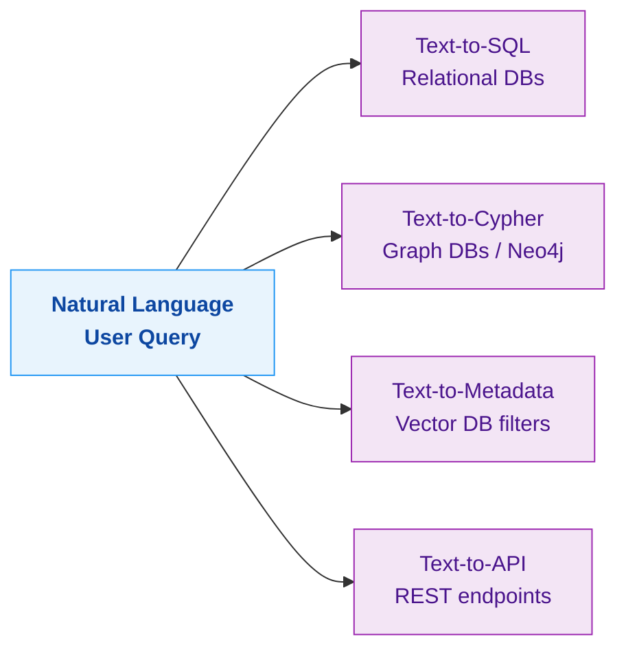

| Construction | Target | Example |
|-------------|--------|---------|
| **Text-to-SQL** | MySQL, PostgreSQL | `SELECT COUNT(*) FROM orders WHERE status='shipped'` |
| **Text-to-Cypher** | Neo4j | `MATCH (n)-[:DEPENDS_ON]->(m) RETURN m.name` |
| **Text-to-Metadata** | Vector DB filters | `filter={"source": "hr_policy.pdf", "page": 42}` |

---

## 11. Indexing — How You Store Matters

### What Is It?

Indexing is about HOW you chunk, embed, and store your documents. Bad indexing → bad retrieval, no matter how good your query is.

### Advanced Indexing Techniques:

```mermaid
flowchart TD
    subgraph IT ["Indexing Techniques"]
        A["1. Multi-Representation Indexing\nStore SUMMARIES for search,\nretrieve FULL documents"]:::idx
        B["2. Parent-Child Indexing\nSmall chunks for SEARCH\nReturn parent chunk for CONTEXT"]:::idx
        C["3. Specialized Embeddings\nText → text embedding model\nCode → code embedding model\nTables → table embedding model"]:::idx
        D["4. ColBERT\nToken-level embeddings\n→ More precise matching"]:::idx
    end
    classDef idx fill:#f1f8e9,stroke:#8BC34A,color:#33691e
```

### In Our Rag_1.py:

```python
# We use basic indexing:
# RecursiveCharacterTextSplitter → OllamaEmbeddings → Qdrant
# This is "Naive Indexing" — works but can be improved
```

---

## 12. Retrieval — Getting the Right Chunks

### What Is It?

The actual search phase — how you find and rank the most relevant chunks from your vector database.

### Retrieval Improvement Techniques:

```mermaid
flowchart TD
    subgraph RT ["Retrieval Techniques"]
        R1["1. Re-Ranking\nInitial search → 20 candidates\nCross-encoder re-ranks → Top 5"]:::ret
        R2["2. Hybrid Search\nVector (semantic) + BM25 (keyword)\n→ Combined results"]:::ret
        R3["3. Corrective RAG (CRAG)\nLLM GRADES each chunk:\n✅ RELEVANT → keep it\n❌ NOT RELEVANT → discard\nAll bad → search web / rewrite"]:::ret
        R4["4. Active Retrieval\nModel decides WHEN to retrieve:\nI know this → answer directly\nI don't know → search Vector DB"]:::ret
    end
    classDef ret fill:#f3e5f5,stroke:#9C27B0,color:#4a148c
```

### Corrective RAG (CRAG) Architecture:

```mermaid
flowchart TD
    Q3(["❓ Query"]):::input --> S["Search Vector DB"]:::step
    S --> C1["c1"] & C2["c2"] & C3["c3"] & C4["c4"] & C5["c5"]
    C1 -->|"✅ RELEVANT"| USE["Use [c1, c3]\nfor answer"]:::good
    C2 -->|"❌ NOT RELEVANT"| FALL["Fallback:\nRewrite query\nSearch web\nTry different DB"]:::bad
    C3 -->|"✅ RELEVANT"| USE
    C4 -->|"AMBIGUOUS"| FALL
    C5 -->|"❌ NOT RELEVANT"| FALL
    USE --> ANS(["✅ Answer"]):::output
    FALL --> ANS
    classDef input fill:#e8f4fd,stroke:#2196F3,color:#0d47a1,font-weight:bold
    classDef step  fill:#f1f8e9,stroke:#8BC34A,color:#33691e
    classDef good  fill:#e8f5e9,stroke:#4CAF50,color:#1b5e20,font-weight:bold
    classDef bad   fill:#ffebee,stroke:#F44336,color:#b71c1c
    classDef output fill:#e0f2f1,stroke:#009688,color:#004d40,font-weight:bold
```

---

## 13. Generation — The Final Answer

### What Is It?

The last stage — the LLM generates the answer from retrieved chunks. But we can optimize this too.

### Generation Techniques:

```mermaid
flowchart TD
    subgraph GEN ["Generation Techniques"]
        G1["1. Self-RAG\nGenerate answer → check self:\nIs answer grounded in chunks? → Yes → done\nAm I hallucinating? → Yes → retrieve + retry"]:::gen
        G2["2. Citation/Grounding\nLLM cites WHICH chunk each sentence came from:\n'According to chunk 3, the policy allows...'"]:::gen
        G3["3. Chain-of-Thought Generation\nReason step-by-step before answering:\nBased on chunk 1, I know X...\nTherefore, the answer is Z."]:::gen
        G4["4. Faithfulness Check\nSecond LLM call verifies answer against chunks:\nDoes this answer contain info NOT in context?\n→ Yes → flag as potential hallucination"]:::gen
    end
    classDef gen fill:#e0f2f1,stroke:#009688,color:#004d40
```

### Self-RAG Architecture:

```mermaid
flowchart TD
    Q4(["❓ Query + Chunks"]):::input --> LLM["🤖 LLM generates answer"]:::llm
    LLM --> EVAL{"🧠 Self-Evaluate:\nIs answer grounded in chunks?"}:::eval
    EVAL -->|"YES"| ANS(["✅ Return answer"]):::good
    EVAL -->|"NO"| MORE["Retrieve MORE or\nDIFFERENT chunks"]:::bad
    MORE --> LLM
    classDef input fill:#e8f4fd,stroke:#2196F3,color:#0d47a1,font-weight:bold
    classDef llm   fill:#fce4ec,stroke:#E91E63,color:#880e4f,font-weight:bold
    classDef eval  fill:#fff8e1,stroke:#FFC107,color:#795548,font-weight:bold
    classDef good  fill:#e8f5e9,stroke:#4CAF50,color:#1b5e20,font-weight:bold
    classDef bad   fill:#ffebee,stroke:#F44336,color:#b71c1c
```

---

## 14. Quick Revision Cheat Sheet

| Concept | One-liner |
|---------|-----------|
| **Query Translation** | Transform user query into better queries before searching vector DB |
| **Garbage In = Garbage Out** | Bad query → bad chunks → bad answer. Fix the query first! |
| **What user ASKS ≠ What user WANTS** | Query translation bridges this gap |
| **Abstraction Spectrum** | Too vague = random chunks. Too specific = misses context. Sweet spot = middle |
| **Multi-Query / RAG Fusion** | LLM generates 3-5 question versions → search each → merge results |
| **Fan-Out** | One input → multiple parallel outputs (like a fan spreading out) |
| **RRF (Reciprocal Rank Fusion)** | Ranking algorithm: `Σ 1/(k + rank)` — rewards chunks appearing in multiple lists |
| **k=60 in RRF** | Dampening constant — prevents rank 1 from dominating, rewards breadth |
| **Query Decomposition** | Break complex query into sub-questions → answer each → combine |
| **Step-Back Prompting** | Go MORE ABSTRACT — ask general question first, then specific |
| **Chain-of-Thought Decomp** | Go LESS ABSTRACT — break into detailed step-by-step plan |
| **Few-Shot for Translation** | Give LLM examples of good query rewrites so it produces better ones |
| **HyDE** | LLM generates hypothetical answer → embed THAT → search (needs large models) |
| **HyDE ❌ Legal Docs** | LLM might generate wrong legal terminology → bad embeddings |
| **Routing** | Classify query → send to right DB (Vector, Graph, SQL) |
| **Logical Routing** | LLM classifies query type using rules/prompt |
| **Semantic Routing** | Compare query embedding to pre-defined route embeddings |
| **Query Construction** | Natural language → Text-to-SQL, Text-to-Cypher, Text-to-Metadata |
| **Multi-Rep Indexing** | Embed summaries for search, return full docs for context |
| **Parent-Child Indexing** | Small chunks for search precision, return parent chunk for context |
| **ColBERT** | Token-level embeddings instead of document-level — more precise matching |
| **Re-Ranking** | Initial search gets candidates, cross-encoder re-ranks for precision |
| **Corrective RAG** | LLM grades each chunk as RELEVANT/NOT → discards bad ones → retries if all bad |
| **Self-RAG** | LLM evaluates its own answer → retries if not grounded in context |
| **Faithfulness Check** | Second LLM call verifies answer against chunks for hallucinations |
| **Song Analogy** | You hum a tune → friend recognizes the song = vague input → translated to precise query |
| **Legal Docs Need** | Step-Back + Decomposition + Few-Shot (NOT HyDE) — domain-specific accuracy |
| **Simple Chatbot Needs** | Basic RAG or Multi-Query — don't over-engineer |

### When to Use What — Decision Matrix:

```mermaid
flowchart LR
    subgraph DM ["Use Case Decision Matrix"]
        U1["Simple coding chatbot\n→ Naive RAG"]:::naive
        U2["Legal document search\n→ Step-Back + Decomposition + Few-Shot + RRF"]:::legal
        U3["Exploratory/browse\n→ HyDE + Multi-Query"]:::explore
        U4["Multi-source data\n→ Routing + Query Construction"]:::multi
        U5["High-accuracy required\n→ CRAG + Self-RAG + Re-Rank"]:::highAcc
        U6["Tabular/structured data\n→ TAG + Text-to-SQL"]:::tabular
        U7["Relationship-heavy data\n→ GraphRAG + Routing"]:::graph
    end
    classDef naive   fill:#e8f4fd,stroke:#2196F3,color:#0d47a1
    classDef legal   fill:#f3e5f5,stroke:#9C27B0,color:#4a148c
    classDef explore fill:#ede7f6,stroke:#673AB7,color:#311b92
    classDef multi   fill:#fff3e0,stroke:#FF9800,color:#e65100
    classDef highAcc fill:#fce4ec,stroke:#E91E63,color:#880e4f
    classDef tabular fill:#f1f8e9,stroke:#8BC34A,color:#33691e
    classDef graph   fill:#e0f2f1,stroke:#009688,color:#004d40
```

### The Complete Advanced RAG Pipeline:

```mermaid
flowchart TD
    Q5(["❓ User Query"]):::input

    subgraph QT ["1. Query Translation"]
        QT1["Multi-Query / Step-Back / Decomposition / HyDE"]:::stage
    end

    subgraph RT2 ["2. Routing"]
        RT1["Where should this go?\nVector DB? Graph DB? SQL?"]:::stage
    end

    subgraph QC ["3. Query Construction"]
        QC1["Natural lang → DB language\nText-to-SQL / Cypher / Metadata filters"]:::stage
    end

    subgraph RET ["4. Retrieval"]
        R1["Search → RRF Ranking → Re-Rank → CRAG grading"]:::stage
    end

    subgraph GN ["5. Generation"]
        G1["LLM answers with context\nSelf-RAG check → Citations → Final answer"]:::stage
    end

    Q5 --> QT --> RT2 --> QC --> RET --> GN --> ANS(["✅ Answer"]):::output

    classDef input fill:#e8f4fd,stroke:#2196F3,color:#0d47a1,font-weight:bold
    classDef stage fill:#f1f8e9,stroke:#8BC34A,color:#33691e
    classDef output fill:#e0f2f1,stroke:#009688,color:#004d40,font-weight:bold
```
