# RAG (Retrieval-Augmented Generation) — Complete Notes

---

## Table of Contents

**Prerequisites (Understand These First):**
1. [The Problem RAG Solves](#1-the-problem-rag-solves)
2. [What is Vector Embedding?](#2-what-is-vector-embedding)
3. [What are Vector Databases?](#3-what-are-vector-databases)

**Core Concept:**
4. [What is RAG?](#4-what-is-rag)
5. [RAG Architecture — System Design](#5-rag-architecture--system-design)

**The Two Pipelines:**
6. [Indexing Pipeline — Preparing Your Data](#6-indexing-pipeline--preparing-your-data)
7. [Retrieval Pipeline — Answering Questions](#7-retrieval-pipeline--answering-questions)

**Implementation:**
8. [Building RAG with LangChain](#8-building-rag-with-langchain)
9. [LangChain LCEL — Chaining Components](#9-langchain-lcel--chaining-components)
10. [Problems with LangChain](#10-problems-with-langchain)

**Advanced:**
11. [RAG Optimization Techniques](#11-rag-optimization-techniques)
12. [Query Translation — Making Searches Smarter](#12-query-translation--making-searches-smarter)
13. [Reciprocal Rank Fusion (RRF) — Merging Results](#13-reciprocal-rank-fusion-rrf--merging-results)
14. [HyDE — When Users Don't Know What to Ask](#14-hyde--when-users-dont-know-what-to-ask)
15. [Advanced Chunking — It's Not That Simple](#15-advanced-chunking--its-not-that-simple)
16. [Beyond Vector Embeddings — Graph Databases](#16-beyond-vector-embeddings--graph-databases)
17. [RAG Variants — Different Architectures](#17-rag-variants--different-architectures)

**Reference:**
18. [Why Every RAG Code Looks Different](#18-why-every-rag-code-looks-different)
19. [Quick Revision Cheat Sheet](#19-quick-revision-cheat-sheet)

---

## 1. The Problem RAG Solves

### LLMs are Powerful but Limited

LLMs (GPT, Claude, LLaMA) know a LOT of general information, but they have **3 critical problems**:

| Problem | Example |
|---------|---------|
| **Knowledge Cutoff** | "What happened yesterday?" — LLM doesn't know, it was trained months/years ago |
| **No Private Data** | "What's in my company's HR policy PDF?" — LLM has never seen it |
| **Hallucinations** | LLM confidently makes up answers when it doesn't know |

### The Naive Solution: Stuff Everything in the Prompt

You could paste your entire PDF into the system prompt:

```python
system_prompt = f"""
You are a helpful assistant. Answer based on THIS context:
{entire_pdf_text}
"""
```

**Problems with this approach:**
- LLMs have a **context window limit** (e.g., 8K, 32K, 128K tokens)
- A 255-page PDF is WAY too big to fit
- Even if it fits, it's **expensive** (you pay per token)
- LLM performance **degrades** with too much context

> **RAG solves this:** Instead of stuffing EVERYTHING, only fetch the RELEVANT parts and give those to the LLM.

---

## 2. What is Vector Embedding?

### Traditional Database Search vs Vector Search

**Traditional DB (SQL/Regex Pattern Matching):**
```sql
SELECT * FROM users WHERE name LIKE '%sahil%';
SELECT * FROM products WHERE name LIKE '%car%';
```

- This is **exact keyword matching** — searching for the literal string "car"
- If you search "car", you will NOT find "Honda", "Toyota", "automobile", "vehicle"
- It matches **characters**, not **meaning**

**Vector Embedding Search:**
- Words/sentences are converted into **numerical vectors** (list of numbers)
- These vectors live in a **multi-dimensional space** (think 3D space but with 100s or 1000s of dimensions)
- Words with **similar meanings** are **close together** in this space

```
"car"    → [0.8, 0.2, 0.1, ...]
"Honda"  → [0.75, 0.25, 0.15, ...]   ← CLOSE to "car"!
"Toyota" → [0.78, 0.22, 0.12, ...]   ← CLOSE to "car"!
"banana" → [0.1, 0.9, 0.3, ...]      ← FAR from "car"
```

> **The magic:** If you search for "car", vector search will ALSO return "Honda", "Toyota", "automobile" because they are **semantically similar** (close in vector space).

### How Embeddings Capture Meaning (Visualized in 3D)

```
        ↑ (Vehicle dimension)
        |
  car ● ● Honda
        ● Toyota
        ● automobile
        |
        |          ● banana
        |          ● mango
        |               ● apple
        +────────────────────→ (Food dimension)
       /
      / (Color dimension)
```

- "Car", "Honda", "Toyota" are **clustered together** (similar meaning)
- "Banana", "Mango", "Apple" are in a **different cluster**
- The **distance** between vectors = how similar the meanings are

### How We Created Embeddings (`embedding.py`)

```python
from openai import OpenAI
client = OpenAI()

text = "Eiffel Tower is in Paris and is a famous landmark"
response = client.embeddings.create(
    input=text,
    model="text-embedding-3-small"
)
print(response.data[0].embedding)  # [0.023, -0.041, 0.067, ...] → 1536 numbers!
```

- Each text gets converted into a **vector of 1536 numbers** (for this model)
- These numbers **encode the semantic meaning** of the text
- **Vector embedding is ONLY used for similarity search** — finding which chunks are relevant to the user's question

---

## 3. What are Vector Databases?

A **Vector Database** is a specialized database designed to store, index, and search **vector embeddings** efficiently.

> Now that we know what embeddings are (numbers capturing meaning), we need a place to STORE and SEARCH them. That's what vector databases do.

### Why Not a Regular Database?

```
Regular DB:    SELECT * WHERE text LIKE '%machine learning%'  ← exact match only
Vector DB:     Find vectors closest to [0.045, 0.032, ...]    ← semantic similarity
```

### Popular Vector Databases:

| Database | Type | Free Tier | Best For |
|----------|------|-----------|----------|
| **Pinecone** | Cloud (managed) | Yes (limited) | Production apps, easy setup |
| **ChromaDB** | Local / Self-hosted | Free (open source) | Development, prototyping |
| **Qdrant** | Local / Cloud | Free (open source) | High performance, filtering |
| **PGVector** | PostgreSQL extension | Free | If you already use PostgreSQL |
| **AstraDB** | Cloud (DataStax) | Yes | Cassandra-based, scalable |
| **Weaviate** | Local / Cloud | Free (open source) | GraphQL API, multi-modal |
| **FAISS** | Library (Facebook) | Free | Research, in-memory search |

### How Vector Search Works (Similarity Search)

When you search, the DB calculates **distance** between your query vector and all stored vectors:

```
Query:   "What is deep learning?"  → [0.8, 0.3, 0.1]

Stored vectors:
Chunk A: "Deep learning uses neural networks"  → [0.78, 0.32, 0.12]  ← Distance: 0.05 (CLOSE!)
Chunk B: "Python is a programming language"    → [0.1, 0.9, 0.4]     ← Distance: 0.89 (FAR)
Chunk C: "Neural networks have multiple layers" → [0.75, 0.35, 0.15] ← Distance: 0.09 (CLOSE!)

→ Returns: Chunk A and Chunk C (most similar)
```

**Distance Metrics:**
- **Cosine Similarity** — Most common. Measures angle between vectors (0-1, higher = more similar)
- **Euclidean Distance** — Straight-line distance (lower = more similar)
- **Dot Product** — Faster, used when vectors are normalized

### 📌 In Our Project (Rag_1.py)

We use **Qdrant** as our vector database, running locally via Docker:

```yaml
# docker-compose.db.yml
services:
  qdrant:
    image: qdrant/qdrant
    ports:
      - 6333:6333
```

**Run it:**
```bash
docker compose -f docker-compose.db.yml up
```

Qdrant runs on `http://localhost:6333` and also provides a **web dashboard** at http://localhost:6333/dashboard where you can browse collections, view stored vectors, and test searches.

---

## 4. What is RAG?

**RAG = Retrieval-Augmented Generation**

| Word | Meaning |
|------|---------|
| **Retrieval** | Go FETCH relevant information from your data |
| **Augmented** | ADD that information to the LLM's prompt |
| **Generation** | LLM GENERATES an answer using that added context |

> **Simple definition:** Instead of relying on what the LLM already knows, first SEARCH your own data for relevant info, then give it to the LLM to answer.

### RAG vs No RAG

```
WITHOUT RAG:
User: "What's our company leave policy?"
LLM: "I don't have that information." (or worse, it hallucinates)

WITH RAG:
User: "What's our company leave policy?"
System: *searches company HR PDF* → finds relevant paragraphs
LLM: "According to your HR policy, employees get 24 paid leaves per year..."
```

### The Core Idea

```
RAG = Your Data + Similarity Search + LLM

1. Store your data as vector embeddings
2. When user asks a question, find similar chunks
3. Feed those chunks + question to LLM
4. LLM answers using YOUR data, not its training data
```

---

## 5. RAG Architecture — System Design

RAG has **2 main pipelines** that work together:

```mermaid
flowchart TD
    subgraph P1 [" 📥 Pipeline 1 — INDEXING  \n one-time setup "]
        DS["📁 Data Source\nPDF / CSV / Web / Docs"]:::source
        CH["✂️ Chunking\nSplit into pieces"]:::step
        EM["🔢 Embeddings\nConvert to vectors"]:::step
        VDB[("🗄️ Vector DB\nStore for searching")]:::db
        DS --> CH --> EM --> VDB
    end

    subgraph P2 [" 🔍 Pipeline 2 — RETRIEVAL  \n runs on every user question "]
        UQ(["❓ User Question"]):::input
        EQ["🔢 Embed Question\nsame embedding model"]:::step
        SV["🔍 Search Vector DB\ncosine similarity"]:::step
        RC["📦 Relevant Chunks\nTop K results"]:::step
        LLM["🤖 LLM\nGPT / Claude / Gemini"]:::llm
        ANS(["✅ Final Answer"]):::output
        UQ --> EQ --> SV --> RC --> LLM
        UQ --> LLM
        LLM --> ANS
    end

    VDB --> SV

    classDef source   fill:#e8f4fd,stroke:#2196F3,color:#0d47a1
    classDef step     fill:#f1f8e9,stroke:#8BC34A,color:#33691e
    classDef db       fill:#f3e5f5,stroke:#9C27B0,color:#4a148c
    classDef input    fill:#fff8e1,stroke:#FFC107,color:#795548,font-weight:bold
    classDef llm      fill:#fce4ec,stroke:#E91E63,color:#880e4f,font-weight:bold
    classDef output   fill:#e0f2f1,stroke:#009688,color:#004d40,font-weight:bold
```

---

## 6. Indexing Pipeline — Preparing Your Data

This is the **one-time setup** — preparing your data so it can be searched. (Pipeline 1 from the architecture above)

### The 4 Steps:

```
Data Source → Chunking → Embedding → Store in Vector DB
```

### Step 1: Load Data Source

Your data can come from anywhere:

| Data Source | Examples |
|-------------|----------|
| Documents | PDF, DOCX, PPTX |
| Structured Data | CSV, Excel, JSON |
| Web Pages | HTML, scraped content |
| Databases | SQL, MongoDB |
| Code | GitHub repos, source files |

For a **255-page PDF**, you first extract all the text from it.

> 📌 **In Our Rag_1.py:** We load a `nodejs.pdf` file using `PyPDFLoader`:
> ```python
> from langchain_community.document_loaders import PyPDFLoader
> pdf_path = Path(__file__).parent / "nodejs.pdf"
> loader = PyPDFLoader(file_path=pdf_path)
> docs = loader.load()
> ```

### Step 2: Chunking (Splitting)

A 255-page PDF is too big to embed as one piece. We **split it into smaller chunks**.

```
PDF (255 pages)
    ↓
Page 1: "Chapter 1: Introduction to Machine Learning..."
Page 2: "Supervised learning involves..."
Page 3: "Neural networks are..."
...
Page 255: "Conclusion and future work..."
```

**Why chunk?**
- Embedding models have **max token limits** (e.g., 512 or 8192 tokens)
- Smaller chunks = **more precise** search results
- You don't want to retrieve an entire chapter when only 1 paragraph is relevant

**Chunking Strategies:**

| Strategy | How it works | When to use |
|----------|-------------|-------------|
| **Fixed Size** | Split every 500 characters | Simple, predictable |
| **By Paragraph** | Split on `\n\n` | Preserves natural breaks |
| **By Page** | One chunk per page | Good for PDFs |
| **Recursive** | Try paragraph → sentence → character | Most flexible (LangChain default) |
| **Overlap** | Each chunk overlaps with next by ~50-100 chars | Prevents losing context at boundaries |

> 📌 **In Our Rag_1.py:** We use `RecursiveCharacterTextSplitter` with 1000-char chunks and 200-char overlap:
> ```python
> text_splitter = RecursiveCharacterTextSplitter(chunk_size=1000, chunk_overlap=200)
> split_docs = text_splitter.split_documents(documents=docs)
> ```

```
Without overlap:
Chunk 1: "...machine learning is powerful"
Chunk 2: "because it can learn patterns from data..."
→ Lost context! "powerful because" is split across chunks.

With overlap (100 chars):
Chunk 1: "...machine learning is powerful because it can"
Chunk 2: "is powerful because it can learn patterns from data..."
→ Context preserved!
```

### Step 3: Convert Chunks to Embeddings

Each chunk is converted to a vector using an **embedding model**:

```python
# Using OpenAI
response = client.embeddings.create(
    input="Machine learning is a subset of AI...",
    model="text-embedding-3-small"
)
vector = response.data[0].embedding  # [0.023, -0.041, ...] (1536 numbers)
```

**Embedding Models:**

| Model | Provider | Dimensions | Notes |
|-------|----------|-----------|-------|
| `text-embedding-3-small` | OpenAI | 1536 | Good balance of quality & cost |
| `text-embedding-3-large` | OpenAI | 3072 | Best quality, more expensive |
| `all-MiniLM-L6-v2` | Hugging Face (free) | 384 | Free, runs locally |
| `Gemini embedding` | Google | 768 | Free tier available |
| `Cohere embed` | Cohere | 1024 | Good for multilingual |
| `nomic-embed-text` | Ollama (free, local) | 768 | **Used in our Rag_1.py** — runs via Ollama |

> 📌 **In Our Rag_1.py:** We use **OllamaEmbeddings** with the `nomic-embed-text` model (free, runs locally via Ollama):
> ```python
> from langchain_ollama import OllamaEmbeddings
> embeddings = OllamaEmbeddings(
>     model="nomic-embed-text",
>     base_url="http://localhost:11434"
> )
> ```
> This means **zero cost** — no API key needed, embeddings run on your own machine.

### Step 4: Store in Vector Database

Store the vectors (with their original text) in a **vector database**:

```
Vector DB stores:
┌──────────────────────────────────────────────┐
│  ID  │  Vector (1536 numbers)  │  Text       │
├──────┼──────────────────────────┼─────────────┤
│  1   │  [0.023, -0.041, ...]   │  "Chapter 1 │
│  2   │  [0.067, 0.012, ...]    │  "ML is a.. │
│  3   │  [0.089, -0.055, ...]   │  "Neural ne │
│  ...                                          │
└──────────────────────────────────────────────┘
```

> 📌 **In Our Rag_1.py — Ingestion Phase (commented out, run once):**
> ```python
> vector_store = QdrantVectorStore.from_documents(
>     documents=[],
>     url="http://localhost:6333",
>     collection_name="nodejs",
>     embedding=embeddings
> )
> vector_store.add_documents(documents=split_docs)
> print("Ingestion done")
> ```
> - `from_documents(documents=[])` → Creates the Qdrant collection with the right vector config
> - `add_documents(split_docs)` → Embeds each chunk using OllamaEmbeddings and stores them in Qdrant
> - This code is **commented out** after the first run because the data is already in Qdrant

---

## 7. Retrieval Pipeline — Answering Questions

This runs **every time a user asks a question**: (Pipeline 2 from the architecture above)

### The Flow:

```mermaid
flowchart TD
    Q(["❓ User Question\n'What is supervised learning?'"]):::input
    E["🔢 Step 1: Embed Question\n→ vector &#91;0.045, 0.032, ...&#93;"]:::step
    S["🔍 Step 2: Search Vector DB\nFind similar vectors"]:::step
    K["📦 Step 3: Get Top-K Chunks\ne.g. top 3–5 results"]:::step
    F["⚖️ Step 4: Filter & Rank\nRemove low-relevance chunks"]:::step
    P["📝 Step 5: Build Prompt\nSystem Prompt + Chunks + Question"]:::step
    L["🤖 Step 6: LLM\nGPT / Claude / Gemini"]:::llm
    A(["✅ Final Answer"]):::output

    Q --> E --> S --> K --> F --> P --> L --> A

    classDef input  fill:#e8f4fd,stroke:#2196F3,color:#0d47a1,font-weight:bold
    classDef step   fill:#f1f8e9,stroke:#8BC34A,color:#33691e
    classDef llm    fill:#fce4ec,stroke:#E91E63,color:#880e4f,font-weight:bold
    classDef output fill:#e0f2f1,stroke:#009688,color:#004d40,font-weight:bold
```

### What the LLM Actually Sees:

```python
messages = [
    {
        "role": "system",
        "content": """You are a helpful assistant. Answer questions based ONLY on
        the provided context. If the answer is not in the context, say 'I don't know.'

        Context:
        ---
        Chunk 1: "Supervised learning is a type of machine learning where the model
        learns from labeled data. Each training example has an input and a correct output..."

        Chunk 2: "Common supervised learning algorithms include linear regression,
        decision trees, and neural networks..."

        Chunk 3: "In supervised learning, the model adjusts its parameters to minimize
        the difference between predicted and actual outputs..."
        ---
        """
    },
    {
        "role": "user",
        "content": "What is supervised learning?"
    }
]
```

> The LLM never sees the full 255-page PDF. It only sees the **3-5 most relevant chunks**. This is the power of RAG — reduce but keep all needed info.

### 📌 In Our Rag_1.py — Retrieval Phase

```python
# Connect to EXISTING Qdrant collection (data already ingested)
retriever = QdrantVectorStore.from_existing_collection(
    url="http://localhost:6333",
    collection_name="nodejs",
    embedding=embeddings
)

# Similarity search — find chunks relevant to our question
relevant_chunks = retriever.similarity_search(
    query="What is FS Module?"
)

# Build system prompt with retrieved context
SYSTEM_PROMPT = """ You are a helpful assistant who responds based on the available context

context:
{relevant_chunks}
"""
```

**What happens step by step:**

| Step | Code | What it does |
|------|------|--------------|
| 1 | `from_existing_collection()` | Connects to Qdrant (doesn't re-ingest — data already there) |
| 2 | `similarity_search(query=...)` | Embeds the query using same `nomic-embed-text` → searches Qdrant → returns top matching chunks |
| 3 | `SYSTEM_PROMPT` with `{relevant_chunks}` | Injects only the relevant chunks into the LLM prompt |

> **Key insight:** `from_existing_collection()` vs `from_documents()` — the first is for **retrieval** (data already stored), the second is for **ingestion** (first-time storing). In Rag_1.py, ingestion code is commented out because we already ran it once.

---

## 8. Building RAG with LangChain

### What is LangChain?

LangChain is a **Python library** that provides **pre-built wrappers** (helper functions) for every step of the RAG pipeline. Instead of writing everything from scratch, you use their functions.

> **Think of it as:** A collection of ready-made building blocks for AI apps. Like how Express.js gives you ready-made middleware for web apps.

### What LangChain Provides:

```
Without LangChain — you write everything yourself:
  def load_pdf(path): ...
  def split_text(text, chunk_size): ...
  def embed_chunks(chunks): ...
  def save_to_pinecone(vectors): ...
  def search_pinecone(query): ...
  def chat_with_llm(context, question): ...

With LangChain — use their ready-made classes:
  from langchain_community.document_loaders import PyPDFLoader
  from langchain.text_splitter import RecursiveCharacterTextSplitter
  from langchain_openai import OpenAIEmbeddings
  from langchain_pinecone import PineconeVectorStore
  from langchain_openai import ChatOpenAI
```

### LangChain Components Mapped to RAG Steps:

#### 1. Document Loaders — Load Data from Any Source

```python
from langchain_community.document_loaders import (
    PyPDFLoader,          # PDF files
    Docx2txtLoader,       # Word documents (.docx)
    CSVLoader,            # CSV files
    UnstructuredExcelLoader,  # Excel files
    WebBaseLoader,        # Web pages
    TextLoader,           # Plain text files
    UnstructuredPowerPointLoader,  # PowerPoint files
)

# Example: Load a PDF
loader = PyPDFLoader("machine_learning.pdf")
documents = loader.load()        # Returns list of Document objects
# Each Document has: .page_content (text) and .metadata (page number, source, etc.)
```

> LangChain has **100+ loaders** — PDF, CSV, Excel, PPT, web pages, YouTube transcripts, GitHub repos, Notion, Google Drive, etc.

#### 2. Text Splitters — Chunk Your Documents

```python
from langchain.text_splitter import RecursiveCharacterTextSplitter

splitter = RecursiveCharacterTextSplitter(
    chunk_size=1000,       # Max characters per chunk
    chunk_overlap=200,     # Overlap between chunks (prevents losing context)
    separators=["\n\n", "\n", " ", ""]  # Try splitting by paragraph first, then line, etc.
)

chunks = splitter.split_documents(documents)
# chunks = [Document(page_content="...", metadata={...}), ...]
```

#### 3. Embedding Models — Convert Chunks to Vectors

```python
from langchain_openai import OpenAIEmbeddings
from langchain_community.embeddings import HuggingFaceEmbeddings

# Using OpenAI (paid)
embeddings = OpenAIEmbeddings(model="text-embedding-3-small")

# Using Hugging Face (free, runs locally)
embeddings = HuggingFaceEmbeddings(model_name="all-MiniLM-L6-v2")

# Using Ollama (free, runs locally) ← Used in our Rag_1.py
from langchain_ollama import OllamaEmbeddings
embeddings = OllamaEmbeddings(
    model="nomic-embed-text",
    base_url="http://localhost:11434"
)
```

#### 4. Vector Stores — Store and Search Embeddings

```python
from langchain_pinecone import PineconeVectorStore
from langchain_community.vectorstores import Chroma, Qdrant, FAISS
from langchain_postgres import PGVector
from langchain_qdrant import QdrantVectorStore  # ← Used in our Rag_1.py

# Store chunks in Pinecone
vectorstore = PineconeVectorStore.from_documents(
    documents=chunks,
    embedding=embeddings,
    index_name="my-index"
)

# OR store in ChromaDB (local, free)
vectorstore = Chroma.from_documents(
    documents=chunks,
    embedding=embeddings,
    persist_directory="./chroma_db"
)

# OR store in Qdrant (local via Docker) ← Used in our Rag_1.py
vectorstore = QdrantVectorStore.from_documents(
    documents=chunks,
    url="http://localhost:6333",
    collection_name="my-collection",
    embedding=embeddings
)

# Search
results = vectorstore.similarity_search("What is deep learning?", k=3)
# Returns top 3 most relevant chunks
```

#### 5. LLM — Generate the Answer

```python
from langchain_openai import ChatOpenAI
from langchain_community.chat_models import ChatOllama

# Using OpenAI
llm = ChatOpenAI(model="gpt-4o", temperature=0)

# Using Ollama (self-hosted, free)
llm = ChatOllama(model="qwen2.5:0.5b")
```

#### 6. Putting It All Together — Our Rag_1.py (Complete RAG)

Here's the **actual code** from our project (`Rag_1.py`) with explanations:

```python
# === IMPORTS ===
from langchain_community.document_loaders import PyPDFLoader       # Load PDF
from langchain_text_splitters import RecursiveCharacterTextSplitter # Chunk text
from langchain_ollama import OllamaEmbeddings                      # Embed with Ollama (free, local)
from langchain_qdrant import QdrantVectorStore                     # Store/search in Qdrant
from dotenv import load_dotenv
from pathlib import Path

load_dotenv()

# === INDEXING PIPELINE (one-time setup) ===

# Step 1: Load PDF
pdf_path = Path(__file__).parent / "nodejs.pdf"
loader = PyPDFLoader(file_path=pdf_path)
docs = loader.load()  # Returns list of Document objects (one per page)

# Step 2: Chunk
text_splitter = RecursiveCharacterTextSplitter(chunk_size=1000, chunk_overlap=200)
split_docs = text_splitter.split_documents(documents=docs)

# Step 3: Create Embedding Model
embeddings = OllamaEmbeddings(
    model="nomic-embed-text",           # Free embedding model via Ollama
    base_url="http://localhost:11434"    # Ollama running locally
)

# Step 4: Store in Qdrant (run once, then comment out)
# vector_store = QdrantVectorStore.from_documents(
#     documents=[],
#     url="http://localhost:6333",       # Qdrant running via Docker
#     collection_name="nodejs",
#     embedding=embeddings
# )
# vector_store.add_documents(documents=split_docs)
# print("Ingestion done")

# === RETRIEVAL PIPELINE (every query) ===

# Step 5: Connect to existing collection
retriever = QdrantVectorStore.from_existing_collection(
    url="http://localhost:6333",
    collection_name="nodejs",
    embedding=embeddings
)

# Step 6: Search for relevant chunks
relevant_chunks = retriever.similarity_search(
    query="What is FS Module?"
)

# Step 7: Build prompt with context
SYSTEM_PROMPT = """ You are a helpful assistant who responds based on the available context

context:
{relevant_chunks}
"""
```

### Rag_1.py — Line-by-Line Mapping to RAG Pipeline:

```
Rag_1.py Code                          →  RAG Pipeline Step
─────────────────────────────────────────────────────────────
PyPDFLoader("nodejs.pdf")              →  Step 1: Load Data Source
loader.load()                          →  (returns Document objects per page)
RecursiveCharacterTextSplitter(...)     →  Step 2: Chunking
text_splitter.split_documents(docs)     →  (splits into 1000-char chunks with 200 overlap)
OllamaEmbeddings("nomic-embed-text")   →  Step 3: Embedding Model (local, free)
QdrantVectorStore.from_documents(...)   →  Step 4: Store in Vector DB (ingestion)
add_documents(split_docs)              →  (embed + store all chunks)
────────────── INGESTION DONE ──────────────────────────────
from_existing_collection(...)           →  Connect to existing Qdrant collection
similarity_search(query=...)            →  Step 5: Search Vector DB
SYSTEM_PROMPT + {relevant_chunks}       →  Step 6: Build prompt with context
                                        →  Step 7: Send to LLM (not shown yet)
```

### Infrastructure Required to Run Rag_1.py:

```
┌─────────────────────────────────────────────────────────┐
│  What You Need Running:                                 │
│                                                         │
│  1. Ollama (Docker)    → localhost:11434                │
│     └── For: nomic-embed-text embedding model           │
│     └── Run: docker compose -f docker-compose.yml up    │
│                                                         │
│  2. Qdrant (Docker)    → localhost:6333                 │
│     └── For: Vector database storage + search           │
│     └── Run: docker compose -f docker-compose.db.yml up │
│     └── Dashboard: http://localhost:6333/dashboard       │
│                                                         │
│  3. nodejs.pdf         → Same folder as Rag_1.py        │
│     └── For: The document to be RAG'd                   │
│                                                         │
│  4. Python packages:                                    │
│     pip install langchain-community langchain-text-      │
│     splitters langchain-ollama langchain-qdrant          │
│     python-dotenv pypdf                                  │
└─────────────────────────────────────────────────────────┘
```

---

## 9. LangChain LCEL — Chaining Components

### What is LCEL?

LCEL is LangChain's way of **chaining components together** using the **pipe `|` operator** — similar to Unix pipes.

> Instead of calling each function one by one, you build a **chain** and invoke it in one go.

### Creating an Ingest Chain (Indexing)

To create an ingest chain, you need: **Loader → Splitter → Embedding Model → Vector Store**

```python
from langchain_community.document_loaders import PyPDFLoader
from langchain.text_splitter import RecursiveCharacterTextSplitter
from langchain_openai import OpenAIEmbeddings
from langchain_community.vectorstores import Qdrant

# Individual components
loader = PyPDFLoader("handbook.pdf")
splitter = RecursiveCharacterTextSplitter(chunk_size=1000, chunk_overlap=200)
embeddings = OpenAIEmbeddings()

# Chain them together
docs = loader.load()
chunks = splitter.split_documents(docs)
vectorstore = Qdrant.from_documents(chunks, embeddings, location=":memory:")
```

### Creating a Retrieval Chain (Querying)

```python
from langchain_core.prompts import ChatPromptTemplate
from langchain_openai import ChatOpenAI
from langchain_core.output_parsers import StrOutputParser
from langchain_core.runnables import RunnablePassthrough

# Components
retriever = vectorstore.as_retriever(search_kwargs={"k": 3})
llm = ChatOpenAI(model="gpt-4o")

# Prompt template
prompt = ChatPromptTemplate.from_template("""
    Answer the question based on the context:
    Context: {context}
    Question: {question}
""")

# Build the chain using LCEL pipe operator
chain = (
    {"context": retriever, "question": RunnablePassthrough()}
    | prompt
    | llm
    | StrOutputParser()
)

# Run it!
answer = chain.invoke("What is the leave policy?")
print(answer)
```

### How the Chain Works (Step by Step):

```
chain.invoke("What is the leave policy?")

Step 1: RunnablePassthrough()
        → Passes "What is the leave policy?" as-is

Step 2: retriever
        → Searches vector DB → Returns relevant chunks as "context"

Step 3: prompt
        → Fills template: Context: {chunks} + Question: {user query}

Step 4: llm
        → Sends filled prompt to GPT-4o

Step 5: StrOutputParser()
        → Extracts the text string from LLM response

→ Returns: "Employees get 24 paid leaves per year..."
```

### LCEL Pipe Operator Explained

```python
# LCEL style (chained)
chain = prompt | llm | parser
result = chain.invoke(input)

# Same thing without LCEL (manual)
filled_prompt = prompt.invoke(input)
llm_response = llm.invoke(filled_prompt)
result = parser.invoke(llm_response)
```

> **The `|` operator** = "pass the output of the left side as input to the right side" — just like Unix pipes (`cat file.txt | grep "hello" | wc -l`).

---

## 10. Problems with LangChain

LangChain is popular but has **real problems** that developers complain about:

### 1. Too Much Abstraction

```python
# What's happening inside? Who knows! 🤷
chain = load_qa_chain(llm, chain_type="stuff")
answer = chain.run(input_documents=docs, question=query)
# What is "stuff"? What chain_type options exist? What's run() doing?
```

> When something breaks, you have **no idea** which layer failed because everything is abstracted away.

### 2. Things Get Out of Control

- LangChain updates **frequently** — APIs break between versions
- Simple things require **many layers of abstraction**
- Debugging is painful — error messages are cryptic
- You end up reading LangChain source code to understand what's happening

### 3. Performance Overhead

- LangChain adds **unnecessary overhead** for simple use cases
- Sometimes it's faster to write 20 lines of raw Python than use LangChain

### 4. The Alternative: Build It Yourself

For simple RAG, you really only need:
```python
# That's it. No LangChain needed.
import openai
import chromadb

# Load PDF → extract text (PyPDF2)
# Split into chunks (simple string slicing)
# Embed chunks (openai.embeddings.create)
# Store in ChromaDB (chromadb.Client)
# Search (collection.query)
# Send to LLM (openai.chat.completions.create)
```

### When to Use LangChain vs Not:

| Use LangChain | Don't Use LangChain |
|---------------|---------------------|
| Quick prototyping | Production systems |
| Need many data loaders | e |
| Complex chains with branching | When you need full control |
| Learning RAG concepts | When debugging matters |
| Hackathon/demo | Performance-critical apps |

---

## 11. RAG Optimization Techniques

### Basic RAG Problems & Solutions:

#### 1. Chunk Size OptimizationSimple RAG pipelin

```
Too small chunks (100 chars) → Loses context, retrieves fragmented info
Too large chunks (5000 chars) → Retrieves irrelevant noise, wastes tokens
Sweet spot: 500-1500 chars with 100-200 overlap
```

#### 2. Hybrid Search (Keyword + Vector)

Combine traditional keyword search with vector search:
```
Vector search: "What's the refund policy?"  → Finds semantically similar chunks
Keyword search: "refund policy"             → Finds chunks with exact words
Hybrid: Combine both results → Better recall
```

#### 3. Re-Ranking

After retrieving top K chunks, **re-rank** them using a cross-encoder model to improve relevance:
```
Initial retrieval: 20 chunks (fast but rough)
Re-ranking: Score each chunk against the query (slow but accurate)
Final: Top 3-5 best chunks
```

#### 4. Query Transformation

Sometimes the user's question is vague. Transform it before searching:
```
Original: "Tell me about it"
Transformed: "Tell me about the company's leave policy" (using conversation context)
```

#### 5. Multi-Query RAG

Generate **multiple versions** of the user's question and search for all of them:
```
Original: "How does authentication work?"
Query 1: "What is the authentication mechanism?"
Query 2: "How do users log in?"
Query 3: "What security protocols are used for auth?"
→ Search all 3 → Merge results → More comprehensive retrieval
```

#### 6. Contextual Compression

After retrieving chunks, **compress** them — extract only the relevant sentences:
```
Retrieved chunk (500 chars): "The company was founded in 2010. It has 500 employees.
The leave policy allows 24 paid leaves per year. The office is in Mumbai..."

Compressed (relevant part only): "The leave policy allows 24 paid leaves per year."
→ Less noise for the LLM
```

#### 7. Metadata Filtering

Store metadata with chunks and filter before vector search:
```python
# Store with metadata
{"text": "...", "source": "hr_policy.pdf", "page": 42, "department": "HR"}

# Search with filter
results = vectorstore.similarity_search(
    query="leave policy",
    filter={"department": "HR"}  # Only search HR documents
)
```

### RAG Optimization Summary:

```mermaid
flowchart TD
    subgraph IDX [" 📥 Indexing Stage "]
        I1["✅ Smart chunking\nsize + overlap tuning"]:::idx
        I2["✅ Rich metadata\nsource, page, date, tags"]:::idx
        I3["✅ Multiple embedding models"]:::idx
    end

    subgraph RET [" 🔍 Retrieval Stage "]
        R1["✅ Hybrid search\nvector + keyword (BM25)"]:::ret
        R2["✅ Multi-query expansion"]:::ret
        R3["✅ Re-ranking\ncross-encoder"]:::ret
        R4["✅ Metadata filtering"]:::ret
        R5["✅ Contextual compression"]:::ret
    end

    subgraph GEN [" ✍️ Generation Stage "]
        G1["✅ Better prompts\nfew-shot, CoT"]:::gen
        G2["✅ Cite sources"]:::gen
        G3["✅ Hallucination detection"]:::gen
    end

    IDX --> RET --> GEN

    classDef idx fill:#e8f4fd,stroke:#2196F3,color:#0d47a1
    classDef ret fill:#f3e5f5,stroke:#9C27B0,color:#4a148c
    classDef gen fill:#e0f2f1,stroke:#009688,color:#004d40
```

---

## 12. Query Translation — Making Searches Smarter

In basic RAG, the user's question goes **directly** to the vector DB. But what if the user's query is vague, too short, or uses different words than the documents?

> **Query Translation** = Transform the user's query into **better queries** before searching.

### The Problem:

```
User asks:  "How does auth work?"

Vector DB has chunks about:
  - "JWT token-based authentication using OAuth2.0"
  - "Session management and cookie-based auth"
  - "Role-based access control (RBAC)"

Direct search might miss some of these because the user said "auth" not "OAuth2.0" or "RBAC".
```

### The Full Pipeline:

```
User Query
    ↓
┌─────────────────────────┐
│   QUERY TRANSLATION     │ ← LLM (e.g., Gemini) rewrites/expands the query
│   (Enrichment Node)     │
└────────┬────────────────┘
         ↓
┌─────────────────────────┐
│   MULTI-QUERY GENERATION│ ← LLM generates 3-5 different versions
│                         │
│  Q1: "How does JWT      │
│       authentication    │
│       work?"            │
│  Q2: "What is OAuth2.0  │
│       login flow?"      │
│  Q3: "Session vs token  │
│       based auth?"      │
│  Q4: "RBAC access       │
│       control system?"  │
└────────┬────────────────┘
         ↓
    Each query searches Vector DB independently
         ↓
    Merge all results → Rank Fusion → Top K chunks
         ↓
    LLM generates answer
```

### Query Translation Techniques (Breakdown):

| Technique | What It Does | Example |
|-----------|-------------|---------|
| **Query Rewriting** | Rephrase the query to be clearer | "auth stuff" → "How does authentication work in the system?" |
| **Query Expansion** | Add related terms/synonyms | "auth" → "auth OR authentication OR OAuth OR JWT OR login" |
| **Multi-Query** | Generate multiple distinct questions | See below |
| **Step-Back Prompting** | Ask a broader question first | "How does JWT refresh work?" → "What is JWT authentication?" (broader) |
| **Sub-Query Decomposition** | Break complex question into parts | "Compare SQL vs NoSQL for auth" → Q1: "How is auth done in SQL?" Q2: "How is auth done in NoSQL?" |

### Multi-Query with Gemini (Enrichment Node):

```python
# The LLM generates multiple queries from one user question
import google.generativeai as genai

user_query = "How does auth work?"

prompt = f"""You are a helpful assistant. Given the user's question, generate 
4 different versions of this question that would help retrieve relevant 
documents from a vector database. Each version should approach the topic 
from a different angle.

User question: {user_query}

Return only the 4 questions, one per line."""

model = genai.GenerativeModel("gemini-1.5-flash")
response = model.generate_content(prompt)

# Output:
# 1. What authentication mechanisms are used in the system?
# 2. How does the login and session management work?
# 3. What is the JWT token-based authentication flow?
# 4. How is role-based access control implemented?
```

> **Why Gemini / LLM for this?** The LLM understands the **intent** behind the vague query and can generate semantically diverse versions that cover different angles. A simple string manipulation can't do this.

### Each Query Gets Its Own Chunks:

```
Q1: "What authentication mechanisms are used?"
    → Chunk A (score 0.92), Chunk D (score 0.85), Chunk F (score 0.78)

Q2: "How does login and session management work?"
    → Chunk B (score 0.90), Chunk A (score 0.82), Chunk E (score 0.76)

Q3: "JWT token-based authentication flow?"
    → Chunk A (score 0.95), Chunk C (score 0.88), Chunk D (score 0.80)

Q4: "Role-based access control implementation?"
    → Chunk G (score 0.91), Chunk D (score 0.83), Chunk B (score 0.75)

Now we have chunks from ALL angles. But how do we merge them?
→ Reciprocal Rank Fusion (next section)
```

---

## 13. Reciprocal Rank Fusion (RRF) — Merging Results

When you have **multiple queries** each returning their own ranked results, you need a way to **combine** them into one final ranked list. This is called **Rank Fusion**.

### The Problem:

```
Query 1 results: [A, D, F]  (A is rank 1, D is rank 2, F is rank 3)
Query 2 results: [B, A, E]  (B is rank 1, A is rank 2, E is rank 3)
Query 3 results: [A, C, D]  (A is rank 1, C is rank 2, D is rank 3)
Query 4 results: [G, D, B]  (G is rank 1, D is rank 2, B is rank 3)

Which chunks should we send to the LLM? How do we rank them?
```

### Reciprocal Rank Fusion (RRF) Formula:

```
RRF_score(chunk) = Σ  1 / (k + rank_in_list)

Where:
  k = constant (usually 60) — prevents giving too much weight to top ranks
  rank = position of the chunk in each query's result list (1-indexed)
  Σ = sum across ALL query result lists where this chunk appears
```

### Step-by-Step Example:

```
k = 60

Chunk A appears in:
  Query 1: rank 1  →  1/(60+1) = 0.0164
  Query 2: rank 2  →  1/(60+2) = 0.0161
  Query 3: rank 1  →  1/(60+1) = 0.0164
  Query 4: not found → 0
  ─────────────────────────────
  RRF(A) = 0.0164 + 0.0161 + 0.0164 = 0.0489  ← HIGHEST!

Chunk D appears in:
  Query 1: rank 2  →  1/(60+2) = 0.0161
  Query 2: not found → 0
  Query 3: rank 3  →  1/(60+3) = 0.0159
  Query 4: rank 2  →  1/(60+2) = 0.0161
  ─────────────────────────────
  RRF(D) = 0.0161 + 0.0159 + 0.0161 = 0.0481

Chunk B appears in:
  Query 2: rank 1  →  1/(60+1) = 0.0164
  Query 4: rank 3  →  1/(60+3) = 0.0159
  ─────────────────────────────
  RRF(B) = 0.0164 + 0.0159 = 0.0323

Final Ranking: A (0.0489) > D (0.0481) > B (0.0323) > G > C > E > F
→ Send top 3-5 to LLM
```

### Why RRF Works:

| Factor | How RRF Handles It |
|--------|-------------------|
| **Appears in many lists** | Higher score (more queries found it relevant) |
| **High rank in lists** | Higher score (rank 1 > rank 5) |
| **Only in one list** | Lower score (might be niche, not broadly relevant) |
| **Different scoring scales** | Doesn't matter — RRF uses ranks not raw scores |

> **Key insight:** RRF doesn't care about the **raw similarity scores** (which might be on different scales across different queries). It only cares about **rank positions**. This makes it robust for merging results from different sources.

### RRF vs Other Fusion Methods:

| Method | How It Works | Pros | Cons |
|--------|-------------|------|------|
| **Simple Union** | Just combine all results, remove duplicates | Easy | No ranking |
| **Score Averaging** | Average similarity scores across queries | Simple | Scores on different scales |
| **Max Score** | Take highest score per chunk | Simple | Ignores breadth |
| **RRF** | Rank-based fusion with k constant | Scale-independent, rewards breadth | Slightly more complex |
| **Weighted RRF** | Different weights per query | Most flexible | Need to tune weights |

---

## 14. HyDE — When Users Don't Know What to Ask

### The Problem:

Sometimes users don't know the right words to search for. Their question is vague or they're exploring a topic they know nothing about.

```
User: "Tell me about that thing where servers talk to each other"
What they actually want: Information about REST APIs, gRPC, microservice communication, etc.

The user's vague query → BAD embeddings → BAD search results
```

### HyDE (Hypothetical Document Embeddings):

Instead of embedding the **user's question**, ask the LLM to **generate a hypothetical answer** first, then embed THAT.

```mermaid
flowchart LR
    subgraph NORMAL [" 🔴 Normal RAG "]
        NQ(["❓ Vague Query\n'that thing where\nservers talk'"]):::input
        NE["🔢 Embed Query\n&#91;0.1, 0.3, 0.2...&#93;"]:::embed
        NS["🔍 Search Vector DB\n😕 Vague matches"]:::bad
        NQ --> NE --> NS
    end

    subgraph HYDE [" 🟢 HyDE RAG "]
        HQ(["❓ Same Vague Query"]):::input
        HL["🤖 LLM generates\nhypothetical answer:\n'REST APIs enable server-to-server\ncommunication via HTTP..'"]:::llm
        HE["🔢 Embed the ANSWER\n&#91;0.8, 0.7, 0.9...&#93;"]:::embed
        HS["🔍 Search Vector DB\n✅ Much better matches!"]:::good
        HQ --> HL --> HE --> HS
    end

    classDef input fill:#e8f4fd,stroke:#2196F3,color:#0d47a1,font-weight:bold
    classDef embed fill:#fff8e1,stroke:#FFC107,color:#795548
    classDef llm   fill:#fce4ec,stroke:#E91E63,color:#880e4f
    classDef bad   fill:#ffebee,stroke:#F44336,color:#b71c1c
    classDef good  fill:#e8f5e9,stroke:#4CAF50,color:#1b5e20,font-weight:bold
```

### Why HyDE Works:

```
User query:          "that thing where servers talk"
                      → Short, vague, bad embedding

Hypothetical doc:    "REST APIs enable server-to-server communication 
                      using HTTP methods. Microservices communicate via 
                      gRPC, message queues, or event-driven patterns..."
                      → Rich, detailed, GREAT embedding

The hypothetical doc is CLOSER in embedding space to the actual stored 
documents than the user's vague query would be.
```

> **Analogy:** It's like asking a librarian "I want that book about... you know... the space thing." The librarian (LLM) says "Oh, you probably mean something about space exploration, NASA missions, or astrophysics" — and then searches for THOSE terms instead.

### HyDE Example Code:

```python
from langchain_ollama import OllamaEmbeddings

user_query = "that thing where servers talk to each other"

# Step 1: LLM generates a hypothetical answer (doesn't need to be accurate!)
hypothetical_prompt = f"""Write a short technical paragraph that would answer 
this question. Even if you're not sure, write what a good answer would look like:

Question: {user_query}"""

# LLM generates:
hypothetical_doc = """REST APIs enable server-to-server communication using HTTP 
methods like GET, POST, PUT, DELETE. In microservice architectures, services 
communicate via synchronous protocols like gRPC or asynchronous patterns using 
message queues like RabbitMQ and Apache Kafka..."""

# Step 2: Embed the hypothetical doc (NOT the user's query)
embeddings = OllamaEmbeddings(model="nomic-embed-text", base_url="http://localhost:11434")
hyde_vector = embeddings.embed_query(hypothetical_doc)

# Step 3: Search vector DB with this richer embedding
results = vectorstore.similarity_search_by_vector(hyde_vector, k=5)
# → Gets MUCH better results than searching with "that thing where servers talk"
```

### When to Use HyDE:

| Use HyDE | Don't Use HyDE |
|----------|---------------|
| Users are non-technical / exploratory | Users know exactly what they want |
| Vague or short queries | Specific keyword queries |
| Discovery / browsing use cases | Precision-critical searches |
| When LLM can reasonably guess the domain | When LLM would hallucinate wrong domain |

### Generating Arbitrary Documents (Proactive RAG):

Taking HyDE further — you can also generate documents about topics the user **might** ask about:

```
User asks: "What is FS module?"

LLM thinks: "If they're asking about FS module, they might also want to know about..."
  → Path module (related to FS)
  → Streams (FS uses streams internally)
  → Buffer (FS returns Buffer objects)

Generate hypothetical docs for these related topics
→ Search for those too
→ Include in response: "You might also want to know about: Path module, Streams..."
```

> This is like **proactive suggestion** — anticipating what the user WILL ask next.

---

## 15. Advanced Chunking — It's Not That Simple

We covered basic chunking in Section 6 (fixed size, recursive, overlap). But **real-world chunking is way more complex** than just splitting every 1000 characters.

### Why Simple Chunking Fails:

```
Document:
"Chapter 3: Authentication
3.1 JWT Tokens
JWT (JSON Web Token) is a compact, URL-safe means of representing claims...
The token consists of three parts: header, payload, and signature.
The header typically contains the algorithm used...

3.2 OAuth 2.0
OAuth is an authorization framework that enables applications..."

Simple fixed-size chunking at 200 chars might produce:

Chunk 1: "Chapter 3: Authentication\n3.1 JWT Tokens\nJWT (JSON Web Token) is a compact, URL-safe means of representing cla"
Chunk 2: "ims...\nThe token consists of three parts: header, payload, and signature.\nThe header typically contains the al"
Chunk 3: "gorithm used...\n\n3.2 OAuth 2.0\nOAuth is an authorization framework that enables applications..."

→ "claims" is split across Chunk 1 and 2
→ "algorithm" is split across Chunk 2 and 3
→ Chunk 3 mixes JWT content with OAuth content
```

### Advanced Chunking Strategies:

#### 1. Semantic Chunking

Split based on **meaning changes**, not character count:

```
Instead of:  Split every 1000 characters

Do this:     Use embeddings to detect topic shifts

Paragraph 1: [0.8, 0.2, 0.1]  ── About JWT
Paragraph 2: [0.78, 0.22, 0.12] ── Still about JWT     → Same chunk
Paragraph 3: [0.75, 0.25, 0.15] ── Still JWT            → Same chunk
Paragraph 4: [0.1, 0.85, 0.3]  ── About OAuth          → NEW chunk!
Paragraph 5: [0.15, 0.82, 0.28] ── Still OAuth          → Same chunk

Result: Chunk 1 = All JWT paragraphs, Chunk 2 = All OAuth paragraphs
```

> **How it works:** Embed each paragraph, compare consecutive embeddings. When similarity drops below a threshold → start a new chunk.

#### 2. Document-Structure-Aware Chunking

Use the document's **own structure** (headings, sections, tables):

```
Markdown aware:
  Split on ## headings → each section = one chunk

PDF aware:
  Split on page + section headers (OCR can detect headings)
  Keep tables intact (don't split mid-table)

Code aware:
  Split on function/class boundaries
  Keep imports with the function that uses them
```

#### 3. Parent-Child Chunking (Small-to-Big)

Store chunks in two sizes — **small for search, big for context**:

```
┌─────────────────────────────────────────────┐
│ Parent Chunk (2000 chars) — FULL CONTEXT    │
│                                             │
│ ┌─────────────┐ ┌─────────────┐            │
│ │ Child (500) │ │ Child (500) │ ...        │
│ │ Used for    │ │ Used for    │            │
│ │ SEARCH      │ │ SEARCH      │            │
│ └─────────────┘ └─────────────┘            │
└─────────────────────────────────────────────┘

Search → Match child chunk (precise)
Return → Parent chunk (full context)

Why: Small chunks = better search precision
     But LLM needs more context than just 500 chars
```

#### 4. Sliding Window with Stride

Like convolution in neural networks — window slides with a stride:

```
Text: [A B C D E F G H I J K L M N O P]

Window=6, Stride=3:
Chunk 1: [A B C D E F]
Chunk 2: [D E F G H I]      ← overlaps by 3
Chunk 3: [G H I J K L]      ← overlaps by 3
Chunk 4: [J K L M N O P]

More overlap than basic overlap → NEVER loses boundary context
```

#### 5. Agentic Chunking (LLM-Based)

Use an **LLM** to decide where to chunk:

```python
prompt = """Given this document, identify the logical sections and 
where natural breakpoints occur. For each section, provide a title 
and the start/end positions.

Document:
{document_text}
"""
# LLM outputs: [{"title": "JWT Authentication", "start": 0, "end": 1234}, ...]
```

> **Most expensive** but **most intelligent** — the LLM understands context and meaning.

### Chunking Strategy Comparison:

| Strategy | Precision | Speed | Cost | Best For |
|----------|-----------|-------|------|----------|
| **Fixed Size** | ⭐⭐ | ⭐⭐⭐⭐⭐ | Free | Quick prototypes |
| **Recursive** | ⭐⭐⭐ | ⭐⭐⭐⭐ | Free | General purpose (our Rag_1.py) |
| **Semantic** | ⭐⭐⭐⭐ | ⭐⭐⭐ | Embedding cost | Topic-heavy docs |
| **Structure-Aware** | ⭐⭐⭐⭐ | ⭐⭐⭐⭐ | Free | Markdown, code, structured PDFs |
| **Parent-Child** | ⭐⭐⭐⭐⭐ | ⭐⭐⭐ | Storage × 2 | Production RAG systems |
| **Agentic (LLM)** | ⭐⭐⭐⭐⭐ | ⭐⭐ | LLM calls | Complex / high-value docs |

---

## 16. Beyond Vector Embeddings — Graph Databases

### Is Vector Embedding Enough?

Vector embeddings are great for **"find me similar text"** but they have limitations:

```
Question: "What modules need to be installed before using the FS module?"

Vector search finds chunks about:
  - FS module documentation  ✅
  - "npm install" instructions  ✅
  
But MISSES:
  - FS module depends on Path module (which depends on OS module)
  - The RELATIONSHIP between modules
  - The dependency HIERARCHY
```

> **Vector embeddings capture MEANING but not RELATIONSHIPS between entities.**

### Graph Databases — Capturing Relationships

A **graph database** stores data as **nodes** (entities) and **edges** (relationships):

```
                    ┌──────────┐
                    │  Node.js │
                    └────┬─────┘
                         │ has_module
              ┌──────────┼──────────┐
              ↓          ↓          ↓
         ┌────────┐ ┌────────┐ ┌────────┐
         │   FS   │ │  HTTP  │ │  Path  │
         └───┬────┘ └───┬────┘ └────────┘
             │          │
         depends_on  depends_on
             │          │
             ↓          ↓
         ┌────────┐ ┌────────┐
         │  Path  │ │  Net   │
         └───┬────┘ └────────┘
             │
         depends_on
             ↓
         ┌────────┐
         │   OS   │
         └────────┘
```

### Neo4j — The Most Popular Graph Database

**Neo4j** uses **Cypher** query language (like SQL but for graphs):

```cypher
// Create nodes
CREATE (fs:Module {name: "FS", type: "core"})
CREATE (path:Module {name: "Path", type: "core"})
CREATE (os:Module {name: "OS", type: "core"})

// Create relationships
CREATE (fs)-[:DEPENDS_ON]->(path)
CREATE (path)-[:DEPENDS_ON]->(os)

// Query: What does FS depend on? (including transitive deps)
MATCH (fs:Module {name: "FS"})-[:DEPENDS_ON*]->(dep)
RETURN dep.name
// Returns: Path, OS
```

### Vector + Graph = GraphRAG

The most powerful approach **combines BOTH**:

```mermaid
flowchart TD
    Q(["🔍 User Query"]):::input --> VS & GT

    VS["📚 Vector Search\nSimilarity-based\n'Find chunks about FS'"]:::vector
    GT["🕸️ Graph Traversal\nRelationship-based\n'Find entities connected to FS'"]:::graph

    VS --> VC["📄 Chunks about FS\n(text similarity)"]:::result
    GT --> GC["🔗 Path, OS, Streams\n(connected entities)"]:::result

    VC --> M["🔀 Merge + Rank\nCombine both results"]:::merge
    GC --> M
    M --> LLM["🤖 LLM\nFull context answer"]:::llm
    LLM --> A(["✅ Answer"]):::output

    classDef input  fill:#e8f4fd,stroke:#2196F3,color:#0d47a1,font-weight:bold
    classDef vector fill:#f3e5f5,stroke:#9C27B0,color:#4a148c
    classDef graph  fill:#ede7f6,stroke:#673AB7,color:#311b92
    classDef result fill:#f1f8e9,stroke:#8BC34A,color:#33691e
    classDef merge  fill:#fff8e1,stroke:#FFC107,color:#795548
    classDef llm    fill:#fce4ec,stroke:#E91E63,color:#880e4f,font-weight:bold
    classDef output fill:#e0f2f1,stroke:#009688,color:#004d40,font-weight:bold
```

### Neo4j with Vector Embeddings:

Neo4j now supports **native vector indexes** — store embeddings INSIDE the graph:

```
┌─────────────────────────────────────────┐
│  Node: FS Module                        │
│  ├── name: "FS"                         │
│  ├── description: "File system module"  │
│  ├── embedding: [0.8, 0.2, 0.1, ...]   │ ← Vector stored in node!
│  ├── DEPENDS_ON → Path                  │ ← Graph relationship
│  └── USED_BY → Express                  │ ← Graph relationship
└─────────────────────────────────────────┘
```

```python
# Neo4j vector search + graph traversal in one query
from langchain_neo4j import Neo4jVector, Neo4jGraph

# Store embeddings in Neo4j
vectorstore = Neo4jVector.from_documents(
    documents=chunks,
    embedding=embeddings,
    url="bolt://localhost:7687",
    username="neo4j",
    password="password"
)

# Search: vector similarity + graph relationships
results = vectorstore.similarity_search("What is FS module?", k=3)
# Gets chunks about FS + follows relationships to related modules
```

### When to Use What:

| Storage | Best For | Example |
|---------|----------|---------|
| **Vector DB only** (Qdrant, Pinecone) | Similarity search on unstructured text | "Find docs about machine learning" |
| **Graph DB only** (Neo4j) | Relationship queries, connected data | "What depends on FS module?" |
| **Vector + Graph** (Neo4j + embeddings) | Complex RAG needing both meaning AND relationships | "Explain FS module and everything related to it" |
| **Vector + Knowledge Graph** | Enterprise RAG with entity resolution | Medical records, legal documents |

> **The trend:** Production RAG systems are moving toward **hybrid storage** — vector DBs for semantic search + graph DBs for relationship-aware retrieval.

---

## 17. RAG Variants — Different Architectures

Not all RAG systems are the same. The basic RAG we built in Rag_1.py is called **Naive RAG**. Here are the different evolving architectures:

### The RAG Evolution:

```mermaid
flowchart LR
    N["🟢 Naive RAG\nSimple pipeline"]:::naive
    A["🔵 Advanced RAG\nOptimized pipeline"]:::advanced
    M["🟣 Modular RAG\nMix & match components"]:::modular
    N -->|"add optimizations"| A -->|"make composable"| M
    classDef naive    fill:#e8f5e9,stroke:#4CAF50,color:#1b5e20
    classDef advanced fill:#e3f2fd,stroke:#1976D2,color:#0d47a1
    classDef modular  fill:#f3e5f5,stroke:#9C27B0,color:#4a148c
```

### 1. Naive RAG (What We Built)

```mermaid
flowchart LR
    Q(["❓ Query"]):::input --> E["🔢 Embed"]:::step --> S["🔍 Search"]:::step --> K["📦 Top K Chunks"]:::step --> L["🤖 LLM"]:::llm --> A(["✅ Answer"]):::output
    style Q fill:#e8f4fd,stroke:#2196F3,color:#0d47a1
    style E fill:#f1f8e9,stroke:#8BC34A,color:#33691e
    style S fill:#f1f8e9,stroke:#8BC34A,color:#33691e
    style K fill:#f1f8e9,stroke:#8BC34A,color:#33691e
    style L fill:#fce4ec,stroke:#E91E63,color:#880e4f
    style A fill:#e0f2f1,stroke:#009688,color:#004d40
```
✅ Simple to build (our Rag_1.py)  
❌ No query optimization  
❌ No result validation  
❌ Retrieves irrelevant chunks sometimes

### 2. Advanced RAG

Adds **pre-retrieval** and **post-retrieval** optimization:

```mermaid
flowchart LR
    Q(["❓ Query"]):::input
    T["✏️ Query\nTranslation"]:::pre
    MQ["📋 Multi-Query"]:::pre
    S["🔍 Search"]:::step
    RR["⚖️ Re-Rank"]:::post
    C["✂️ Compress"]:::post
    L["🤖 LLM"]:::llm
    A(["✅ Answer"]):::output
    Q --> T --> MQ --> S --> RR --> C --> L --> A

    subgraph PRE ["Pre-Retrieval Optimizations"]
        T
        MQ
    end
    subgraph POST ["Post-Retrieval Optimizations"]
        RR
        C
    end

    classDef input fill:#e8f4fd,stroke:#2196F3,color:#0d47a1,font-weight:bold
    classDef pre   fill:#e3f2fd,stroke:#1976D2,color:#0d47a1
    classDef step  fill:#f1f8e9,stroke:#8BC34A,color:#33691e
    classDef post  fill:#fff3e0,stroke:#FF9800,color:#e65100
    classDef llm   fill:#fce4ec,stroke:#E91E63,color:#880e4f,font-weight:bold
    classDef output fill:#e0f2f1,stroke:#009688,color:#004d40,font-weight:bold
```

### 3. Corrective RAG (CRAG)

The retrieval **checks itself** — if retrieved docs aren't relevant, it **corrects** the search:

```mermaid
flowchart TD
    Q(["🔍 Query"]):::input --> S["🔎 Search\nVector DB"]:::step
    S --> G["🤖 LLM Grades\nEach Chunk"]:::llm
    G -->|"✅ RELEVANT"| USE["📄 Use chunks\nfor answer"]:::good
    G -->|"❌ NOT RELEVANT"| FIX["⚠️ Trigger Correction"]:::bad
    FIX --> R1["🔄 Rewrite query"]:::fix
    FIX --> R2["🌐 Search web instead"]:::fix
    FIX --> R3["🗄️ Try different DB"]:::fix
    USE --> LLM["🤖 LLM → Answer"]:::llmgen
    R1 --> LLM
    R2 --> LLM
    R3 --> LLM
    LLM --> A(["✅ Answer"]):::output

    classDef input  fill:#e8f4fd,stroke:#2196F3,color:#0d47a1,font-weight:bold
    classDef step   fill:#f1f8e9,stroke:#8BC34A,color:#33691e
    classDef llm    fill:#fff8e1,stroke:#FFC107,color:#795548
    classDef good   fill:#e8f5e9,stroke:#4CAF50,color:#1b5e20,font-weight:bold
    classDef bad    fill:#ffebee,stroke:#F44336,color:#b71c1c
    classDef fix    fill:#fce4ec,stroke:#E91E63,color:#880e4f
    classDef llmgen fill:#fce4ec,stroke:#E91E63,color:#880e4f,font-weight:bold
    classDef output fill:#e0f2f1,stroke:#009688,color:#004d40,font-weight:bold
```

**How the "grading" works:**
```python
grading_prompt = """Given this retrieved document and user question, 
is this document relevant to answering the question?

Document: {chunk}
Question: {user_query}

Answer: RELEVANT or NOT_RELEVANT"""

# If most chunks are NOT_RELEVANT → search failed → try alternative strategy
```

> **Analogy:** Like a student who checks their answer before submitting — "Wait, this doesn't look right, let me try a different approach."

### 4. Self-RAG (Self-Reflective RAG)

The LLM **evaluates its own output** and decides if it needs more retrieval:

```mermaid
flowchart TD
    Q(["🔍 Query"]):::input --> S["🔎 Search\nVector DB"]:::step
    S --> GEN["🤖 Generate Answer"]:::llm
    GEN --> EVAL{"🧠 Self-Evaluate\nIs answer grounded?"}:::eval
    EVAL -->|"✅ GOOD"| DONE(["✅ Return Answer"]):::good
    EVAL -->|"❌ BAD"| MORE["🔄 Retrieve MORE /\nDIFFERENT chunks"]:::bad
    MORE --> GEN

    classDef input fill:#e8f4fd,stroke:#2196F3,color:#0d47a1,font-weight:bold
    classDef step  fill:#f1f8e9,stroke:#8BC34A,color:#33691e
    classDef llm   fill:#fce4ec,stroke:#E91E63,color:#880e4f,font-weight:bold
    classDef eval  fill:#fff8e1,stroke:#FFC107,color:#795548,font-weight:bold
    classDef good  fill:#e8f5e9,stroke:#4CAF50,color:#1b5e20,font-weight:bold
    classDef bad   fill:#ffebee,stroke:#F44336,color:#b71c1c
```

### 5. Agentic RAG

The RAG is powered by an **AI Agent** that decides what to do dynamically:

```mermaid
flowchart TD
    Q(["🔍 Query"]):::input --> AG["🤖 Agent\nLLM with Tools"]:::agent
    AG -->|"search docs"| T1["🗄️ vector_search()"]:::tool
    AG -->|"check relations"| T2["🕸️ graph_query()"]:::tool
    AG -->|"bad results"| T3["✏️ rewrite_query()"]:::tool
    AG -->|"need latest info"| T4["🌐 web_search()"]:::tool
    AG -->|"verify answer"| T5["✅ fact_check()"]:::tool
    T1 & T2 & T3 & T4 & T5 -.->|"results"| AG
    AG -->|"done"| ANS(["✅ Final Response"]):::output

    classDef input  fill:#e8f4fd,stroke:#2196F3,color:#0d47a1,font-weight:bold
    classDef agent  fill:#fff3e0,stroke:#FF9800,color:#e65100,font-weight:bold
    classDef tool   fill:#f3e5f5,stroke:#9C27B0,color:#4a148c
    classDef output fill:#e0f2f1,stroke:#009688,color:#004d40,font-weight:bold
```

> **Like our weather_agent.py / project_builder_agent.py** — but instead of tools like `get_weather` and `create_file`, the agent has tools like `search_vectordb`, `search_web`, `rewrite_query`.

### 6. TAG (Table-Augmented Generation)

Specialized RAG for **structured/tabular data** (CSV, databases, spreadsheets):

```
Normal RAG:  Chunks of text → Vector search → LLM reads text

TAG:         Tables/databases → SQL/query generation → LLM reads structured results

Example:
  User: "What were total sales in Q3?"
  
  Normal RAG: Searches text chunks → Might find "Q3 sales were strong..."
  TAG: Generates SQL → SELECT SUM(sales) FROM data WHERE quarter='Q3' → $4.2M (exact!)
```

```mermaid
flowchart TD
    Q(["🔍 User Query\n'Total sales in Q3?'"]):::input
    GEN["🤖 LLM generates\nSQL / DataFrame query"]:::llm
    EX["⚙️ Execute on Database\n/ Table"]:::step
    RES["📊 Precise Results\nnumbers, rows"]:::result
    FMT["🤖 LLM formats answer\nwith exact data"]:::llm
    ANS(["✅ 'Q3 sales: $4.2M'"]):::output
    Q --> GEN --> EX --> RES --> FMT --> ANS

    classDef input  fill:#e8f4fd,stroke:#2196F3,color:#0d47a1,font-weight:bold
    classDef llm    fill:#fce4ec,stroke:#E91E63,color:#880e4f,font-weight:bold
    classDef step   fill:#f1f8e9,stroke:#8BC34A,color:#33691e
    classDef result fill:#fff3e0,stroke:#FF9800,color:#e65100
    classDef output fill:#e0f2f1,stroke:#009688,color:#004d40,font-weight:bold
```

### 7. Adaptive RAG

Routes the query to the **right RAG pipeline** based on query type:

```mermaid
flowchart TD
    Q(["🔍 Query"]):::input --> R{"🤖 Router\nLLM classifies"}:::router
    R -->|"simple"| N["🟢 Naive RAG"]:::naive
    R -->|"complex"| A["🔵 Advanced RAG"]:::advanced
    R -->|"tabular"| T["🟣 TAG RAG\nSQL/DataFrame"]:::tag
    N & A & T --> ANS(["✅ Answer"]):::output

    classDef input    fill:#e8f4fd,stroke:#2196F3,color:#0d47a1,font-weight:bold
    classDef router   fill:#fff3e0,stroke:#FF9800,color:#e65100,font-weight:bold
    classDef naive    fill:#e8f5e9,stroke:#4CAF50,color:#1b5e20
    classDef advanced fill:#e3f2fd,stroke:#1976D2,color:#0d47a1
    classDef tag      fill:#f3e5f5,stroke:#9C27B0,color:#4a148c
    classDef output   fill:#e0f2f1,stroke:#009688,color:#004d40,font-weight:bold
```

### RAG Variants Comparison:

| Variant | Key Feature | Complexity | Best For |
|---------|------------|-----------|----------|
| **Naive RAG** | Simple retrieve + generate | ⭐ | Learning, prototypes (our Rag_1.py) |
| **Advanced RAG** | Query optimization + re-ranking | ⭐⭐⭐ | Production apps |
| **Corrective RAG** | Self-checking retrieval | ⭐⭐⭐ | High-accuracy needs |
| **Self-RAG** | Self-reflecting generation | ⭐⭐⭐⭐ | Critical applications |
| **Agentic RAG** | Agent with search tools | ⭐⭐⭐⭐ | Dynamic, multi-source |
| **TAG** | Table/SQL augmented | ⭐⭐⭐ | Structured data |
| **Adaptive RAG** | Routes to right pipeline | ⭐⭐⭐⭐ | Multi-type queries |
| **GraphRAG** | Vector + graph relationships | ⭐⭐⭐⭐ | Connected/relationship data |

---

## 18. Why Every RAG Code Looks Different

If you look at 10 RAG tutorials, all the code looks different. Here's why:

### The RAG Pipeline Has Choices at Every Step:

| Step | Options |
|------|---------|
| **Data Loading** | PyPDF2, PyPDFLoader, LlamaParse, Unstructured, custom parser |
| **Chunking** | Fixed size, recursive, semantic, by page, by paragraph |
| **Embedding** | OpenAI, Cohere, HuggingFace, Gemini, **Ollama (nomic-embed-text)** |
| **Vector DB** | Pinecone, ChromaDB, **Qdrant**, PGVector, Weaviate, FAISS |
| **Search** | Pure vector, hybrid, with re-ranking, with filtering |
| **LLM** | GPT-4, Claude, LLaMA, Gemini, Ollama |
| **Framework** | LangChain, LlamaIndex, raw Python, Haystack |
| **Orchestration** | LCEL chains, custom loops, agents |

> **In our Rag_1.py we chose:** PyPDFLoader + RecursiveCharacterTextSplitter + Ollama/nomic-embed-text + Qdrant + LangChain. Every combination is valid — the underlying concept is always: **Load → Chunk → Embed → Store → Search → Generate**.

### The Constant (What Never Changes):

```
No matter which code you see, the RAG flow is ALWAYS:

1. Load your data from somewhere
2. Split it into chunks
3. Convert chunks to vectors (embeddings)
4. Store vectors in some database
5. When user asks → embed question → similarity search
6. Feed relevant chunks + question to LLM
7. LLM generates answer

Everything else is just implementation details.
```

---

## 19. Quick Revision Cheat Sheet

| Concept | One-liner |
|---------|-----------|
| **RAG** | Retrieve relevant data → Add to prompt → LLM generates answer |
| **Vector Embedding** | Text → Numbers that capture semantic meaning |
| **Similarity Search** | Find vectors closest to query vector (not keyword matching) |
| **Chunking** | Split large documents into smaller searchable pieces |
| **Chunk Overlap** | Chunks share some text at boundaries to preserve context |
| **Vector Database** | Specialized DB for storing and searching vectors (Pinecone, Chroma, Qdrant) |
| **Cosine Similarity** | Distance metric — how similar two vectors are (0 to 1) |
| **Indexing Pipeline** | Load → Chunk → Embed → Store (done once) |
| **Retrieval Pipeline** | Embed question → Search → Get chunks → LLM answers (every query) |
| **LangChain** | Python library with pre-built wrappers for RAG components |
| **Document Loader** | LangChain class that loads data from PDF/CSV/Web/etc. |
| **Text Splitter** | LangChain class that chunks text (RecursiveCharacterTextSplitter) |
| **LCEL** | LangChain Expression Language — chain components with `\|` pipe operator |
| **Retriever** | `vectorstore.as_retriever()` — interface for searching |
| **Re-ranking** | Score retrieved chunks again for better relevance |
| **Hybrid Search** | Vector + keyword search combined |
| **Multi-Query** | Generate multiple question versions for broader search |
| **Metadata Filtering** | Filter chunks by source/page/tags before vector search |
| **Context Window** | Max tokens an LLM can process — reason we need RAG for large docs |
| **Hallucination** | LLM makes up info — RAG reduces this by providing real context |
| **Qdrant** | Vector database used in our Rag_1.py — runs locally via Docker on port 6333 |
| **nomic-embed-text** | Free embedding model running via Ollama — used in Rag_1.py |
| **OllamaEmbeddings** | LangChain wrapper for Ollama embedding models (langchain_ollama) |
| **QdrantVectorStore** | LangChain wrapper for Qdrant (langchain_qdrant) |
| **from_documents()** | Creates collection + stores embeddings (ingestion — run once) |
| **from_existing_collection()** | Connects to already-ingested collection (retrieval — every query) |
| **Rag_1.py** | Our project: PyPDFLoader → RecursiveCharacterTextSplitter → OllamaEmbeddings → Qdrant |
| **Query Translation** | Transform user query into better/clearer queries before searching |
| **Multi-Query** | LLM generates 3-5 versions of the question → search each → merge results |
| **Enrichment Node** | The LLM component that rewrites/expands queries (e.g., Gemini) |
| **Reciprocal Rank Fusion** | Merge multiple ranked lists using RRF formula: Σ 1/(k + rank) |
| **HyDE** | Hypothetical Document Embeddings — LLM generates fake answer, embed THAT for search |
| **Semantic Chunking** | Split by meaning changes (embedding similarity) not character count |
| **Parent-Child Chunking** | Small chunks for search precision, return parent chunk for full context |
| **Agentic Chunking** | LLM decides where to split based on understanding |
| **Graph Database** | Stores entities + relationships (Neo4j uses Cypher query language) |
| **GraphRAG** | Vector search + graph traversal combined for meaning AND relationships |
| **Neo4j** | Popular graph DB — now supports native vector indexes inside nodes |
| **Naive RAG** | Basic pipeline: Query → Search → Generate (our Rag_1.py) |
| **Corrective RAG (CRAG)** | LLM grades retrieved chunks — corrects search if results are irrelevant |
| **Self-RAG** | LLM evaluates its own answer — retries if quality is poor |
| **Agentic RAG** | Agent with tools (vector_search, web_search, rewrite_query) decides dynamically |
| **TAG** | Table-Augmented Generation — LLM writes SQL for structured data instead of text search |
| **Adaptive RAG** | Router classifies query type → sends to appropriate RAG pipeline |